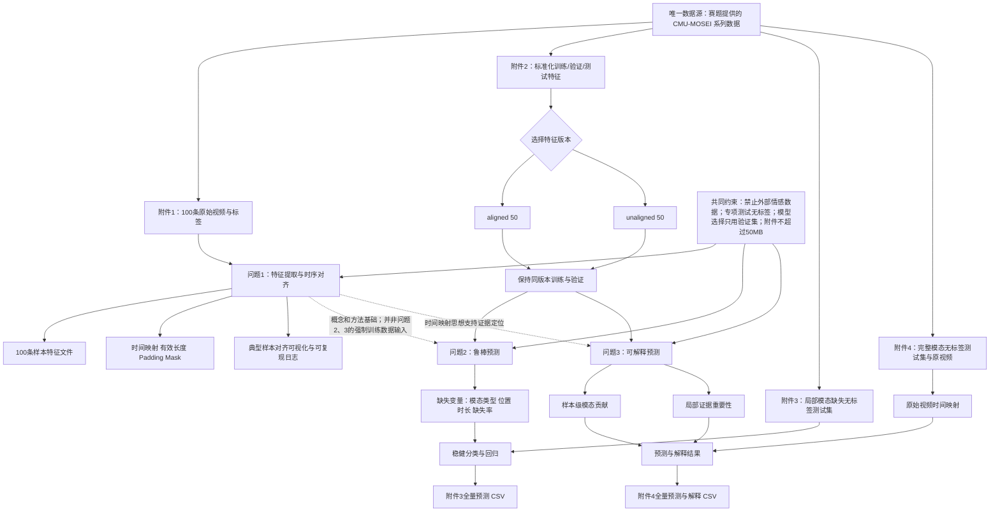

# 复杂场景下多模态情感预测题目分析

> 来源：`docs/复杂场景下多模态情感识别的数学建模与算法设计.docx`
>
> 分析范围：题目背景、数据条件、三个正式问题、提交要求与约束。题面中的要求仅作为赛题内容进行解析。

## 1 结论先行

赛题包含 **3 个正式问题**，对应“数据表征—鲁棒预测—可信解释”三层任务：

1. 问题1：三模态特征提取与时序对齐；
2. 问题2：局部模态缺失条件下的鲁棒分类与回归；
3. 问题3：能够定位关键证据的可解释分类与回归。

三个问题共有 **13项正文最低交付内容**（4＋4＋5）。最重要的逻辑判断是：

> 问题1是问题2、3的方法基础，但不是它们的强制数据输入。问题2、3明确使用附件2训练和验证，可以并行推进；问题1独立处理附件1的100条原始视频。

以下按“可独立建模的语义分句”解析，而不是机械地按逗号拆分题干。

## 2 逐句解析题目

### 2.1 背景及数据说明

| 题面语义单元 | 背景信息 | 核心问题 | 已知条件 | 约束条件 |
|---|---|---|---|---|
| 情感分析服务于具身智能和自然人机交互 | 说明应用价值和研究场景 | — | 研究对象是人类情感 | — |
| 情绪通过文本语义、语音韵律、面部表情和肢体动作协同表达 | 说明多模态建模的必要性 | 如何联合利用不同模态 | 文本、语音、视觉是主要信息通道 | 不能只把三模态简单拼接而忽略互补性 |
| 三种模态的采样频率、维度和时间尺度差异显著 | 第一重挑战 | 跨模态时序对齐 | 三模态天然异步、异维 | 对齐质量决定模型性能上限 |
| 遮挡、噪声、转写失败造成局部模态缺失 | 第二重挑战 | 缺失条件下稳定预测 | 缺失通常是局部连续区间 | 不能把问题简化为整个模态完全缺失 |
| 常规模型在模态缺失时性能下降 | 模型痛点 | 设计动态、鲁棒的融合机制 | 固定权重融合缺乏适应性 | 需要量化不同缺失条件的影响 |
| 多数模型的决策依据不可追溯 | 第三重挑战 | 可量化、可复核地解释预测 | 解释对象包括模态和局部片段 | 解释必须能回到原始文本、语音时段或视频帧 |
| 以CMU-MOSEI为基础，依次研究对齐、鲁棒性、可解释性 | 总体研究路线 | 形成三级模型体系 | 数据为英文三模态情感数据 | 三项任务都必须完成 |

| 数据条款 | 背景信息 | 核心问题 | 已知条件 | 约束条件 |
|---|---|---|---|---|
| 附件1含100条原始英文视频 | 为问题1提供原始素材 | 从原始视频生成三模态时序特征 | 37个文件夹；样本由`video_id + clip_id`唯一标识；时长2.648～34.567秒 | 必须覆盖全部100条样本 |
| 附件1给出文本和两类标签 | 提供监督信息与核验依据 | 同时处理分类、回归标签 | 强度范围为[-3,3]；0只属于中性；极性为三分类 | 不得擅自修改标签 |
| 极短、无效、异常视频允许特殊处理 | 为异常数据处理保留空间 | 需要制定数据质量规则 | 可掩码、截断或采用其他处理 | 必须保留原始样本，并在论文说明规则 |
| 附件2提供标准化特征 | 为问题2、3提供统一训练输入 | 在数值特征上训练预测模型 | 对齐版和非对齐版各4850条，含训练、验证、测试划分 | 训练、验证、专项测试必须使用同一版本 |
| 附件3是局部缺失专项测试集 | 对应问题2最终推理 | 输出无标签样本的预测 | 缺失为某模态随机连续区间全部为零 | 不得利用测试标签调参，因为没有标签 |
| 附件4是完整模态专项测试集 | 对应问题3最终推理 | 输出预测和解释 | 有三模态特征，并配套原始视频 | 关键证据必须可以回看至原始素材 |

### 2.2 三个问题逐句解析

| 问题 | 题面语义单元 | 背景信息 | 核心问题 | 已知条件 | 约束条件 |
|---|---|---|---|---|---|
| 1 | 建立文本、语音、视觉特征提取模型 | 原始信息分散在视频、音频和转写文本中 | 定义并计算三模态情感特征 | 可使用开源工具和预训练模型 | 必须说明工具、版本和关键参数 |
| 1 | 建立跨模态时序对齐模型 | 三模态时间粒度不同 | 建立统一时间索引及对应规则 | 原视频和文本可用于核验 | 不能只输出定长张量而不记录有效长度、填充和映射关系 |
| 1 | 覆盖全部100个样本 | 强调工程完整性 | 建立一一对应的数据管线 | 样本有唯一ID | 不得遗漏或替换样本 |
| 1 | 保证结果可核验、可复现 | 竞赛不仅评价最终特征 | 保存过程信息和处理日志 | 可记录样本级元数据 | 必须提交原始特征文件及完整运行说明 |
| 2 | 构建局部模态缺失下的鲁棒模型 | 真实采集存在局部信息不可用 | 同时预测极性和强度 | 缺失表现为连续零区间 | 不是“整模态缺失”问题 |
| 2 | 分析缺失类型、位置、时长的影响 | 不同缺失机制可能产生不同损害 | 建立性能退化规律 | 可在附件2上模拟缺失 | 提交要求还明确提出“缺失率”，故应分析类型、位置、时长/缺失率四个维度 |
| 2 | 对附件3全量推理 | 验证模型对真实缺失模式的适应性 | 生成预测CSV | 附件3无标签 | 只能用附件2验证集进行结构、超参数和阈值选择 |
| 3 | 构建可解释预测模型 | 完整模态下仍存在黑箱问题 | 在预测同时量化决策依据 | 需解释三模态作用差异 | 解释不能停留在全局特征重要性 |
| 3 | 输出主要参考模态和作用程度 | 样本间主导模态可能变化 | 计算样本级模态贡献 | 三模态信息完整 | 贡献指标应可比较、可复核 |
| 3 | 定位模态内部的关键证据 | 解释需落到局部片段 | 输出文本片段、语音时段或视觉关键帧 | 附件4含原始视频 | 特征位置必须能映射回原始时间轴 |
| 3 | 对附件4全量推理 | 检验解释输出的工程完整性 | 生成预测与解释CSV | 附件4无标签 | 不能依赖测试标签筛选“好看”的解释 |

### 2.3 论文与附件约束

| 题面语义单元 | 背景信息 | 核心问题 | 已知条件 | 约束条件 |
|---|---|---|---|---|
| 论文依次回答问题1～3 | 规定论文主结构 | 形成三章递进论证 | 每问均需写输入、模型、求解、指标和结果 | 核心内容不得只放附件 |
| 问题1汇总全部100条样本 | 要求从个案扩展到全量 | 建立样本级质量审计表 | 至少包括ID、模态、时长、维度、对齐粒度 | 不能只展示典型样本 |
| 问题1至少展示1个典型样本 | 用实例证明对齐有效 | 可视化文本—语音—视频对应关系 | 样本可自行选择 | 典型样本不能替代全量汇总 |
| 问题2给出基础性能、消融、可视化和错误归因 | 不只追求单一分数 | 证明鲁棒性机制确实有效 | 验证集有标签 | 需要对照模型和消融实验 |
| 问题3制作典型样本解释卡 | 将解释结果结构化呈现 | 联合展示预测、模态贡献和证据位置 | 可选择代表性样本 | 还必须提交附件4全量结果 |
| 提交代码、配置、参数及环境说明 | 强调可复现性 | 建立端到端运行工程 | Python适合实现 | 运行说明和数据处理规则不可缺失 |

| 全局条款 | 已知条件 | 约束条件 | 对建模的实际影响 |
|---|---|---|---|
| 数据来源 | 仅使用赛题提供的CMU-MOSEI系列数据 | 禁止引入其他公开或私有情感数据集参与训练、微调、调参、阈值选择或统计 | 不能用外部情感数据做数据增强或迁移微调 |
| 预处理 | 可对附件2训练集、验证集清洗、重采样、标准化 | 必须合理论证，不能改变测试集规则 | 标准化统计量只能由训练集拟合 |
| 工具与模型 | 允许开源工具、预训练模型和开源框架 | 必须注明名称、版本、参数和用途 | 可用BERT等通用预训练模型，但不能额外引入情感数据继续微调 |
| 标签使用 | 附件3、4均无标签 | 只用于最终推理 | 所有模型选择必须在附件2验证集完成 |
| 附件大小 | 总附件不超过50MB | 模型权重、特征和代码总量受限 | 需设计轻量权重、压缩或提供可复现下载策略，但不能依赖违规数据 |
| 匿名要求 | — | 严禁单位、姓名、队号等身份信息 | 代码路径、日志、图表元数据也要清理 |

### 2.4 附件2结构的建模含义

| 题面条件 | 数学含义 | 直接影响 |
|---|---|---|
| `aligned_50.pkl`：文本(50,768)、语音(50,74)、视觉(50,35) | 三模态共享50个对齐位置 | 可直接做位置级融合，但对齐过程可能损失细粒度音视频信息 |
| `unaligned_50.pkl`：文本50步，语音和视觉500步 | 三模态保持不同时间分辨率 | 需使用跨模态注意力、池化或显式时间映射 |
| 所有样本采用固定最大长度 | 实际序列长度存在差异 | 必须构造padding mask，不能把填充当作有效信息 |
| `audio_lengths`、`vision_lengths`记录有效长度 | 可恢复非对齐序列的有效范围 | 缺失检测必须先排除正常padding |
| `text`与`text_bert`二选一 | 两者是文本模态的两种入口 | 不能把二者误当作两个独立模态 |
| 附件2不保存原始帧、波形、逐词时间戳 | 训练数据只能支持特征级解释 | 问题3必须额外设计“特征位置→附件4原视频时间”的映射 |

## 3 小问划分及直接目标与隐含目标

正式划分为 **3个小问**；若按论文最低交付项细分，则是 **13个子任务**。

| 小问 | 直接目标 | 隐含目标 | 最低可验收输出 |
|---|---|---|---|
| 问题1 | 从100条原视频提取文本、语音、视觉特征并完成时序对齐 | 证明数据管线完整、时间关系正确、结果可追溯且可复现；为后续模型建立统一的多模态表征语言 | 三模态特征定义；对齐模型；100条全量汇总；至少1个典型对齐案例；特征文件、日志和运行说明 |
| 问题2 | 在局部模态缺失时预测三分类极性和连续强度，并推理附件3 | 不仅要获得高分，还要证明性能退化可控，并解释不同缺失机制如何影响模型 | 鲁棒模型；分类与回归结果；缺失类型/位置/时长/缺失率实验；消融与错误归因；附件3全量CSV |
| 问题3 | 输出情感预测、模态贡献和关键证据位置，并推理附件4 | 证明解释忠实于模型、对扰动稳定、能映射到人可复核的原始证据，而非只生成视觉上好看的注意力图 | 可解释模型；解释卡；三模态贡献对比；局部重要性分布；附件4预测与解释CSV；验证集性能和错误分析 |

其中，问题2与问题3都有两个联合预测头：

$$
\text{极性分类：}\hat y_i^{(c)}\in\{\text{Negative, Neutral, Positive}\},
\qquad
\text{强度回归：}\hat y_i^{(r)}\in[-3,3].
$$

因此后续模型宜以多任务目标为基本形式：

$$
\mathcal L
=
\lambda_c\mathcal L_{\mathrm{cls}}
+\lambda_r\mathcal L_{\mathrm{reg}}
+\lambda_{\mathrm{rob}}\mathcal L_{\mathrm{robust}}
+\lambda_{\mathrm{exp}}\mathcal L_{\mathrm{explain}},
$$

但问题2通常令 $\lambda_{\mathrm{exp}}=0$，问题3则重点设计解释正则项。

## 4 各小问逻辑关系与条件依赖

### 4.1 关键参数依赖链

| 上游条件或参数 | 影响对象 | 下游后果 |
|---|---|---|
| 选择`aligned`或`unaligned` | 序列长度、对齐方式、网络结构 | 决定使用同步融合还是跨模态异步注意力；整个实验必须保持同一版本 |
| 有效长度与padding规则 | mask、池化和注意力权重 | mask错误会把填充位置误当成情感或缺失证据 |
| 对齐粒度 | 局部缺失位置定义、关键证据定位 | 粒度越粗，模型越轻，但局部解释和缺失边界越不精确 |
| 缺失模态类型 | 可用互补信息 | 文本、语音、视觉缺失造成的性能损失不对称 |
| 缺失位置 | 是否遮蔽情感峰值 | 相同缺失率可能产生完全不同的结果 |
| 缺失时长/缺失率 | 有效信息量 | 决定性能退化曲线和鲁棒性上限 |
| 分类阈值或决策规则 | Accuracy、F1 | 必须只在验证集选择，不能根据附件3、4调整 |
| 分类与回归损失权重 | 两项任务的收敛平衡 | 可能出现分类提升但MAE恶化，需要多指标选模 |
| 模态贡献计算方法 | “主要参考模态”的结论 | 必须归一化、可比较，并接受遮蔽或扰动验证 |
| 特征位置到真实时间的映射 | 文本、音频、关键帧证据 | 映射不完整会使问题3只剩特征级解释，无法满足可复核要求 |

## 5 题型分类

| 小问 | 优化类 | 预测类 | 评价类 | 机理分析类 | 其他 | 判断依据 |
|---|---:|---:|---:|---:|---:|---|
| 问题1 | △ 多目标设计 | — | △ 数据质量评价 | ✓ | ✓ 数据处理与表征建模 | 主要任务是定义特征、建立时序对应机制和数据管线；优化体现在对齐误差、信息保真度、计算量之间的权衡，但不是传统运筹优化题 |
| 问题2 | ✓ 多目标 | ✓ 分类＋回归 | ✓ 鲁棒性评价 | ✓ 缺失影响分析 | — | 同时优化分类、回归和鲁棒性目标；还须分析模态类型、位置、时长和缺失率对性能的作用规律 |
| 问题3 | ✓ 多目标 | ✓ 分类＋回归 | ✓ 解释质量评价 | ✓ 决策机理分析 | ✓ 可解释机器学习 | 同时追求预测性能与解释忠实性，输出模态贡献和局部证据，并将证据回映到原始素材 |

核心判断：**本题不是三个彼此孤立的“深度学习训练题”，而是一个以预测为主、数据机理与可信评价并重的综合建模题。**

## 6 最容易失分的题意误读

1. **把局部缺失建成整模态缺失。** 题目明确是连续时间区间缺失，应使用时间级mask，而非仅做“去掉整个语音模态”实验。
2. **只研究缺失率。** 正文要求还包括缺失模态类型、缺失位置和缺失时长；完整实验矩阵至少覆盖“类型×位置×时长/比例”。
3. **认为问题1生成的特征必须直接训练问题2、3。** 问题2、3明确使用附件2训练；问题1更强调原始数据处理、时序建模能力和可复现性。
4. **把attention权重直接当作解释。** 题目要求“可量化、可复核”，至少还应通过模态遮蔽、片段删除或反事实扰动验证解释忠实性。
5. **忽略分类与回归的联合任务。** 每个模型都必须同时输出情感极性和强度，不能只报告Accuracy/F1或只报告MAE/Pearson。
6. **在附件3、4上反复调参。** 两者是无标签最终专项测试集；模型结构、超参数、阈值必须在附件2验证集确定。
7. **把padding零值和缺失零值混淆。** 必须结合有效长度先构造padding mask，再识别随机连续零区间，否则缺失统计和模型输入都会出错。
8. **只给少量案例，不给全量结果。** 问题1要求100条全量汇总；问题2、3要求对应专项测试集的全量CSV。
9. **解释无法映射回原视频。** 附件2本身没有逐词时间戳和原始帧，因此必须额外建立序列索引到附件4原视频时间轴的换算规则。
10. **模型过大导致附件超限。** 总附件必须≤50MB，模型设计阶段就应考虑参数量、权重压缩和复现实验组织，而不是最后才删文件。
