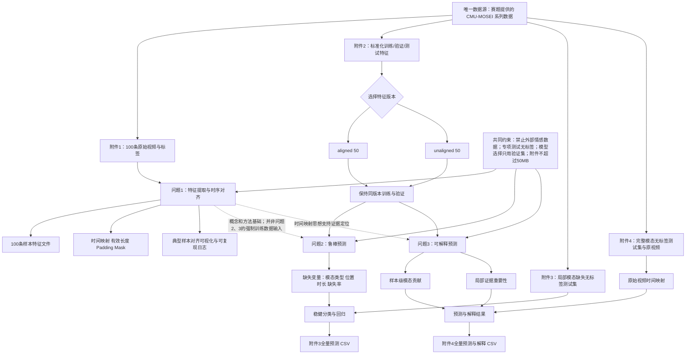
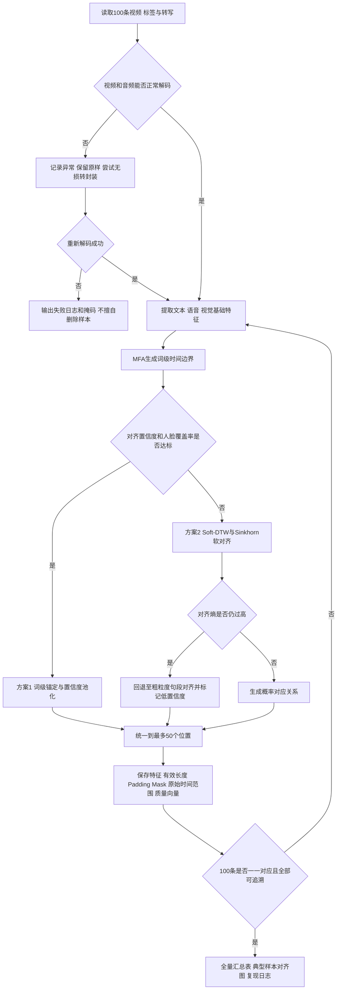
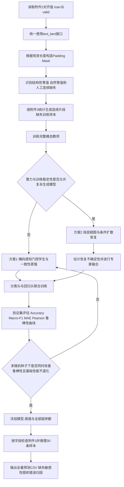
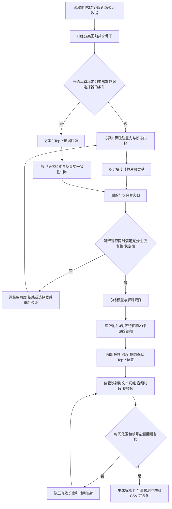
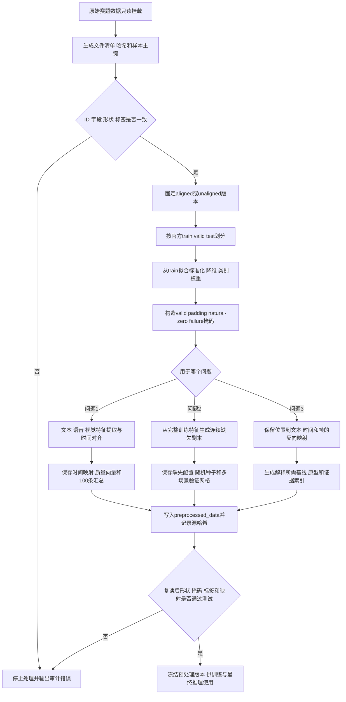

# 复杂场景下多模态情感预测题目分析

> 来源：`docs/复杂场景下多模态情感识别的数学建模与算法设计.docx`
>
> 分析范围：题目背景、数据条件、三个正式问题、提交要求与约束。题面中的要求仅作为赛题内容进行解析。

## 1 结论先行

赛题包含 **3 个正式问题**，对应“数据表征—鲁棒预测—可信解释”三层任务：

1. 问题1：三模态特征提取与时序对齐；
2. 问题2：局部模态缺失条件下的鲁棒分类与回归；
3. 问题3：能够定位关键证据的可解释分类与回归。

三个问题共有 **13项正文最低交付内容**（4＋4＋5）。最重要的逻辑判断是：

> 问题1是问题2、3的方法基础，但不是它们的强制数据输入。问题2、3明确使用附件2训练和验证，可以并行推进；问题1独立处理附件1的100条原始视频。

以下按“可独立建模的语义分句”解析，而不是机械地按逗号拆分题干。

## 2 逐句解析题目

### 2.1 背景及数据说明

| 题面语义单元 | 背景信息 | 核心问题 | 已知条件 | 约束条件 |
|---|---|---|---|---|
| 情感分析服务于具身智能和自然人机交互 | 说明应用价值和研究场景 | — | 研究对象是人类情感 | — |
| 情绪通过文本语义、语音韵律、面部表情和肢体动作协同表达 | 说明多模态建模的必要性 | 如何联合利用不同模态 | 文本、语音、视觉是主要信息通道 | 不能只把三模态简单拼接而忽略互补性 |
| 三种模态的采样频率、维度和时间尺度差异显著 | 第一重挑战 | 跨模态时序对齐 | 三模态天然异步、异维 | 对齐质量决定模型性能上限 |
| 遮挡、噪声、转写失败造成局部模态缺失 | 第二重挑战 | 缺失条件下稳定预测 | 缺失通常是局部连续区间 | 不能把问题简化为整个模态完全缺失 |
| 常规模型在模态缺失时性能下降 | 模型痛点 | 设计动态、鲁棒的融合机制 | 固定权重融合缺乏适应性 | 需要量化不同缺失条件的影响 |
| 多数模型的决策依据不可追溯 | 第三重挑战 | 可量化、可复核地解释预测 | 解释对象包括模态和局部片段 | 解释必须能回到原始文本、语音时段或视频帧 |
| 以CMU-MOSEI为基础，依次研究对齐、鲁棒性、可解释性 | 总体研究路线 | 形成三级模型体系 | 数据为英文三模态情感数据 | 三项任务都必须完成 |

| 数据条款 | 背景信息 | 核心问题 | 已知条件 | 约束条件 |
|---|---|---|---|---|
| 附件1含100条原始英文视频 | 为问题1提供原始素材 | 从原始视频生成三模态时序特征 | 37个文件夹；样本由`video_id + clip_id`唯一标识；时长2.648～34.567秒 | 必须覆盖全部100条样本 |
| 附件1给出文本和两类标签 | 提供监督信息与核验依据 | 同时处理分类、回归标签 | 强度范围为[-3,3]；0只属于中性；极性为三分类 | 不得擅自修改标签 |
| 极短、无效、异常视频允许特殊处理 | 为异常数据处理保留空间 | 需要制定数据质量规则 | 可掩码、截断或采用其他处理 | 必须保留原始样本，并在论文说明规则 |
| 附件2提供标准化特征 | 为问题2、3提供统一训练输入 | 在数值特征上训练预测模型 | 对齐版和非对齐版各4850条，含训练、验证、测试划分 | 训练、验证、专项测试必须使用同一版本 |
| 附件3是局部缺失专项测试集 | 对应问题2最终推理 | 输出无标签样本的预测 | 缺失为某模态随机连续区间全部为零 | 不得利用测试标签调参，因为没有标签 |
| 附件4是完整模态专项测试集 | 对应问题3最终推理 | 输出预测和解释 | 有三模态特征，并配套原始视频 | 关键证据必须可以回看至原始素材 |

### 2.2 三个问题逐句解析

| 问题 | 题面语义单元 | 背景信息 | 核心问题 | 已知条件 | 约束条件 |
|---|---|---|---|---|---|
| 1 | 建立文本、语音、视觉特征提取模型 | 原始信息分散在视频、音频和转写文本中 | 定义并计算三模态情感特征 | 可使用开源工具和预训练模型 | 必须说明工具、版本和关键参数 |
| 1 | 建立跨模态时序对齐模型 | 三模态时间粒度不同 | 建立统一时间索引及对应规则 | 原视频和文本可用于核验 | 不能只输出定长张量而不记录有效长度、填充和映射关系 |
| 1 | 覆盖全部100个样本 | 强调工程完整性 | 建立一一对应的数据管线 | 样本有唯一ID | 不得遗漏或替换样本 |
| 1 | 保证结果可核验、可复现 | 竞赛不仅评价最终特征 | 保存过程信息和处理日志 | 可记录样本级元数据 | 必须提交原始特征文件及完整运行说明 |
| 2 | 构建局部模态缺失下的鲁棒模型 | 真实采集存在局部信息不可用 | 同时预测极性和强度 | 缺失表现为连续零区间 | 不是“整模态缺失”问题 |
| 2 | 分析缺失类型、位置、时长的影响 | 不同缺失机制可能产生不同损害 | 建立性能退化规律 | 可在附件2上模拟缺失 | 提交要求还明确提出“缺失率”，故应分析类型、位置、时长/缺失率四个维度 |
| 2 | 对附件3全量推理 | 验证模型对真实缺失模式的适应性 | 生成预测CSV | 附件3无标签 | 只能用附件2验证集进行结构、超参数和阈值选择 |
| 3 | 构建可解释预测模型 | 完整模态下仍存在黑箱问题 | 在预测同时量化决策依据 | 需解释三模态作用差异 | 解释不能停留在全局特征重要性 |
| 3 | 输出主要参考模态和作用程度 | 样本间主导模态可能变化 | 计算样本级模态贡献 | 三模态信息完整 | 贡献指标应可比较、可复核 |
| 3 | 定位模态内部的关键证据 | 解释需落到局部片段 | 输出文本片段、语音时段或视觉关键帧 | 附件4含原始视频 | 特征位置必须能映射回原始时间轴 |
| 3 | 对附件4全量推理 | 检验解释输出的工程完整性 | 生成预测与解释CSV | 附件4无标签 | 不能依赖测试标签筛选“好看”的解释 |

### 2.3 论文与附件约束

| 题面语义单元 | 背景信息 | 核心问题 | 已知条件 | 约束条件 |
|---|---|---|---|---|
| 论文依次回答问题1～3 | 规定论文主结构 | 形成三章递进论证 | 每问均需写输入、模型、求解、指标和结果 | 核心内容不得只放附件 |
| 问题1汇总全部100条样本 | 要求从个案扩展到全量 | 建立样本级质量审计表 | 至少包括ID、模态、时长、维度、对齐粒度 | 不能只展示典型样本 |
| 问题1至少展示1个典型样本 | 用实例证明对齐有效 | 可视化文本—语音—视频对应关系 | 样本可自行选择 | 典型样本不能替代全量汇总 |
| 问题2给出基础性能、消融、可视化和错误归因 | 不只追求单一分数 | 证明鲁棒性机制确实有效 | 验证集有标签 | 需要对照模型和消融实验 |
| 问题3制作典型样本解释卡 | 将解释结果结构化呈现 | 联合展示预测、模态贡献和证据位置 | 可选择代表性样本 | 还必须提交附件4全量结果 |
| 提交代码、配置、参数及环境说明 | 强调可复现性 | 建立端到端运行工程 | Python适合实现 | 运行说明和数据处理规则不可缺失 |

| 全局条款 | 已知条件 | 约束条件 | 对建模的实际影响 |
|---|---|---|---|
| 数据来源 | 仅使用赛题提供的CMU-MOSEI系列数据 | 禁止引入其他公开或私有情感数据集参与训练、微调、调参、阈值选择或统计 | 不能用外部情感数据做数据增强或迁移微调 |
| 预处理 | 可对附件2训练集、验证集清洗、重采样、标准化 | 必须合理论证，不能改变测试集规则 | 标准化统计量只能由训练集拟合 |
| 工具与模型 | 允许开源工具、预训练模型和开源框架 | 必须注明名称、版本、参数和用途 | 可用BERT等通用预训练模型，但不能额外引入情感数据继续微调 |
| 标签使用 | 附件3、4均无标签 | 只用于最终推理 | 所有模型选择必须在附件2验证集完成 |
| 附件大小 | 总附件不超过50MB | 模型权重、特征和代码总量受限 | 需设计轻量权重、压缩或提供可复现下载策略，但不能依赖违规数据 |
| 匿名要求 | — | 严禁单位、姓名、队号等身份信息 | 代码路径、日志、图表元数据也要清理 |

### 2.4 附件2结构的建模含义

| 题面条件 | 数学含义 | 直接影响 |
|---|---|---|
| `aligned_50.pkl`：文本(50,768)、语音(50,74)、视觉(50,35) | 三模态共享50个对齐位置 | 可直接做位置级融合，但对齐过程可能损失细粒度音视频信息 |
| `unaligned_50.pkl`：文本50步，语音和视觉500步 | 三模态保持不同时间分辨率 | 需使用跨模态注意力、池化或显式时间映射 |
| 所有样本采用固定最大长度 | 实际序列长度存在差异 | 必须构造padding mask，不能把填充当作有效信息 |
| `audio_lengths`、`vision_lengths`记录有效长度 | 可恢复非对齐序列的有效范围 | 缺失检测必须先排除正常padding |
| `text`与`text_bert`二选一 | 两者是文本模态的两种入口 | 不能把二者误当作两个独立模态 |
| 附件2不保存原始帧、波形、逐词时间戳 | 训练数据只能支持特征级解释 | 问题3必须额外设计“特征位置→附件4原视频时间”的映射 |

## 3 小问划分及直接目标与隐含目标

正式划分为 **3个小问**；若按论文最低交付项细分，则是 **13个子任务**。

| 小问 | 直接目标 | 隐含目标 | 最低可验收输出 |
|---|---|---|---|
| 问题1 | 从100条原视频提取文本、语音、视觉特征并完成时序对齐 | 证明数据管线完整、时间关系正确、结果可追溯且可复现；为后续模型建立统一的多模态表征语言 | 三模态特征定义；对齐模型；100条全量汇总；至少1个典型对齐案例；特征文件、日志和运行说明 |
| 问题2 | 在局部模态缺失时预测三分类极性和连续强度，并推理附件3 | 不仅要获得高分，还要证明性能退化可控，并解释不同缺失机制如何影响模型 | 鲁棒模型；分类与回归结果；缺失类型/位置/时长/缺失率实验；消融与错误归因；附件3全量CSV |
| 问题3 | 输出情感预测、模态贡献和关键证据位置，并推理附件4 | 证明解释忠实于模型、对扰动稳定、能映射到人可复核的原始证据，而非只生成视觉上好看的注意力图 | 可解释模型；解释卡；三模态贡献对比；局部重要性分布；附件4预测与解释CSV；验证集性能和错误分析 |

其中，问题2与问题3都有两个联合预测头：

$$
\text{极性分类：}\hat y_i^{(c)}\in\{\text{Negative, Neutral, Positive}\},
\qquad
\text{强度回归：}\hat y_i^{(r)}\in[-3,3].
$$

因此后续模型宜以多任务目标为基本形式：

$$
\mathcal L
=
\lambda_c\mathcal L_{\mathrm{cls}}
+\lambda_r\mathcal L_{\mathrm{reg}}
+\lambda_{\mathrm{rob}}\mathcal L_{\mathrm{robust}}
+\lambda_{\mathrm{exp}}\mathcal L_{\mathrm{explain}},
$$

但问题2通常令 $\lambda_{\mathrm{exp}}=0$，问题3则重点设计解释正则项。

## 4 各小问逻辑关系与条件依赖



### 4.1 关键参数依赖链

| 上游条件或参数 | 影响对象 | 下游后果 |
|---|---|---|
| 选择`aligned`或`unaligned` | 序列长度、对齐方式、网络结构 | 决定使用同步融合还是跨模态异步注意力；整个实验必须保持同一版本 |
| 有效长度与padding规则 | mask、池化和注意力权重 | mask错误会把填充位置误当成情感或缺失证据 |
| 对齐粒度 | 局部缺失位置定义、关键证据定位 | 粒度越粗，模型越轻，但局部解释和缺失边界越不精确 |
| 缺失模态类型 | 可用互补信息 | 文本、语音、视觉缺失造成的性能损失不对称 |
| 缺失位置 | 是否遮蔽情感峰值 | 相同缺失率可能产生完全不同的结果 |
| 缺失时长/缺失率 | 有效信息量 | 决定性能退化曲线和鲁棒性上限 |
| 分类阈值或决策规则 | Accuracy、F1 | 必须只在验证集选择，不能根据附件3、4调整 |
| 分类与回归损失权重 | 两项任务的收敛平衡 | 可能出现分类提升但MAE恶化，需要多指标选模 |
| 模态贡献计算方法 | “主要参考模态”的结论 | 必须归一化、可比较，并接受遮蔽或扰动验证 |
| 特征位置到真实时间的映射 | 文本、音频、关键帧证据 | 映射不完整会使问题3只剩特征级解释，无法满足可复核要求 |

## 5 题型分类

| 小问 | 优化类 | 预测类 | 评价类 | 机理分析类 | 其他 | 判断依据 |
|---|---:|---:|---:|---:|---:|---|
| 问题1 | △ 多目标设计 | — | △ 数据质量评价 | ✓ | ✓ 数据处理与表征建模 | 主要任务是定义特征、建立时序对应机制和数据管线；优化体现在对齐误差、信息保真度、计算量之间的权衡，但不是传统运筹优化题 |
| 问题2 | ✓ 多目标 | ✓ 分类＋回归 | ✓ 鲁棒性评价 | ✓ 缺失影响分析 | — | 同时优化分类、回归和鲁棒性目标；还须分析模态类型、位置、时长和缺失率对性能的作用规律 |
| 问题3 | ✓ 多目标 | ✓ 分类＋回归 | ✓ 解释质量评价 | ✓ 决策机理分析 | ✓ 可解释机器学习 | 同时追求预测性能与解释忠实性，输出模态贡献和局部证据，并将证据回映到原始素材 |

核心判断：**本题不是三个彼此孤立的“深度学习训练题”，而是一个以预测为主、数据机理与可信评价并重的综合建模题。**

## 6 最容易失分的题意误读

1. **把局部缺失建成整模态缺失。** 题目明确是连续时间区间缺失，应使用时间级mask，而非仅做“去掉整个语音模态”实验。
2. **只研究缺失率。** 正文要求还包括缺失模态类型、缺失位置和缺失时长；完整实验矩阵至少覆盖“类型×位置×时长/比例”。
3. **认为问题1生成的特征必须直接训练问题2、3。** 问题2、3明确使用附件2训练；问题1更强调原始数据处理、时序建模能力和可复现性。
4. **把attention权重直接当作解释。** 题目要求“可量化、可复核”，至少还应通过模态遮蔽、片段删除或反事实扰动验证解释忠实性。
5. **忽略分类与回归的联合任务。** 每个模型都必须同时输出情感极性和强度，不能只报告Accuracy/F1或只报告MAE/Pearson。
6. **在附件3、4上反复调参。** 两者是无标签最终专项测试集；模型结构、超参数、阈值必须在附件2验证集确定。
7. **把padding零值和缺失零值混淆。** 必须结合有效长度先构造padding mask，再识别随机连续零区间，否则缺失统计和模型输入都会出错。
8. **只给少量案例，不给全量结果。** 问题1要求100条全量汇总；问题2、3要求对应专项测试集的全量CSV。
9. **解释无法映射回原视频。** 附件2本身没有逐词时间戳和原始帧，因此必须额外建立序列索引到附件4原视频时间轴的换算规则。
10. **模型过大导致附件超限。** 总附件必须≤50MB，模型设计阶段就应考虑参数量、权重压缩和复现实验组织，而不是最后才删文件。

## 7 模型选择阶段

### 7.1 选择依据与总体建议

本节不仅依据题面，还结合 `outputs/data_analysis_results/analysis_report.md` 中已经确认的数据事实：

- 问题1只有100条原始视频，标签分布为正向57、中性25、负向18，样本量不足以从头训练大型特征提取器，因而应优先采用预训练工具和可核验的确定性对齐流程。
- 附件2训练集、验证集、测试集分别为3395、728、727条，正向类别约占48.9%，模型选择不能只看Accuracy，应重点观察Macro-F1、MAE和Pearson。
- 对齐版序列最多50步，未对齐版音频、视觉最多500步；对齐版更适合在有限算力下完成鲁棒性实验、解释定位和批量消融。
- 附件3中缺失主要发生在音频和视觉，文本保持完整；对齐版音频、视觉平均缺失比例约18.5%和18.9%，但训练集本身存在自然全零视觉片段，不能把所有零值都判为人工缺失。
- 附件4的20条样本三模态完整，视频与特征编号可直接对应；未对齐版样本13、16的`vision_lengths`存在异常，因此问题3默认选用对齐版更稳妥。

综合“获奖创新性、代码可执行性、附件不超过50MB和赛期风险”，建议采用以下组合：

| 问题 | 方案1：基础适配 | 方案2：创新融合 | 推荐落地方式 |
|---|---|---|---|
| 问题1 | 词级锚定三模态流水线 | 单调最优传输与Soft-DTW多尺度对齐 | 方案1作为主流程，方案2处理低置信度样本并形成创新消融 |
| 问题2 | 掩码感知门控网络与完整—缺失一致性蒸馏 | 局部超图、条件扩散与不确定性专家融合 | 先完成方案1；方案2只有在多随机种子上稳定改善鲁棒性指标时才作为主模型 |
| 问题3 | 层次稀疏注意力与积分梯度复核 | 稀疏证据瓶颈、原型记忆与反事实一致性 | 方案1作为解释基线；方案2作为论文的核心创新模型 |

### 7.2 问题1模型方案

#### 7.2.1 方案1：词级锚定三模态流水线

**模型组成：** `BERT文本编码 + MFA语音强制对齐 + openSMILE声学特征 + LibreFace/人脸行为特征 + 置信度加权池化`。

**核心原理：** 先利用题目给出的英文转写文本，通过强制对齐工具确定每个单词在音频中的起止时间；随后在同一时间区间内分别汇总文本表示、语音韵律特征和人脸表情特征，使三个模态都落到“单词位置”这一共同时间轴上。若一个单词覆盖多个音频帧或视频帧，则用带置信度的均值或注意力池化汇总，最后填充或截断到统一长度，并同时保存有效长度和原始时间范围。

**适配性：** 问题1只有100条原始视频，平均时长约11.15秒、平均转写词数约19.32，适合使用成熟的预训练特征工具而不适合从头训练大型端到端模型。以词为锚点还能自然对接附件2的50步文本序列，并直接满足“文本片段—语音时段—视频帧段”可核验的题目要求。MFA用于词音边界，[BERT](https://aclanthology.org/N19-1423/)提供上下文文本表示，[LibreFace](https://openaccess.thecvf.com/content/WACV2024/html/Chang_LibreFace_An_Open-Source_Toolkit_for_Deep_Facial_Expression_Analysis_WACV_2024_paper.html)可提供动作单元和表情特征。

**创新点：** 相比固定均值池化，加入“数据质量驱动的动态权重”：语音权重由信噪比、对齐置信度控制，视觉权重由人脸检测率、遮挡率控制，文本权重由截断和未知词比例控制。同时生成样本级质量向量并随特征文件保存，使后续模型既能使用情感特征，也能知道每个模态是否可靠。该设计把工程日志转化为可进入模型的数学变量。

**局限性：** 强制对齐可能受口音、背景噪声、笑声和吞音影响；低分辨率视频可能造成人脸动作单元不稳定；以单词为统一粒度会压缩单词内部的细粒度韵律变化。预训练特征还可能存在领域偏差，因此必须保留原始边界、置信度和失败回退记录。

#### 7.2.2 方案2：单调最优传输与Soft-DTW多尺度对齐

**模型组成：** `多尺度时序编码 + Soft-DTW单调约束 + Sinkhorn最优传输 + 三模态共识时间轴`。

**核心原理：** 不把强制对齐结果视为绝对真值，而是把文本词元、短时声学窗口和视频帧段看成三组带顺序的“质量点”。先计算跨模态片段之间的相似度和时间距离，再通过Soft-DTW寻找保持前后顺序的柔性路径，同时用熵正则最优传输为一个文本位置分配多个可能的音频/视觉片段。最终的对齐不是单个硬边界，而是一组概率对应关系，能表达某个情感词与稍晚出现的语调或表情之间的时间滞后。

**适配性：** 三模态采样频率和时间尺度差异明显，且真实情感动作经常与语言存在提前或滞后。Soft-DTW可以处理变长、局部伸缩和时间偏移，[Soft-DTW原始论文](https://proceedings.mlr.press/v70/cuturi17a.html)给出了可微的时间序列对齐方式；[Sinkhorn最优传输](https://proceedings.neurips.cc/paper/2013/hash/af21d0c97db2e27e13572cbf59eb343d-Abstract.html)可高效计算软对应关系。该方案不依赖额外情感数据，符合数据约束。

**创新点：** 将语音处理中常用的动态时间规整与概率分布间的最优传输结合，并加入“单调但允许局部滞后”的约束；同时使用短、中、长三个时间尺度对齐，在短尺度捕捉词内韵律，在长尺度捕捉跨词表情延迟。输出对齐熵作为不确定性指标，对齐熵高的样本自动回退到方案1或进入人工复核列表。

**局限性：** 成本矩阵若只依靠低层特征，可能把外观相似但语义无关的片段错误匹配；Soft-DTW和最优传输都增加计算量，参数过多时在100条样本上难以可靠调优；软对齐还需要转化为清晰的原始时间区间才能满足核验要求。

#### 7.2.3 问题1应用流程



### 7.3 问题2模型方案

#### 7.3.1 方案1：掩码感知门控网络与完整—缺失一致性蒸馏

**模型组成：** `轻量BiGRU/TCN模态编码器 + 显式三类掩码 + 样本级可靠性门控 + 完整教师/缺失学生蒸馏 + 分类回归双头`。

**核心原理：** 使用完整样本训练一个教师网络，再按附件3统计到的缺失位置和比例，在训练样本的有效区间内随机生成连续缺失片段，交给学生网络学习。学生不直接把零值当成普通特征，而是同时接收有效位置、自然零值和人工缺失三种掩码；门控模块根据缺失比例、局部上下文和模态质量动态调整文本、语音、视觉的融合权重。学生既拟合真实标签，也尽量保持与完整教师相同的中间表示和预测结果。

**适配性：** 对齐版只有50步，轻量BiGRU或TCN即可建模局部连续缺失，参数量和训练成本都较低。附件3显示文本不缺失、音频和视觉平均缺失约两成，因此文本可以作为稳定锚点，音频和视觉由可靠性门控动态使用。完整—缺失表示对齐的思想与[MissModal](https://aclanthology.org/2023.tacl-1.94/)一致，而多层相关性蒸馏可参考[CMAD](https://openaccess.thecvf.com/content/ICCV2025/html/Zhuang_CMAD_Correlation-Aware_and_Modalities-Aware_Distillation_for_Multimodal_Sentiment_Analysis_with_ICCV_2025_paper.html)。

**创新点：** 将普通Modality Dropout改为“经验分布驱动的连续片段遮蔽”，缺失率、片段长度和相对位置从附件3统计分布或其平滑扩展中采样；加入缺失位置编码，使模型区分句首、句中和句尾缺失；蒸馏同时约束分类概率、回归值、样本间距离和模态贡献，从而避免学生只复制教师最终输出。

**局限性：** 附件3只有30条样本，经验缺失分布估计不稳定；教师本身的偏差会传递给学生；训练集自然全零视觉片段可能与人工缺失混淆。若过度依赖文本，整体指标可能较高，但语音和视觉的真实贡献会被削弱，因此必须报告各模态遮蔽消融。

**接口注意：** 附件3对齐版只有`audio`、`vision`和`text_bert`，主模型训练时也应从`text_bert`生成文本表示，不能训练时使用预计算`text`、推理时却换成另一套文本入口。若完整BERT权重受50MB限制，可固定教师BERT，将其蒸馏到小型词元编码器并进行INT8量化，同时记录词表、版本和校验值。

#### 7.3.2 方案2：局部超图、条件扩散与不确定性专家融合

**模型组成：** `模态—时间局部超图 + 条件潜变量扩散恢复 + 不确定性估计 + Mixture-of-Experts动态融合`。

**核心原理：** 将每个“模态×时间位置”视为图节点，同一时刻的三模态、相邻时间窗口以及语义相近片段通过不同超边连接。对缺失的音频或视觉节点，条件扩散模型不只生成一个确定值，而是在完整文本和周围可用节点的条件下生成多组可能的潜表示；生成结果的方差代表恢复不确定性。专家融合器根据观测掩码和不确定性，决定使用原始模态、恢复模态还是仅依赖其他模态。

**适配性：** 局部缺失破坏的是连续时间片段而非整个模态，超图能同时表达同一时刻的跨模态联系和跨时刻的局部联系；概率恢复比简单插值更能表达“无法从现有信息唯一推断”的情况。该思路与[2026年的不确定性校准弹性对齐研究](https://aclanthology.org/2026.findings-acl.260/)相呼应，也吸收了缺失模态蒸馏方法对完整/缺失表示一致性的要求。

**创新点：** 把缺失恢复、可靠性估计和最终预测统一到一个模型中；扩散方差直接进入专家门控，避免模型对“看似合理但不确定”的重建特征过度自信；超边权重还能作为缺失位置影响规律的可视化依据。进一步可让完整教师网络约束恢复前后的类别原型和回归排序关系。

**局限性：** 训练和调参成本明显高于方案1，扩散模型在3395条训练样本上可能不稳定；如果恢复损失权重过大，模型会追求特征重建而非情感判别；超图和扩散同时加入会增加归因困难。该方案必须通过消融证明“超图、扩散、不确定性门控”各自有独立贡献，否则容易被认为是模块堆叠。

#### 7.3.3 问题2应用流程



### 7.4 问题3模型方案

#### 7.4.1 方案1：层次稀疏注意力与积分梯度复核

**模型组成：** `三模态时序编码器 + 稀疏模态门控 + 稀疏时间注意力 + Integrated Gradients + 删除/保留实验`。

**核心原理：** 模型先在每个模态内部学习哪些时间片段重要，再在三种模态之间分配样本级权重，得到分类和回归结果。为了避免直接把注意力权重当成解释，再使用积分梯度计算输入片段对本次输出的贡献，并通过“删除高重要性片段后预测应明显变化、只保留高重要性片段时预测应基本保持”两种实验验证解释是否忠实。

**适配性：** 对齐版的50个位置使三模态贡献和局部片段贡献可以统一展示，附件4又提供原始视频，适合把位置索引映射回文本、时间段和关键帧。[Integrated Gradients](https://proceedings.mlr.press/v70/sundararajan17a)无需修改原网络，容易在PyTorch中实现，适合作为稳定、可复现的解释基线。

**创新点：** 将单一注意力图改为“模型内稀疏选择＋模型后积分梯度＋反事实删除验证”的三重证据；模态作用程度不直接取注意力，而是综合门控权重、积分梯度绝对贡献和遮蔽后的预测变化，再归一化为三模态贡献比例。解释卡同时报告置信度和忠实度评分。

**局限性：** 积分梯度依赖基线选择，零向量基线可能与真实数据分布不符；注意力、梯度和删除实验可能给出不一致排序；逐样本反复前向传播会增加解释时间。该方案仍属于以后验解释为主，不能保证预测从结构上只依赖展示出的证据。

#### 7.4.2 方案2：稀疏证据瓶颈、原型记忆与反事实一致性

**模型组成：** `Top-K证据选择器 + 证据受限预测器 + 类别/强度原型记忆库 + 充分性与完备性反事实损失`。

**核心原理：** 模型在预测前必须从全部三模态时间片段中选出少量证据，后续预测器只能看到这些被选片段，因此解释不再是预测完成后的附加结果。每个入选片段还会在训练集记忆库中寻找相似原型，回答“本样本的这一语音/表情/文本证据类似哪些已知模式”。训练时要求入选证据单独使用时仍能维持原预测，而移除这些证据后预测明显减弱，并要求轻微扰动下证据集合保持稳定。

**适配性：** 题目要求给出主要参考模态、模态作用程度和可回看的关键证据，该结构的输出天然就是模态—时间位置集合及其贡献。训练不需要额外的人工解释标签，可以只使用现有情感极性和强度标签。2026年的[FRSR可解释多模态情感模型](https://aclanthology.org/2026.findings-acl.1519/)同样采用先稀疏检索证据、再进行深层推理的思路，可作为设计依据。

**创新点：** 将信息瓶颈、案例推理和反事实验证融合：证据瓶颈保证解释忠实，原型记忆提高人类可理解性，反事实一致性衡量解释是否真正影响预测。模型还可以把极性原型和强度分段原型分开建库，避免三分类原型掩盖连续情感强弱。

**局限性：** 没有人工概念标签时，原型可能只在特征空间相似而缺乏清晰语义；Top-K过小会损失性能，过大则降低解释简洁性；离散证据选择的训练方差较大。概念瓶颈类方法还可能发生“概念泄漏”，即选择分数暗中编码未展示的信息，因此预测器应只接收被选择的真实片段特征，不接收完整选择概率向量。

#### 7.4.3 问题3应用流程



### 7.5 模型选择的统一决策规则

六个方案不能仅凭一次验证集结果选择。建议使用统一的多指标门槛：

1. 每个候选模型至少运行3～5个随机种子，报告均值和标准差。
2. 分类同时报告Accuracy、Macro-F1和各类别F1，避免正向多数类掩盖中性、负向识别不足。
3. 回归同时报告MAE和Pearson，防止模型只拟合均值或只保持排序。
4. 问题2额外计算“性能—缺失率曲线下面积”、最坏缺失组合性能和完整/缺失预测一致率。
5. 问题3额外计算充分性、完备性、删除曲线AUC、解释稳定性和平均证据比例。
6. 创新方案只有在主要指标形成Pareto改进，或在性能近似时显著提升鲁棒性/解释忠实度，才替代基础方案成为主模型。
7. 若两个模型差异未超过多随机种子的波动范围，应选择参数更少、复现更稳定、附件体积更小的方案，并把复杂模型放入消融或拓展讨论。

### 7.6 推荐的最终论文主线

为了避免三个问题各用一套互不相关的模型，建议将论文主线统一为：

> **质量感知时序表征 → 掩码感知鲁棒融合 → 稀疏证据可信解释。**

- 问题1输出的时间边界、有效长度和模态质量向量，为后续缺失掩码和证据定位提供统一定义。
- 问题2的完整—缺失一致性教师可以复用为问题3的预测骨干，减少重复训练和参数文件体积。
- 问题3在同一骨干上增加证据选择与解释验证模块，使论文形成从“数据可信”到“预测鲁棒”再到“决策可信”的递进关系。
- 最稳妥的落地组合是：**问题1方案1＋低置信度Soft-DTW回退，问题2方案1，问题3方案2；其余方案作为对照和消融。**

### 7.7 主要方法依据

- [BERT：双向上下文文本表示](https://aclanthology.org/N19-1423/)
- [Montreal Forced Aligner：词与音素级强制对齐](https://www.isca-archive.org/interspeech_2017/mcauliffe17_interspeech.html)
- [LibreFace：动作单元与表情特征提取](https://openaccess.thecvf.com/content/WACV2024/html/Chang_LibreFace_An_Open-Source_Toolkit_for_Deep_Facial_Expression_Analysis_WACV_2024_paper.html)
- [Soft-DTW：可微时间序列对齐](https://proceedings.mlr.press/v70/cuturi17a.html)
- [Sinkhorn距离：熵正则最优传输](https://proceedings.neurips.cc/paper/2013/hash/af21d0c97db2e27e13572cbf59eb343d-Abstract.html)
- [MulT：非对齐多模态序列的跨模态注意力](https://aclanthology.org/P19-1656/)
- [MissModal：完整与缺失模态表示一致性](https://aclanthology.org/2023.tacl-1.94/)
- [CMAD：相关性感知和模态感知蒸馏](https://openaccess.thecvf.com/content/ICCV2025/html/Zhuang_CMAD_Correlation-Aware_and_Modalities-Aware_Distillation_for_Multimodal_Sentiment_Analysis_with_ICCV_2025_paper.html)
- [EASE：不确定性校准的缺失模态弹性对齐](https://aclanthology.org/2026.findings-acl.260/)
- [Integrated Gradients：满足敏感性与实现不变性的输入归因](https://proceedings.mlr.press/v70/sundararajan17a)
- [FRSR：先检索稀疏证据、再进行多模态推理](https://aclanthology.org/2026.findings-acl.1519/)

## 8 数据处理阶段

### 8.1 赛题数据清单

赛题原始数据位于：

```text
datasets/original_data_from_the_competition_organizer/
├── dataset01/
├── dataset02/
├── dataset03/
└── dataset04/
```

| 数据集 | 实际文件与规模 | 主要字段或内容 | 对应任务 | 标签情况 |
|---|---|---|---|---|
| `dataset01` | 37个`video_id`文件夹、100个MP4、`label-100.xlsx` | `video_id`、`clip_id`、转写文本、连续情感强度、三分类极性；视频时长2.64～34.47秒 | 问题1特征提取与时序对齐 | 有标签 |
| `dataset02/aligned_50.pkl` | 4850条，约994MB；train/valid/test为3395/728/727 | 文本`50×768`、语音`50×74`、视觉`50×35`、`text_bert`、ID、分类和回归标签 | 问题2、3主要训练与验证数据 | 有标签 |
| `dataset02/unaligned_50.pkl` | 4850条，约2.90GB；划分与对齐版完全一致 | 文本`50×768`、语音`500×74`、视觉`500×35`及各自有效长度 | 非对齐建模与对照实验 | 有标签 |
| `dataset02/label.xlsx` | 4850行 | ID、划分、文字极性和连续标签；与两个PKL核验一致 | 数据一致性校验 | 有标签 |
| `dataset03/aligned` | 30个PKL | `audio`、`vision`、`text_bert`；主要是音频和视觉局部连续置零 | 问题2最终推理 | 无标签 |
| `dataset03/unaligned` | 30个PKL | `audio`、`vision`、`raw_text`；音视频保持独立时序 | 问题2非对齐版本推理 | 无标签 |
| `dataset04/aligned` | 20个PKL和20个MP4 | 完整的文本、语音、视觉特征，原始转写与视频 | 问题3最终预测和解释定位 | 无标签 |
| `dataset04/unaligned` | 20个PKL和20个MP4 | 与对齐版为同20个逻辑样本；音视频有效长度独立 | 问题3非对齐对照 | 无标签 |

数据审计结果位于 `outputs/data_analysis_results/`。其中，`analysis_report.md` 是总报告，四个数据集目录中的 `summary.json`、`tables/` 和 `figures/` 分别保存统计结论、明细表和可视化结果。

### 8.2 数据处理总原则

1. **原始数据只读。** 不覆盖任何赛题文件；所有修正、掩码、标准化参数和派生特征写入 `datasets/preprocessed_data/`。
2. **先划分、后拟合预处理器。** 均值、标准差、分位数、PCA、类别权重和阈值只能从`train`计算，随后固定应用于`valid`、`test`、附件3和附件4。
3. **样本主键唯一。** 问题1统一使用`video_id$_$clip_id`；附件3、4同时保留赛方编号、文件名和内部ID，禁止按文件遍历顺序隐式配对。
4. **零值不能只有一种含义。** 必须区分有效观测零值、结构性零值、尾部填充、人工缺失和提取失败。
5. **异常样本以标记为主，删除为末选。** 赛题禁止删除原始样本，模型输入可以掩码或截断，但必须保留原记录和处理理由。
6. **主实验固定使用对齐版。** 未对齐版用于验证创新模型或时序建模能力，不在同一实验中混用两个版本。
7. **标签不进行人工修订。** 连续标签保留原始[-3,3]值，三分类标签使用赛方字段；符号规则只用于一致性检查。
8. **专项测试集不参与调参。** 附件3、4只执行一次冻结模型推理；缺失分布分析可以用于理解任务，但不得利用未知标签反向选择模型。

### 8.3 基础预处理方案

#### 8.3.1 文件清点、完整性与数据血缘

为每个文件建立`manifest.csv`，至少包含：

| 字段 | 含义 |
|---|---|
| `sample_id` | 统一样本主键 |
| `dataset`、`version`、`split` | 数据来源、对齐版本和划分 |
| `relative_path` | 相对项目根目录的文件路径 |
| `file_size`、`sha256` | 文件大小和哈希，防止误覆盖或版本混淆 |
| `duration`、`fps`、`resolution` | 视频物理属性 |
| `text_length`、`valid_lengths` | 文本词数和各模态有效长度 |
| `label_cls`、`label_reg` | 有标签数据的分类和回归标签 |
| `quality_flags` | 解码失败、长度异常、截断、低人脸覆盖率等标记 |

当前审计已经确认：附件1的100条标注和100个视频一一对应，无缺视频、无重复键、无解码失败；附件2两个版本的ID、划分和标签完全一致。因此后续清点的重点是防止训练脚本读错字段、混用版本或把专项测试样本加入训练。

#### 8.3.2 缺失值和零值处理

建议为每个模态建立五类布尔掩码，而不是只建立一个`mask`：

| 掩码 | 含义 | 处理方式 |
|---|---|---|
| `valid_mask` | 真实有效的序列位置 | 可以进入编码器和损失计算 |
| `padding_mask` | 为统一长度补齐的位置 | 始终从注意力、池化和损失中排除 |
| `natural_zero_mask` | 原数据中自然出现的全零位置 | 保留零值，同时输入质量门控；不自动视为缺失 |
| `missing_mask` | 题目设定或训练增强产生的局部缺失 | 特征置零并显式告知模型 |
| `failure_mask` | 人脸未检出、音频损坏、对齐失败等处理失败 | 保留记录，由门控降权或使用邻域信息 |

具体规则如下：

- 对齐版的有效范围优先由`text_bert`注意力掩码和已审计的结构规则确定，不能用视觉的最后一个非零位置推断，因为训练集中有153条视觉整段为零。
- 对齐版第0步存在结构性全零，必须与附件3的人工缺失分开。
- 未对齐版必须使用`audio_lengths`、`vision_lengths`，尾部500步补零不计入缺失率。
- 对附件3中能够配回附件2的4条样本，用“原始非零、专项样本变为零”直接确定缺失区间；其余样本只能在有效范围内根据内部连续全零和结构规则推断，不能声称获得了绝对真实的缺失边界。
- 对训练集的自然全零不做均值填补，否则会制造虚假情绪信号。基础模型使用掩码和动态门控，创新模型再进行带不确定性的潜空间恢复。
- 问题1自主提取的特征若只发生1～2个连续帧的人脸检测失败，可在保留`failure_mask`的前提下做线性插值；较长失败区间不插值，交给模型处理。

#### 8.3.3 异常值处理

| 异常类型 | 已发现情况 | 推荐处理 |
|---|---|---|
| 分辨率和帧率不统一 | 附件1以1280×720、30fps为主，但存在低分辨率和23.98fps视频 | 按真实时间戳采样，不直接用固定帧号代表时间；视觉输入可统一人脸裁剪尺寸，但保留原分辨率和fps |
| 超长文本 | 附件2最长转写达309词，超过50个BERT位置 | 保留`truncated_flag`和截断比例；主模型维持官方50步接口，长文本仅在误差分析中单独讨论 |
| 极端特征值 | 无近常数废维，但各维量纲不同 | 训练集内计算中位数/IQR或均值/标准差；标准化后可将极端值裁剪至±5，但原值另存 |
| 视觉自然稀疏 | 对齐训练集中340条样本有效区出现视觉全零，153条视觉全段为零 | 不删除；建立视觉可用率特征，训练时包含整段视觉不可用情形 |
| 附件4长度字段异常 | 未对齐版样本13、16的`vision_lengths=1`，但后续仍有非零视觉特征 | 保留原字段，另建`derived_vision_length`和`length_override_flag`；非对齐对照实验使用校正长度 |
| 标签不平衡 | 附件2正向48.9%、负向28.5%、中性22.7% | 使用训练集类别权重、Focal Loss或分层批采样；验证必须报告Macro-F1和各类F1 |
| 数据集交集 | 附件1有7条落入附件2测试集；附件3、4分别有4条和5条可配回附件2测试集 | 禁止利用附件1标签调附件2测试结果；所有交集样本写入`leakage_watchlist.csv` |

异常判断建议采用“训练集分位数＋MAD稳健分数”，只将异常标记写入质量表。除文件损坏且无法恢复外，不因统计异常删除样本。

#### 8.3.4 类型转换、标准化与降维

- 音频、视觉和文本连续特征统一转为`float32`；分类标签转为`int64`，回归标签转为`float32`。
- 连续特征按“模态—维度”在训练集有效位置上拟合标准化器。计算统计量时同时排除padding和人工缺失位置；标准化完成后重新把padding和缺失位置设为零。
- 文本768维、语音74维、视觉35维先分别线性投影到共同维度，例如128维。若使用PCA，PCA只能在训练集拟合，并在验证集比较是否造成性能损失。
- 回归标签优先保留[-3,3]原尺度并使用Huber或MAE类损失；若标准化标签，推理后必须反变换并裁剪到[-3,3]。
- `text`与`text_bert`不能同时当作两个模态。问题2主模型统一使用`text_bert`入口，以匹配附件3字段；问题3可使用`text`做对照，但最终解释模型应保持训练和推理接口一致。
- 两个PKL体积较大，建议首次可信读取后转换成按划分存储的内存映射数组或分块NPZ，并把转换脚本、源文件哈希和字段模式写入元数据，避免训练时反复加载整个PKL。

### 8.4 分问题进阶处理

#### 8.4.1 问题1：原始多模态数据处理

**文本：** 清理仅限Unicode规范化和空白合并，不改写词义、不删除停用词；保留原始文本与规范化文本。使用与附件2兼容的BERT WordPiece词表，记录每个词元对应的字符区间和单词区间。

**语音：** 从MP4中提取单声道音频，统一为16kHz PCM供强制对齐或预训练声学模型使用；情感特征可保留基频、能量、谱特征、语速和音质等。静音段不直接删除，因为停顿本身可能表达情绪。

**视觉：** 按真实时间戳抽帧，进行人脸检测、关键点对齐和人脸区域归一化；保存动作单元、头部姿态、注视和表情嵌入。多人或无人脸片段应记录主体选择规则和检测覆盖率。

**时序对齐：** 以词级时间边界为主锚点，将落在同一词区间内的音频帧和视觉帧进行质量加权池化；对低置信度边界使用Soft-DTW/最优传输回退。每个输出位置都保存`token_span`、`start_sec`、`end_sec`、`start_frame`、`end_frame`和三模态质量分数。

**质量控制：** 100条样本必须全部生成一行汇总；若某模态失败，保留该样本并输出失败掩码。随机抽查至少10条，再从短视频、长视频、低分辨率、强正向、强负向和中性中各选代表样本做可视化。

#### 8.4.2 问题2：局部缺失鲁棒性处理

1. 先对完整训练样本做标准化，再仅在有效且原本非零的位置生成连续置零区间。
2. 训练缺失增强和验证缺失网格分开：训练集随机采样缺失，验证集使用固定种子和固定场景，确保模型间公平比较。
3. 保留至少30%～40%的完整样本训练，避免模型只适应缺失场景而损害完整模态性能。
4. 主训练分布重点覆盖音频、视觉和音频＋视觉缺失；同时为满足题目完整规律分析，单独构造文本及其他模态组合的诊断集。
5. 缺失率以有效位置为分母，不把padding计入；位置使用相对时间表示，使长短样本可比较。
6. 缺失增强只作用于特征副本，不修改附件2源文件；每次增强保存随机种子、模态、区间和比例。
7. 对于附件3字段差异，单独编写版本适配器并在推理前进行字段、形状、dtype和有限值断言。

#### 8.4.3 问题3：解释映射处理

1. 使用对齐版作为主输入，以避免附件4未对齐长度异常影响证据定位。
2. 保留标准化前的特征副本，解释时将归因值聚合到“模态—时间位置”，而不是直接展示上百个抽象维度。
3. 对文本位置，利用WordPiece到原始字符串的偏移表还原为可读词组；对音频和视觉位置，利用问题1式时间映射回到秒数和帧号。
4. 音视频映射优先重新对附件4原视频执行强制对齐和时间戳抽帧，不用简单的“位置÷50×总时长”替代精确边界；比例换算只作为失败回退。
5. 积分梯度的基线使用训练集同模态的中位特征或多个基线平均，不默认把全零作为唯一基线，因为零值同时承担padding和缺失语义。
6. 解释结果必须保存`modality_score`、`position_score`、`time_range`、`text_span`、`frame_range`、`sufficiency`、`comprehensiveness`和`stability`。

### 8.5 可复现预处理流程



### 8.6 数据补充的合规边界

题目明确规定CMU-MOSEI赛题附件是唯一数据来源，因此不存在可合法加入训练、微调、阈值选择或结果统计的Kaggle情感数据、其他公开情绪语料或自采集视频。国家统计局等政策数据与本题无关，也无需补充。

可以使用题目允许的开源工具、预训练模型和通用语言资源，但它们是固定的特征提取工具，不应被描述为新增训练样本。获取时应优先使用论文作者或项目官方仓库，固定名称、版本、下载地址和SHA256，不从来源不明的网盘获取权重。

#### 8.6.1 必须补充的数据

这些内容不是外部数据，而是从赛题附件推导出的建模必需信息：

| 补充数据 | 生成途径 | 必须补充的原因 |
|---|---|---|
| `manifest.csv` | 扫描四个附件并计算哈希、视频属性、字段模式 | 保证100条覆盖、版本一致和文件可追溯 |
| `masks.npz` | 根据有效长度、结构零值和人工缺失规则生成五类掩码 | 防止把padding或自然零值误判为缺失 |
| `time_mapping.csv` | 强制对齐、真实时间戳和视频fps联合生成 | 问题1核验和问题3证据回放都依赖该映射 |
| `quality_metadata.csv` | 汇总对齐置信度、SNR、人脸覆盖率、截断率和失败标记 | 为动态模态权重和错误归因提供输入 |
| `length_overrides.csv` | 对比长度字段和最后有效位置 | 修正附件4未对齐版样本13、16的视觉长度异常，同时保留原字段 |
| `leakage_watchlist.csv` | 对四个附件按ID、文本和特征匹配 | 防止使用附件1标签调优附件2测试集重叠样本 |
| `missingness_scenarios.csv` | 从附件3统计和题目要求生成固定缺失场景 | 问题2需要可重复的类型、位置、时长和缺失率实验 |
| `preprocess_config.json` | 保存版本、参数、随机种子、训练集统计量和源哈希 | 保证论文结果与提交代码完全复现 |

#### 8.6.2 可选补充的数据

| 可选补充 | 合规生成方式 | 用途 | 注意事项 |
|---|---|---|---|
| 自监督增强视图 | 仅对附件2训练特征加入小幅高斯噪声、时间抖动、片段遮蔽 | 提升鲁棒性和解释稳定性 | 参数只能用训练集或先验设置，不能根据专项测试标签调整 |
| 类别与强度原型库 | 对训练集隐表示按极性和强度区间聚类 | 问题3原型解释 | 不引入外部样本，原型必须可追溯到训练ID |
| Bootstrap重采样索引 | 对验证集做有放回抽样并保存索引 | 给指标置信区间和模型差异稳定性 | 不改变官方划分，不把验证样本放入训练 |
| 量化校准子集 | 从训练集分层抽取固定样本 | INT8量化和附件压缩 | 不能使用附件3、4进行量化校准 |
| 通用预训练工具资源 | 从BERT、MFA、LibreFace等官方渠道获取固定权重和词典 | 特征提取 | 只能作为题目允许的工具，需披露版本、用途和来源 |

### 8.7 基于合理假设生成的缺失场景数据

为了避免凭主观经验设置缺失增强，可根据附件3的审计结果构造内部合成数据。生成过程仅对附件2训练特征的副本置零，不生成新标签，也不修改源文件。

#### 8.7.1 假设与依据

| 假设 | 参数设置 | 依据 |
|---|---|---|
| 缺失位置在有效序列上近似均匀 | 起点从有效位置均匀采样 | 附件3相对起点均值约0.465和0.498，分布覆盖整段序列 |
| 单个缺失片段通常很短 | 片段长度服从几何分布`Geometric(p=0.70)`，对齐版截断到1～4步 | 几何分布均值约1.43，与对齐/未对齐实测均值1.41/1.37接近 |
| 总缺失比例中心约20% | `Beta(2,8)`后截断到[0.05,0.50] | Beta均值为0.20，接近附件3音频、视觉平均缺失比例0.185～0.220 |
| 完整样本仍需保留 | 训练批次中35%不施加缺失 | 保持完整模态基础性能，并覆盖附件3对齐版3条无内部缺失样本 |
| 音频和视觉是主缺失模态 | 缺失训练样本中A、V、A+V占主要比例 | 附件3未发现文本缺失，27～30条主要为音频和视觉缺失 |
| 文本缺失只用于规律分析 | 在固定诊断网格中加入T及其组合 | 题面要求分析不同模态类型，不能因附件3文本完整而完全忽略文本缺失 |

#### 8.7.2 固定验证场景表

建议生成如下笛卡尔积，并保存为`missingness_scenarios.csv`：

| 字段 | 取值 |
|---|---|
| `modality_set` | `T`、`A`、`V`、`T+A`、`T+V`、`A+V`、`T+A+V` |
| `target_ratio` | 0.10、0.20、0.30、0.40、0.50 |
| `relative_region` | `begin`、`middle`、`end`、`random` |
| `seed` | 2026、2027、2028 |
| `span_distribution` | 几何分布`p=0.70`，对齐版单段最长4步 |
| `complete_control` | 额外增加缺失率0的完整对照 |

该设计形成`7×5×4=140`个缺失模板，加1个完整对照；每个模板使用3个固定种子，共423组可复现实验条件。主排行榜模型可以只在验证集上运行全部场景，训练阶段则随机抽样，避免数据体积膨胀。

#### 8.7.3 可执行的连续缺失掩码生成器

```python
from __future__ import annotations

import numpy as np


def sample_contiguous_missing_mask(
    valid_mask: np.ndarray,
    original_nonzero_mask: np.ndarray,
    rng: np.random.Generator,
    target_ratio: float | None = None,
    geometric_p: float = 0.70,
    max_span: int = 4,
) -> tuple[np.ndarray, float]:
    """只在有效序列内生成连续缺失；不把padding和自然零值计为新增缺失。"""
    valid_mask = np.asarray(valid_mask, dtype=bool)
    original_nonzero_mask = np.asarray(original_nonzero_mask, dtype=bool)
    valid_positions = np.flatnonzero(valid_mask)

    if valid_positions.size == 0:
        return np.zeros_like(valid_mask), 0.0

    if target_ratio is None:
        target_ratio = float(np.clip(rng.beta(2.0, 8.0), 0.05, 0.50))

    target_steps = max(1, int(round(valid_positions.size * target_ratio)))
    missing_mask = np.zeros_like(valid_mask)

    for _ in range(10 * valid_positions.size):
        current_steps = int(np.count_nonzero(missing_mask & valid_mask))
        if current_steps >= target_steps:
            break

        remaining = target_steps - current_steps
        span = min(int(rng.geometric(geometric_p)), max_span, remaining)
        max_start = max(valid_positions.size - span, 0)
        start = int(rng.integers(0, max_start + 1))
        interval = valid_positions[start : start + span]

        # 区间保持连续，但只把原本非零的位置记为新增缺失。
        missing_mask[interval] |= original_nonzero_mask[interval]

    realized_ratio = float(np.count_nonzero(missing_mask) / valid_positions.size)
    return missing_mask, realized_ratio


# 示例：每个epoch和样本ID派生确定性种子，便于完全复现。
seed = 2026 + 100_003 * 7 + 97 * 12
rng = np.random.default_rng(seed)
```

实际训练时应把`epoch`、`sample_id`和全局种子组合成确定性种子；每条增强记录写入`sample_id`、受影响模态、目标比例、实际比例、区间列表和种子。验证集使用预先落盘的固定掩码，禁止每次评估随机变化。

### 8.8 建议的预处理输出结构

```text
datasets/preprocessed_data/
├── manifest.csv
├── preprocess_config.json
├── normalizers/
│   ├── text.json
│   ├── audio.json
│   └── vision.json
├── aligned/
│   ├── train_features.npz
│   ├── valid_features.npz
│   ├── test_features.npz
│   └── masks.npz
├── problem1/
│   ├── features/
│   ├── time_mapping.csv
│   └── quality_metadata.csv
├── problem2/
│   ├── missingness_scenarios.csv
│   └── fixed_validation_masks.npz
├── problem3/
│   ├── evidence_mapping.csv
│   └── explanation_baselines.npz
├── length_overrides.csv
└── leakage_watchlist.csv
```

### 8.9 数据处理验收标准

完成预处理后，必须通过以下检查才能开始模型训练：

1. 附件1的100条样本全部出现在`manifest.csv`和问题1特征目录中，ID一一对应。
2. 附件2两个版本各4850条，官方划分数量、ID集合和标签与原文件一致。
3. 所有连续特征均为有限`float32`，不存在NaN或Inf；标签值域与题面一致。
4. 每条序列满足`valid + padding = total_length`，不同掩码语义互不冲突。
5. 标准化器只使用训练集有效观测位置拟合，验证和测试数据没有进入统计量。
6. 附件3、4不出现在训练索引中；附件1与附件2测试集重叠样本列入泄漏监控名单。
7. 生成缺失只作用于有效且原本非零的位置，实际缺失率与目标缺失率误差可解释。
8. 问题3每个Top-K证据位置都能回映到可读文本、音频秒数或视频帧号。
9. 相同配置和随机种子重复运行得到相同清单、掩码、特征形状和统计结果。
10. 每项自动修正均同时保留原值、修正值、修正原因和处理脚本版本。
