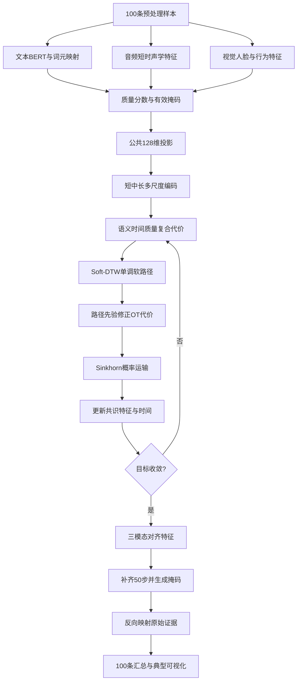
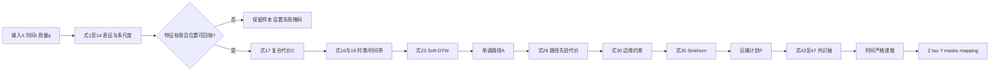
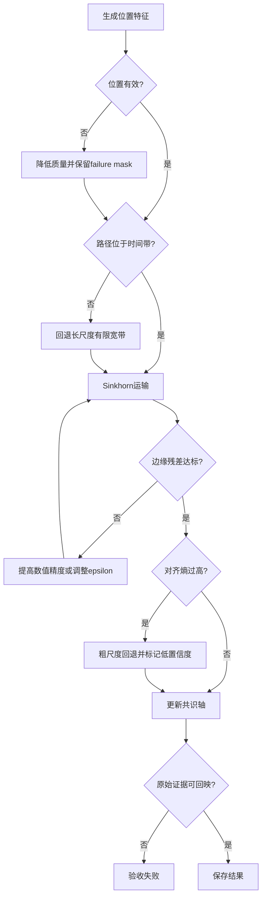

# 问题一：单调最优传输与 Soft-DTW 多尺度对齐完整建模方案

> 模型组成：**多尺度时序编码 + Soft-DTW 单调约束 + Sinkhorn 最优传输 + 三模态共识时间轴**。
>
> 研究对象为附件1的100条英文视频。目标是生成可复现、可核验、能回映原始文本/音频/视频的三模态特征与对齐结果，不是完成问题二的情感预测。

## 1 问题重述与子任务划分

文本以词元为单位，语音以毫秒窗口为单位，视觉以帧为单位；三种模态异维、异步、变长，且语调和表情可能相对语言提前或滞后。因此不能简单截断或线性缩放，所建模型需同时满足：时间顺序不逆转、一对多软对应、局部时滞、质量感知、多尺度表达、原始证据可追溯、100条全覆盖。

| 子任务 | 直接目标 | 隐含目标 | 输出 |
|---|---|---|---|
| 1. 三模态表征 | 将文本、语音、视觉转换成变长向量序列 | 保留原始位置、时间和质量 | 未对齐特征、有效掩码、质量分数 |
| 2. 多尺度编码 | 建立短、中、长时序上下文 | 同时捕捉词内韵律与跨词表情延迟 | 公共维度多尺度表示 |
| 3. Soft-DTW | 求保持顺序的柔性路径 | 允许局部伸缩与有限滞后 | 单调软路径先验 |
| 4. Sinkhorn OT | 求满足边缘分布的一对多概率匹配 | 降低硬路径对噪声的敏感性 | 运输矩阵、对齐熵、边缘残差 |
| 5. 共识时间轴 | 三模态统一到最多50个位置 | 不把任一模态当作绝对真值 | 对齐特征、有效长度、掩码、时间映射 |
| 6. 全量验收 | 检查100条完整、稳定、可回映 | 形成论文全量表与典型案例 | 汇总表、消融、热力图、复现记录 |

## 2 已有数据及建模含义

当前预处理结果已经通过校验。

| 数据事实 | 实际结果 | 建模含义 |
|---|---:|---|
| 样本 | 100 | 不从头训练大型编码器；冻结预训练骨干，只训练轻量层 |
| 文本词数 | 5～65 | 支持变长输入；65词样本不能直接截断为50词 |
| 文本轻量词元 | 2144 | 用于原文回映；模型仍需WordPiece及字符映射 |
| 音频 | 100条、16 kHz、单声道PCM | 统一提取短时声学特征 |
| 音频实际时长 | 2.228～29.109 s | 时间轴使用WAV实际时长 |
| 视觉 | 3977张可读帧 | 形成5 fps视觉序列 |
| 单样本视觉长度 | 12～147步 | 必须采用变长序列和有效掩码 |
| 视觉实际时长 | 2.236～29.267 s | 使用真实帧时间戳，不用容器估算时长 |
| 低分辨率视频 | 30条 | 人脸置信度必须进入质量模型 |
| 标签分布 | 负18、中25、正57 | 标签只作情感保持性验证或弱监督 |

音频与视觉实际时长最大差约0.175 s，说明“视觉短于容器”主要是MP4元数据高估，不是84条视觉缺失。边界差异由有效掩码处理，禁止按容器估算时长补造帧。

## 3 变量定义

### 3.1 索引与输入变量

| 符号 | 角色/类型 | 含义 | 单位或范围 |
|---|---|---|---|
| $n$ | 离散索引 | 样本 | $n=1,\ldots,100$ |
| $m,r$ | 离散索引 | 模态T/A/V | $m,r\in\{T,A,V\}$ |
| $s$ | 离散索引 | 短/中/长尺度 | $s\in\{1,2,3\}$ |
| $i,j$ | 离散索引 | 两个模态的位置 | $1\le i\le L_n^m$，$1\le j\le L_n^r$ |
| $k$ | 离散索引 | 共识位置 | $1\le k\le K_n\le50$ |
| $\mathbf x_{n,i}^m$ | 已知连续向量 | 原始模态特征 | $\mathbb R^{d_m}$ |
| $t_{n,i}^m$ | 已知连续变量 | 音频/视觉实际时间；文本为顺序坐标 | 秒或$[0,1]$ |
| $[b_{n,i}^m,e_{n,i}^m]$ | 已知区间 | 原始字符、音频时间或视频帧边界 | 索引或秒 |
| $q_{n,i}^m$ | 派生连续变量 | 位置质量 | $[0,1]$ |
| $v_{n,i}^m$ | 派生离散变量 | 有效掩码 | $\{0,1\}$ |

### 3.2 决策变量、中间变量与目标变量

| 变量 | 类别 | 类型 | 含义与约束 |
|---|---|---|---|
| $W_m,b_m$ | 决策变量 | 连续参数 | 模态投影，$W_m\in\mathbb R^{d\times d_m}$ |
| $\Theta_m^s$ | 决策变量 | 连续参数 | 模态$m$、尺度$s$的轻量时序编码器参数 |
| $\ell_{mr}^s$ | 决策变量 | 连续 | 模态时滞，$|\ell_{mr}^s|\le\ell_{max}^s$ |
| $\mathbf e_{n,i}^{m,s}$ | 中间变量 | 连续向量 | 公共$d$维多尺度表示 |
| $C_{n,ij}^{mr,s}$ | 中间变量 | 连续 | 局部匹配代价，$C\ge0$ |
| $R_{n,ij}^{mr,s}$ | 中间变量 | 连续 | Soft-DTW累计代价 |
| $A_{n,ij}^{mr,s}$ | 中间变量 | 连续 | Soft-DTW期望路径强度，$A\ge0$ |
| $P_{n,ij}^{mr,s}$ | 决策变量 | 连续 | Sinkhorn运输质量，$P\ge0$且满足边缘约束 |
| $\omega_s$ | 决策/超参数 | 连续 | 尺度权重，$\omega_s\ge0,\sum_s\omega_s=1$ |
| $\beta_n^m$ | 派生/决策 | 连续 | 模态可靠性权重，$\beta_n^m\ge0,\sum_m\beta_n^m=1$ |
| $\tau_{n,k}$ | 目标变量 | 连续 | 共识时间，$0\le\tau_{n,1}<\cdots<\tau_{n,K_n}\le T_n$ |
| $\mathbf z_{n,k}$ | 目标变量 | 连续向量 | 共识表示，$\mathbb R^d$ |
| $\mathbf y_{n,k}^m$ | 目标变量 | 连续向量 | 模态$m$的对齐特征，$\mathbb R^d$ |
| $M_{n,k}$ | 目标变量 | 二元 | 共识有效掩码，$\{0,1\}$ |
| $U_{n,k}$ | 目标变量 | 连续 | 归一化对齐熵，$[0,1]$ |

## 4 核心假设

| 编号 | 假设 | 合理性 | 失效处理 |
|---|---|---|---|
| H1 | 样本内部语义整体按时间顺序发展，允许拉伸但不大规模逆序 | 语言、语音、表情来自同一说话过程，是DTW单调路径的基础 | 用路径交叉率检查，异常样本标记复核 |
| H2 | 情感语调和表情相对文本的时滞局部且有界 | 可提前/延后，但不应任意跨越整段视频 | 按尺度设置有限时间带，长尺度允许更大时滞 |
| H3 | 通用预训练模型提供稳定基础表示 | 100条不足以从头训练大模型，题目允许通用预训练工具 | 冻结主干，只学习轻量投影和对齐参数 |
| H4 | SNR、人脸置信度、清晰度等可近似表示位置可靠性 | 它们直接关联特征噪声 | 质量只改变代价和运输质量，不删除原位置 |
| H5 | 情感过程具有多尺度平滑性，最多50个共识位置能保留主要信息 | 附件2官方接口为50步，文本绝大多数少于50词 | 长文本质量感知合并，并报告压缩/重构误差 |

## 5 模型准备与训练原则

1. `manifest.csv`是唯一入口；基础预处理目录只读。
2. 文本、音频、视觉分别提取，不在特征阶段提前补齐到50步。
3. BERT、通用声学模型和人脸工具主干冻结，训练公共投影、轻量TCN/Transformer和尺度门控。
4. 若标签参与辅助训练，按`video_id`分组做5折交叉验证，避免同一原视频的clip泄漏。
5. 固定随机种子，保存配置、环境、模型权重和数据哈希。
6. 某模态失败时保留样本，用`failure_mask`和低质量权重表达。

## 6 三模态基础特征模型

### 6.1 文本

设原始第$i$个词对应WordPiece集合$\mathcal P_{n,i}$，冻结BERT产生$\mathbf h_{n,p}^B\in\mathbb R^{768}$：

$$
\mathbf x_{n,i}^{T}=\frac{1}{|\mathcal P_{n,i}|}
\sum_{p\in\mathcal P_{n,i}}\mathbf h_{n,p}^{B}.
\tag{1}
$$

式(1)既保留上下文信息，也能回映原词。文本没有真实秒级边界，只定义相对语序：

$$
u_{n,i}^{T}=\frac{i-\tfrac12}{L_n^T}.
\tag{2}
$$

文本质量为：

$$
q_{n,i}^{T}=v_{n,i}^{T}(1-r_{n,i}^{unk})(1-r_{n,i}^{trunc}),
\tag{3}
$$

其中$r^{unk}$和$r^{trunc}$分别为未知词和截断影响。65词样本完整提取，最后由共识轴压缩。

### 6.2 语音

使用25 ms窗、10 ms移位：

$$
b_{n,j}^{A}=(j-1)h_A,\qquad e_{n,j}^{A}=b_{n,j}^{A}+w_A,
\quad w_A=0.025\text{s},\ h_A=0.010\text{s}.
\tag{4}
$$

窗口特征可由openSMILE低层描述符或固定自监督声学嵌入构成：

$$
\mathbf x_{n,j}^{A}=[\mathrm{F0},\mathrm{energy},\mathrm{MFCC},
\mathrm{spectral},\mathrm{voice\ quality},\mathrm{SSL}]_{n,j}.
\tag{5}
$$

位置质量：

$$
q_{n,j}^{A}=v_{n,j}^{A}\sigma(c_0+c_1\widetilde{\mathrm{SNR}}_{n,j}
+c_2\mathrm{VAD}_{n,j}-c_3\mathrm{clip}_{n,j}).
\tag{6}
$$

静音可能表达停顿情绪，因此VAD低只降低质量，不直接删除窗口。

### 6.3 视觉

对5 fps帧提取：

$$
\mathbf x_{n,k}^{V}=[\mathrm{AU},\mathrm{pose},\mathrm{gaze},
\mathrm{expression\ embedding}]_{n,k}.
\tag{7}
$$

多人时选择与上一帧轨迹重叠最大且累计出现时间最长的主体。质量定义：

$$
q_{n,k}^{V}=v_{n,k}^{V}p_{n,k}^{face}(1-o_{n,k})
\min\left(1,\frac{B_{n,k}}{B_0}\right),
\tag{8}
$$

$p^{face}$为人脸置信度，$o$为遮挡比例，$B$为清晰度。连续失败1～2帧可插值但保留失败标记；长段失败不插值。

### 6.4 鲁棒标准化与公共投影

$$
\widetilde x_{n,i,p}^{m}=\operatorname{clip}\left(
\frac{x_{n,i,p}^{m}-\operatorname{median}(x_{\cdot,\cdot,p}^{m})}
{\operatorname{IQR}(x_{\cdot,\cdot,p}^{m})+\delta},-5,5\right).
\tag{9}
$$

式(9)避免极端F0、姿态或表情值支配距离。公共投影：

$$
\mathbf h_{n,i}^{m}=\operatorname{LN}(W_m\widetilde{\mathbf x}_{n,i}^{m}+b_m)
+\operatorname{PE}(u_{n,i}^{m}).
\tag{10}
$$

为防止无监督投影塌缩，引入样本级跨模态对比损失：

$$
\mathcal L_{con}=-\sum_n\sum_{m\ne r}\log
\frac{\exp(\operatorname{sim}(\mathbf g_n^m,\mathbf g_n^r)/\tau_c)}
{\sum_{n'}\exp(\operatorname{sim}(\mathbf g_n^m,\mathbf g_{n'}^r)/\tau_c)},
\tag{11}
$$

$\mathbf g_n^m$为质量加权的样本级池化向量。同样本跨模态为正对，不同样本为负对。

## 7 多尺度时序编码

| 尺度 | 文本窗口 | 语音范围 | 视觉窗口 | 含义 |
|---|---:|---:|---:|---|
| 短 | 1词 | 约0.20 s | 1帧/0.20 s | 词内重音、瞬时表情 |
| 中 | 3词 | 约0.60 s | 3帧/0.60 s | 短语语调、连续动作 |
| 长 | 5词 | 约1.0～1.2 s | 5帧/1.0 s | 跨词趋势、表情滞后 |

当前视觉仅5 fps，不能声称捕捉几十毫秒微表情。尺度$s$邻域$\mathcal N_s(i)$的质量加权聚合为：

$$
\overline{\mathbf h}_{n,i}^{m,s}=
\frac{\sum_{r\in\mathcal N_s(i)}q_{n,r}^{m}v_{n,r}^{m}\mathbf h_{n,r}^{m}}
{\sum_{r\in\mathcal N_s(i)}q_{n,r}^{m}v_{n,r}^{m}+\delta}.
\tag{12}
$$

随后用轻量时序卷积或最多2层Transformer编码：

$$
\mathbf e_{n,i}^{m,s}=f_{\Theta_m^s}^{m,s}
(\overline{\mathbf h}_{n,i}^{m,s},\operatorname{PE}(u_{n,i}^{m})).
\tag{13}
$$

尺度权重：

$$
\omega_s=\frac{\exp(\eta_s)}{\sum_{r=1}^{3}\exp(\eta_r)},
\qquad\omega_s\ge0,\quad\sum_s\omega_s=1.
\tag{14}
$$

## 8 跨模态局部代价与时间约束

音视频使用实际时间归一化：

$$
u_{n,i}^{m}=t_{n,i}^{m}/T_n^{m},\qquad m\in\{A,V\}.
\tag{15}
$$

允许尺度相关时滞：

$$
|\ell_{mr}^{s}|\le\ell_{max}^{s},\qquad
\ell_{max}^{1}<\ell_{max}^{2}<\ell_{max}^{3}.
\tag{16}
$$

建议上界为0.4、0.8、1.5 s。复合代价：

$$
\begin{aligned}
C_{n,ij}^{mr,s}={}&\lambda_{sem}^{s}\left(1-
\frac{\langle\mathbf e_{n,i}^{m,s},\mathbf e_{n,j}^{r,s}\rangle}
{\|\mathbf e_{n,i}^{m,s}\|_2\|\mathbf e_{n,j}^{r,s}\|_2+\delta}\right)\\
&+\lambda_{time}^{s}\rho(u_{n,i}^{m}-u_{n,j}^{r}-\ell_{mr}^{s})\\
&+\lambda_q^{s}\{-\log(q_{n,i}^{m}q_{n,j}^{r}+\delta)\}.
\end{aligned}
\tag{17}
$$

三项分别表示内容距离、时间距离和低质量惩罚。时间项采用Huber函数：

$$
\rho(z)=\begin{cases}
z^2/(2\kappa),&|z|\le\kappa,\\
|z|-\kappa/2,&|z|>\kappa.
\end{cases}
\tag{18}
$$

若：

$$
|u_{n,i}^{m}-u_{n,j}^{r}-\ell_{mr}^{s}|>B_s,
\tag{19}
$$

则令$C_{n,ij}^{mr,s}=M$，其中$M$为极大常数。短尺度使用窄带，长尺度使用宽带，以限制跨段错误匹配并降低计算量。

## 9 Soft-DTW 单调柔性路径

### 9.1 合法路径与传统DTW

对长度$L_m,L_r$的两序列，路径$\Pi\in\{0,1\}^{L_m\times L_r}$必须从$(1,1)$到$(L_m,L_r)$，每步仅允许$(1,0)$、$(0,1)$、$(1,1)$，因而不会逆序。传统DTW为：

$$
\operatorname{DTW}(C)=\min_{\Pi\in\mathcal A(L_m,L_r)}\langle\Pi,C\rangle.
\tag{20}
$$

硬最短路径对噪声和多个近优路径敏感，因此使用光滑最小：

$$
\operatorname{softmin}_{\gamma}(a_1,\ldots,a_K)
=-\gamma\log\sum_{k=1}^{K}\exp(-a_k/\gamma),\quad\gamma>0.
\tag{21}
$$

$\gamma\to0$时逼近硬最小；$\gamma$增大时允许更多近优路径参与。

### 9.2 动态规划推导

边界条件：

$$
R_{0,0}=0,\qquad R_{i,0}=R_{0,j}=+\infty.
\tag{22}
$$

递推：

$$
R_{i,j}=C_{i,j}+\operatorname{softmin}_{\gamma_s}
(R_{i-1,j},R_{i,j-1},R_{i-1,j-1}).
\tag{23}
$$

最终代价：

$$
\operatorname{sDTW}_{\gamma_s}(C)=R_{L_m,L_r}.
\tag{24}
$$

式(23)是单调约束的核心：当前位置只能由左、上、左上到达；横向或纵向连续步实现一对多匹配和局部时间伸缩。

### 9.3 软路径先验

$$
A_{ij}^{mr,s}=
\frac{\partial\operatorname{sDTW}_{\gamma_s}(C^{mr,s})}
{\partial C_{ij}^{mr,s}}.
\tag{25}
$$

$A_{ij}$表示位置$(i,j)$被所有可能路径访问的期望强度。归一化为：

$$
\overline A_{ij}^{mr,s}=
\frac{A_{ij}^{mr,s}+\delta}
{\sum_{p,q}(A_{pq}^{mr,s}+\delta)}.
\tag{26}
$$

Soft-DTW路径不严格控制每个位置应输出多少质量，因此式(26)只作为最优传输的单调先验。若Soft-DTW参与训练，采用去偏差形式：

$$
D_{\gamma}(X,Y)=\operatorname{sDTW}_{\gamma}(X,Y)
-\tfrac12\operatorname{sDTW}_{\gamma}(X,X)
-\tfrac12\operatorname{sDTW}_{\gamma}(Y,Y).
\tag{27}
$$

## 10 Sinkhorn 熵正则最优传输

### 10.1 质量边缘分布

$$
a_i^m=\frac{q_i^mv_i^m+\delta}{\sum_p(q_p^mv_p^m+\delta)},
\qquad
b_j^r=\frac{q_j^rv_j^r+\delta}{\sum_q(q_q^rv_q^r+\delta)}.
\tag{28}
$$

高质量位置拥有更大运输质量；失败位置仅保留数值稳定所需的极小质量。

### 10.2 融合三尺度和路径先验

$$
\widehat C_{ij}^{mr}=
\sum_{s=1}^{3}\omega_s
\left[C_{ij}^{mr,s}-\lambda_{path}
\log(\overline A_{ij}^{mr,s}+\delta)\right].
\tag{29}
$$

不在合理单调路径上的点具有很小$\overline A$，式(29)会显著提高其代价；路径支持较强的点仍允许概率匹配。

### 10.3 运输约束与目标

可行域：

$$
\mathcal U(\mathbf a,\mathbf b)=
\{P\in\mathbb R_+^{L_m\times L_r}:P\mathbf1=\mathbf a,
P^\top\mathbf1=\mathbf b\}.
\tag{30}
$$

求解：

$$
P^{mr*}=\arg\min_{P\in\mathcal U(\mathbf a,\mathbf b)}
\{\langle P,\widehat C^{mr}\rangle-\varepsilon H(P)\},
\tag{31}
$$

其中：

$$
H(P)=-\sum_{i,j}P_{ij}(\log P_{ij}-1).
\tag{32}
$$

第一项最小化匹配成本，熵项保留多个近似合理对应。$\varepsilon$过小导致近硬匹配且数值不稳，过大则过度分散。

### 10.4 Sinkhorn迭代

$$
K=\exp(-\widehat C/\varepsilon),
\tag{33}
$$

$$
P=\operatorname{diag}(\mathbf u)K\operatorname{diag}(\mathbf v).
\tag{34}
$$

交替缩放：

$$
\mathbf u^{(r+1)}=\mathbf a\oslash(K\mathbf v^{(r)}),
\qquad
\mathbf v^{(r+1)}=\mathbf b\oslash(K^\top\mathbf u^{(r+1)}).
\tag{35}
$$

$\oslash$为逐元素除法。当：

$$
\|P\mathbf1-\mathbf a\|_1+
\|P^\top\mathbf1-\mathbf b\|_1<\epsilon_{marg}
\tag{36}
$$

时停止。实际求解使用log-domain Sinkhorn，防止指数下溢。

### 10.5 对齐不确定性

$$
p(j\mid i)=\frac{P_{ij}}{\sum_qP_{iq}+\delta},
\tag{37}
$$

$$
U_i^{m\to r}=-\frac{\sum_jp(j\mid i)
\log(p(j\mid i)+\delta)}{\log L_r}.
\tag{38}
$$

$U\approx0$表示匹配集中，$U\approx1$表示模糊。高熵同时伴随高运输成本和低质量时，回退到长尺度或列入复核。

## 11 三模态共识时间轴

### 11.1 共识长度和初始化

$$
K_n=\min\left(50,\max\left[L_n^T,
\left\lceil\frac{T_n}{\Delta_c}\right\rceil\right]\right),
\qquad T_n=\max(T_n^A,T_n^V).
\tag{39}
$$

推荐$\Delta_c=0.5$ s。该式兼顾文本位置数和时间分辨率，长样本最多50步。初始化：

$$
\tau_{n,k}^{(0)}=\frac{k-\tfrac12}{K_n}T_n.
\tag{40}
$$

### 11.2 模态可靠性

$$
Q_n^m=\frac{\sum_iq_{n,i}^mv_{n,i}^m}
{\sum_iv_{n,i}^m+\delta}.
\tag{41}
$$

$$
\beta_n^m=\beta_{min}+(1-3\beta_{min})
\frac{\exp(Q_n^m/\tau_q)}
{\sum_{r\in\mathcal M}\exp(Q_n^r/\tau_q)}.
\tag{42}
$$

$0<\beta_{min}<1/3$防止低质量模态被完全忽略，保证仍输出三模态结果。

### 11.3 运输重心目标

把共识节点视为第四个序列，分别计算$T\to Z$、$A\to Z$、$V\to Z$的Soft-DTW先验和Sinkhorn计划。共识特征最小化：

$$
\mathcal J_Z=\sum_{m}\beta_n^m\sum_{i,k}P_{n,ik}^{mZ}
\|\mathbf e_{n,i}^{m}-\mathbf z_{n,k}\|_2^2
+\lambda_{smooth}\sum_{k=2}^{K_n}
\|\mathbf z_{n,k}-\mathbf z_{n,k-1}\|_2^2.
\tag{43}
$$

忽略平滑项时有闭式更新：

$$
\mathbf z_{n,k}=\frac{\sum_m\beta_n^m\sum_iP_{n,ik}^{mZ}
\mathbf e_{n,i}^{m}}
{\sum_m\beta_n^m\sum_iP_{n,ik}^{mZ}+\delta}.
\tag{44}
$$

含平滑项时是凸二次问题：

$$
(D+\lambda_{smooth}L)Z=B,
\tag{45}
$$

$D$为接收运输质量的对角阵，$L$为一维链图拉普拉斯矩阵，可用三对角线性方程求解。

共识时间只由有真实秒级时间的音频和视觉更新：

$$
\tau_{n,k}=\frac{\sum_{m\in\{A,V\}}\beta_n^m
\sum_iP_{n,ik}^{mZ}t_{n,i}^{m}}
{\sum_{m\in\{A,V\}}\beta_n^m
\sum_iP_{n,ik}^{mZ}+\delta}.
\tag{46}
$$

更新时间后做等距单调投影，满足：

$$
0\le\tau_{n,1}<\tau_{n,2}<\cdots<\tau_{n,K_n}\le T_n.
\tag{47}
$$

### 11.4 对齐特征、填充与映射

$$
\mathbf y_{n,k}^{m}=\frac{\sum_iP_{n,ik}^{mZ}\mathbf e_{n,i}^{m}}
{\sum_iP_{n,ik}^{mZ}+\delta}.
\tag{48}
$$

$$
M_{n,k}=\mathbb I(k\le K_n),\qquad
\mathbf y_{n,k}^{m}=\mathbf0\quad(k>K_n).
\tag{49}
$$

必须分开保存`valid_mask`、`padding_mask`、`failure_mask`和`low_quality_mask`。每个共识位置取累计运输质量覆盖90%的最小集合：

$$
\mathcal I_{n,k}^{m}=\operatorname{TopMass}_{0.90}
(\{P_{n,ik}^{mZ}\}_{i=1}^{L_n^m}).
\tag{50}
$$

据此还原文本字符范围、音频起止秒数、视觉帧号与时间；软匹配因此仍然可人工核查。

## 12 联合目标函数

$$
\begin{aligned}
\min_{\Theta,W,\ell,P,Z,\tau}\ \mathcal L
={}&\lambda_{rep}\mathcal L_{con}
+\sum_{n,m,s}\beta_n^m\omega_sD_{\gamma_s}(E_n^{m,s},Z_n^s)\\
&+\lambda_{OT}\sum_{n,m,s}\omega_s
[\langle P_n^{mZ,s},\widehat C_n^{mZ,s}\rangle
-\varepsilon_sH(P_n^{mZ,s})]\\
&+\lambda_Z\sum_n\mathcal J_{Z,n}
+\lambda_{lag}\sum_{m<r,s}(\ell_{mr}^{s})^2
+\lambda_{reg}\|\Theta\|_2^2.
\end{aligned}
\tag{51}
$$

六部分依次表示：公共空间防塌缩、Soft-DTW单调路径、熵正则运输、共识重心、时滞限制和参数正则。约束由式(16)、(19)、(30)、(36)、(47)、(49)共同给出。

可选情感保持损失：

$$
\mathcal L_{emo}=\operatorname{CE}(\hat y_n^{cls},y_n^{cls})
+\lambda_y\operatorname{Huber}(\hat y_n^{reg},y_n^{reg}).
\tag{52}
$$

它只证明对齐特征没有丢失情感信息，必须按`video_id`分组交叉验证，不能冒充问题二结果。

## 13 完整建模与求解步骤

1. 读取100条样本及真实音视频时间戳；
2. 分别提取文本、音频、视觉特征和位置质量；
3. 鲁棒标准化并投影到公共$d$维空间；
4. 生成短、中、长三尺度表示；
5. 按式(39)确定$K_n$并初始化共识时间/特征；
6. 按式(17)计算语义、时间、质量复合代价；
7. 按式(22)～(26)计算Soft-DTW单调软路径；
8. 按式(28)～(36)求Sinkhorn运输计划；
9. 按式(44)～(47)更新共识特征和时间；
10. 重复步骤6～9，直到目标相对变化$<10^{-4}$或达到20次；
11. 按式(48)得到三模态对齐特征，补齐到50步；
12. 按式(50)生成原始证据映射；
13. 写出特征、掩码、成本、熵、残差、配置和状态。

```text
for each sample n:
    X_T, q_T, pos_T  = encode_text(n)
    X_A, q_A, time_A = encode_audio(n)
    X_V, q_V, time_V = encode_vision(n)
    E[m,s] = multiscale_encode(X_m, q_m, s)
    initialize K_n, consensus Z and time tau
    repeat:
        C[m,s] = semantic_cost + temporal_cost + quality_cost
        A[m,s] = soft_dtw_expected_path(C[m,s], monotonic_band)
        C_hat[m] = fuse_scales_and_path_prior(C[m,*], A[m,*])
        P[m] = log_sinkhorn(C_hat[m], quality_marginals)
        Z = transport_barycenter(P, E)
        tau = monotonic_time_projection(P_audio, P_vision)
    until converged
    Y_T, Y_A, Y_V = transport_pool(P, E)
    pad to 50, create masks, reverse mappings, validate and save
```

## 14 建模流程图

### 14.1 总体流程



### 14.2 变量→公式→约束→目标



### 14.3 决策节点



## 15 参数建议与选择原则

| 参数 | 建议初值 | 作用 | 选择原则 |
|---|---:|---|---|
| 公共维数$d$ | 128 | 统一三模态维数 | 比较64/128/256，优先稳定且文件小者 |
| Soft-DTW温度$\gamma_s$ | 0.05/0.10/0.20 | 控制路径软化 | 代价先除以中位数，再调温度 |
| Sinkhorn系数$\varepsilon_s$ | 0.03/0.05/0.10 | 控制运输分散 | 联合观察边缘残差和熵 |
| 时间带$B_s$ | 0.10/0.20/0.30 | 限制跨段匹配 | 长尺度允许较大滞后 |
| 共识间隔$\Delta_c$ | 0.5 s | 控制共识长度 | 多数样本不超过50步 |
| 模态权重下限$\beta_{min}$ | 0.10 | 防止完全丢弃某模态 | 做0.05/0.10/0.15消融 |
| 边缘残差阈值 | $10^{-4}$ | Sinkhorn收敛标准 | 100条使用统一标准 |
| 共识迭代上限 | 20 | 控制运行时间 | 同时保存实际迭代数 |
| 证据质量覆盖 | 90% | 生成可读原始区间 | 比较80%、90%、95% |
| 数值稳定常数$\delta$ | $10^{-8}$ | 防止除零和对数零 | 全流程固定 |

参数不能根据少数“图好看”的样本选择。建议使用如下多指标规则：先淘汰边缘残差、NaN或可追溯性不合格的设置，再对循环一致性、路径交叉率、扰动稳定性、信息保持和运行时间做Pareto选择。

## 16 无逐词真值条件下的验收指标

问题一没有人工逐词对齐真值，不能虚构“对齐准确率”。应评价数学可行性、单调性、三模态一致性、稳定性、信息保真和可追溯性。

### 16.1 边缘可行性

$$
E_{marg}=\|P\mathbf1-\mathbf a\|_1+
\|P^\top\mathbf1-\mathbf b\|_1.
\tag{53}
$$

绝大多数样本应满足$E_{marg}<10^{-4}$；未达到者不能进入最终对齐文件。

### 16.2 路径交叉率

$$
R_{cross}=\frac{\sum_{i<i',j>j'}P_{ij}P_{i'j'}}
{(\sum_{ij}P_{ij})^2+\delta}.
\tag{54}
$$

值越小越符合时间单调性。Soft-DTW路径先验下应接近0；若明显升高，说明Sinkhorn熵过大或时间先验过弱。

### 16.3 时间偏差

$$
E_{time}=\sum_{ij}P_{ij}|u_i^m-u_j^r-\ell_{mr}|.
\tag{55}
$$

该值并非越小绝对越好，因为真实表情可滞后；应同时报告短、中、长尺度结果和估计时滞。

### 16.4 三模态循环一致性

将运输计划转成行条件转移矩阵$\bar P$：

$$
E_{cycle}=\|\bar P^{TA}\bar P^{AV}-\bar P^{TV}\|_F.
\tag{56}
$$

如果“文本→语音→视觉”的间接映射与“文本→视觉”的直接映射差异过大，说明两两对齐不能形成稳定三模态共识。

### 16.5 扰动稳定性

对音频加轻微噪声、删除一个视觉帧、改变随机种子后重新对齐：

$$
S_{perturb}=1-\frac{\|P-P'\|_1}{2}.
\tag{57}
$$

越接近1越稳定。报告均值、标准差、5%分位数和最差样本，不能只给平均值。

### 16.6 信息保持与工程验收

信息保持指标包括：

1. 对齐前后模态重构误差；
2. 样本级表示余弦保持度；
3. 可选5折情感分类Macro-F1和回归MAE/Pearson；
4. 与线性缩放、硬DTW、仅Soft-DTW、仅Sinkhorn对照。

工程验收必须满足：

- 100条样本全部输出；
- 连续特征均为有限`float32`，无NaN/Inf；
- 每条满足`valid_length + padding_length = 50`；
- 有效零值、失败零值、填充零值的掩码互不混淆；
- 每个共识位置可回映文本、音频秒数和视频帧号；
- 配置、模型版本、权重哈希、源数据哈希完整；
- 同配置重复运行得到一致形状、映射和统计结果。

## 17 对照实验与消融

| 实验 | 改动 | 证明内容 |
|---|---|---|
| Baseline-1 | 相对位置线性缩放到50步 | 非线性时序对齐的必要性 |
| Baseline-2 | 使用硬DTW | 软路径对噪声与多解是否更稳定 |
| Baseline-3 | 仅Sinkhorn，无Soft-DTW先验 | 单调路径能否减少跨段匹配 |
| Ablation-1 | 仅Soft-DTW，无质量OT | 质量守恒一对多运输的贡献 |
| Ablation-2 | 只用单尺度 | 多尺度互补性 |
| Ablation-3 | 去掉时间代价 | 是否产生语义相似但时间错位的匹配 |
| Ablation-4 | 去掉质量权重 | 低分辨率、模糊和人脸失败的影响 |
| Ablation-5 | 固定文本为唯一锚点 | 三模态共识轴相对硬词级锚点的作用 |
| Ablation-6 | 不使用共识平滑项 | 是否出现相邻位置无意义跳变 |
| Full | 全部模块 | 最终模型 |

完整模型只有在循环一致性、稳定性、信息保持和可追溯性上形成稳定改进时才能作为论文主方案；若只改善个别样本的图形观感，应作为扩展而非主要结论。

## 18 复杂度与可执行性

两序列长度为$L_m,L_r$时：

- Soft-DTW时间和空间复杂度为$O(L_mL_r)$；
- Sinkhorn单次迭代为$O(L_mL_r)$；迭代$I$次为$O(IL_mL_r)$；
- 三尺度将成本约放大3倍；
- 三模态到共识轴只需计算$T/A/V\to Z$三组计划，避免同时维护全部高分辨率两两矩阵。

当前最大文本65词、视觉147步、共识50步，主要成本来自毫秒级音频。音频在进入OT前应通过质量加权时序卷积压缩到不超过约300个有效节点，同时保存每个节点覆盖的原始时间范围；不能直接截断原波形。100条样本可以逐样本并行，单GPU或CPU多进程均可执行。

为满足附件总量不超过50 MB：

1. 本地保留完整WAV和JPEG，但不整体提交；
2. 特征统一`float32`，最终可评估`float16`或有损压缩对结果的影响；
3. 运输矩阵只保存每个共识位置Top-K质量和区间统计，不提交全部稠密矩阵；
4. 提交配置、代码、特征形状清单、时间映射和必要的压缩特征。

## 19 异常样本与失败回退

| 情况 | 处理 | 禁止做法 |
|---|---|---|
| 低分辨率视频 | 保留，降低视觉质量，报告人脸覆盖率 | 删除样本或伪造高置信度 |
| 连续1～2帧无人脸 | 可插值但保留失败掩码 | 把插值当真实观测 |
| 长段无人脸 | 不插值，由质量OT与共识轴吸收 | 全零后当作自然零值 |
| 静音/停顿 | 保留并降低VAD质量 | 删除全部静音 |
| 65词文本 | 全量编码，最后质量感知合并 | 只保留前50词 |
| Soft-DTW不可达 | 检查时间带，回退长尺度有限宽带 | 取消所有单调约束 |
| Sinkhorn不收敛 | log-domain求解、提高精度、调整$\varepsilon$ | 忽略边缘残差直接保存 |
| 高对齐熵 | 回退长尺度并标记低置信度 | 反复调参至个案图“好看” |
| 某模态完全失败 | 保留样本，由其余模态构造共识并输出失败掩码 | 删除样本 |

## 20 最终输出清单

每条样本至少输出：

1. `text.npz`：文本特征、WordPiece、字符/单词映射、质量；
2. `audio.npz`：声学特征、窗口起止时间、VAD/SNR、质量；
3. `vision.npz`：视觉特征、帧号、秒数、人脸置信度、失败掩码；
4. `aligned_features.npz`：三个`[50,d]`对齐特征和共识表示；
5. `masks.npz`：有效、填充、失败、低质量掩码；
6. `time_mapping.csv`：共识位置到文本、音频、视觉的回映射；
7. `outputs/problem1/alignment/alignment_manifest.csv`：长度、成本、熵、边缘残差、迭代次数、状态；
8. `quality_metadata.csv`：SNR、VAD、人脸覆盖率、清晰度、截断率；
9. `resolved_config.yaml`、模型版本、权重与数据哈希；
10. 100条全量汇总表和至少1个典型三模态对齐热力图。

## 21 论文写作可直接使用的结论素材

### 21.1 方法概括

本文将文本词元、短时声学窗口与视觉帧建模为三组带顺序和质量权重的离散测度。首先采用短、中、长三尺度编码器获得公共时序表示；随后以语义距离、相对时间距离和位置质量构造跨模态代价。Soft-DTW通过动态规划产生保持时间顺序且允许局部伸缩的软路径先验，Sinkhorn熵正则最优传输在该先验下求得满足边缘质量约束的一对多概率匹配。最后，通过三模态运输重心迭代更新共识特征与实际时间位置，将异步变长序列统一为最多50个可解释位置。

### 21.2 创新性

1. **单调路径与概率运输结合**：Soft-DTW负责顺序结构，Sinkhorn负责质量守恒和一对多软对应；
2. **三模态共识而非单一锚点**：不把强制对齐文本边界视为绝对真值；
3. **质量进入数学变量**：SNR、人脸置信度、清晰度和截断率共同决定边缘质量与匹配代价；
4. **多尺度时滞**：不同尺度设置不同时间带，兼顾词内韵律和跨词表情延迟；
5. **可核验软对齐**：用累计运输质量把概率匹配还原为文本片段、音频时间和视频帧范围。

### 21.3 结果解释原则

该模型的有效性不能用不存在的逐词人工真值“准确率”证明，而应由边缘可行性、单调性、循环一致性、扰动稳定性、情感信息保持和全量可追溯性共同验证。如果复杂模型未显著优于硬DTW或词级锚定基线，应如实报告，并将其作为低置信度样本的回退模型或创新消融，而不是夸大普适优势。

## 22 主要理论依据

1. Cuturi, M. & Blondel, M. (2017). [Soft-DTW: a Differentiable Loss Function for Time-Series](https://proceedings.mlr.press/v70/cuturi17a.html). ICML/PMLR 70, 894–903。
2. Cuturi, M. (2013). [Sinkhorn Distances: Lightspeed Computation of Optimal Transport](https://papers.neurips.cc/paper_files/paper/2013/hash/af21d0c97db2e27e13572cbf59eb343d-Abstract.html). NeurIPS 26。
3. Blondel, M., Mensch, A. & Vert, J.-P. (2021). [Differentiable Divergences Between Time Series](https://proceedings.mlr.press/v130/blondel21a.html). AISTATS/PMLR 130。
