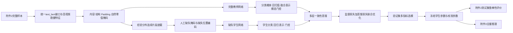
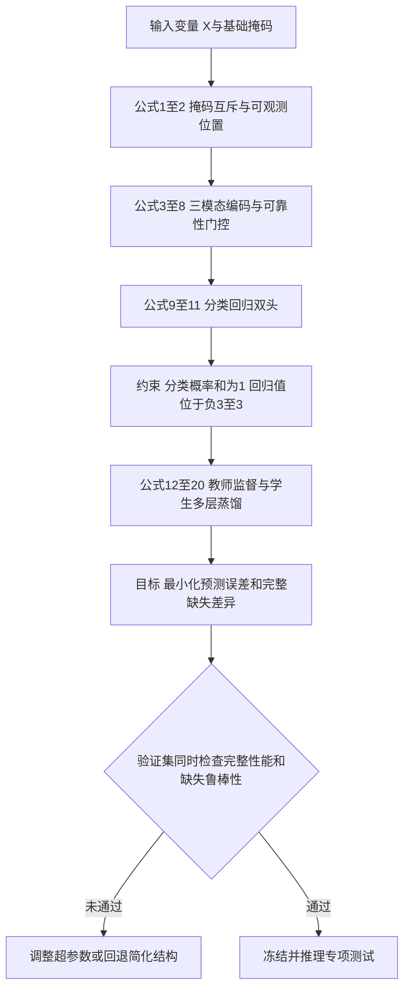
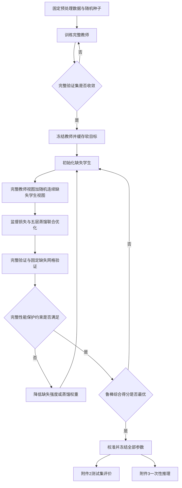

# 问题二掩码感知门控与完整缺失一致性蒸馏建模方案

## 1 建模目标与结论

问题二要求在文本、语音或视觉的局部连续时间段不可用时，同时预测三分类情感极性与连续情感强度，并定量分析缺失模态类型、缺失位置、缺失时长和缺失率对模型性能的影响。本文采用附件2已对齐版作为唯一训练、验证和普通测试数据，采用附件3已对齐版作为最终无标签专项测试数据，建立“完整教师—缺失学生”双阶段模型。

主模型记为 **Mask-aware Reliability-gated Consistency Distillation Network，MRCD-Net**，由以下部分组成：

1. 同一输入接口下的紧凑文本编码器、音频BiGRU编码器和视觉BiGRU编码器；
2. 有效位置、自然零值、人工缺失三类显式语义掩码，以及由它们派生的padding和结构位置掩码；
3. 结合样本级可用率、缺失位置、最长缺失跨度和局部上下文的可靠性门控；
4. 在完整输入上训练的教师网络和在局部缺失输入上训练的学生网络；
5. 分类概率、回归值、融合表示、样本间关系和模态贡献五层一致性蒸馏；
6. 三分类极性头与范围受约束的情感强度回归头。

最终只需要保留学生模型进行附件3推理。教师模型仅在训练阶段提供完整模态知识，不进入最终推理链路。这既控制了附件大小，又保证了部署时只维护一个模型。

## 2 问题二子任务划分

问题二可进一步分为四个相互依赖的建模子任务。

| 子任务 | 数学目标 | 使用数据 | 主要输出 |
|---|---|---|---|
| 2.1 完整模态基准学习 | 学习完整输入到分类与回归目标的映射 | 附件2训练集、验证集 | 完整教师参数、完整模态基准性能 |
| 2.2 局部缺失鲁棒学习 | 在连续片段缺失条件下逼近真实标签和完整教师 | 附件2训练集及人工缺失视图 | 掩码感知学生模型 |
| 2.3 缺失机理影响分析 | 建立性能退化对缺失类型、位置、时长和比例的响应关系 | 附件2验证集的固定缺失实验网格 | 鲁棒性曲线、因素效应和交互效应 |
| 2.4 专项测试推理 | 对无标签真实缺失样本稳定输出预测 | 附件3已对齐版30条样本 | 全量预测CSV及缺失诊断字段 |

四个子任务必须遵守同一输入接口、同一已对齐特征版本和同一预处理统计量。附件3只用于子任务2.4的最终推理，不参与网络选择、超参数调整、分类温度校准或回归校准。

## 3 数据基础与选择依据

### 3.1 已对齐版数据结构

处理后的数据由 `data_progressing/problem2_preprocess.py` 生成，核心规模如下。

| 数据划分 | 样本数 | 文本接口 | 音频形状 | 视觉形状 | 标签 |
|---|---:|---|---|---|---|
| 附件2训练集 | 3395 | `text_bert: 3×50` | `50×74` | `50×35` | 分类＋回归 |
| 附件2验证集 | 728 | `text_bert: 3×50` | `50×74` | `50×35` | 分类＋回归 |
| 附件2测试集 | 727 | `text_bert: 3×50` | `50×74` | `50×35` | 分类＋回归 |
| 附件3专项集 | 30 | `text_bert: 3×50` | `50×74` | `50×35` | 无标签 |

附件3没有附件2中的预计算768维 `text` 字段，因此模型从始至终只使用 `text_bert` 的词元编号、注意力掩码和分段编号生成文本表示。这样避免训练时使用一种文本表示、专项推理时临时更换另一种表示所导致的分布漂移。

### 3.2 为什么选择已对齐版

已对齐版三模态共享50个序列位置，局部缺失可以直接表示为“模态×时间位置”的布尔掩码。完整教师与缺失学生的中间表示也能在相同时间坐标上比较。相反，未对齐版文本为50步，而音频和视觉为500步，若作为主方案，需要额外引入跨模态注意力或时间映射，会同时增加模型参数、蒸馏对齐误差和消融实验成本。

对于当前方案，已对齐版具有以下优势：

- 连续缺失区间有明确的位置和长度定义；
- 50步序列适合轻量BiGRU或TCN；
- 三模态隐表示可在同一时间轴上进行一致性约束；
- 门控权重可解释为同一样本中三模态的动态使用程度；
- 模型、消融和缺失实验能够在有限算力内完成多随机种子验证。

## 4 符号、变量与约束

### 4.1 索引与常量

| 符号 | 含义 | 类型或单位 | 取值范围 |
|---|---|---|---|
| \(i\) | 样本索引 | 离散 | \(i=1,\ldots,N\) |
| \(t\) | 对齐时间位置 | 离散位置 | \(t=1,\ldots,T,\ T=50\) |
| \(m\) | 模态索引 | 离散 | \(m\in\{L,A,V\}\)，分别为文本、音频、视觉 |
| \(c\) | 情感类别索引 | 离散 | \(c\in\{0,1,2\}\)，分别为负向、中性、正向 |
| \(d\) | 统一隐空间维数 | 正整数 | 主方案取 \(d=128\) |
| \(K\) | 每条训练样本的预生成缺失视图数 | 正整数 | 当前取 \(K=4\) |
| \(\epsilon\) | 防止除零或对数溢出的稳定项 | 连续无量纲 | \(10^{-8}\) 或 \(10^{-6}\) |

### 4.2 输入变量

| 变量 | 类别 | 含义 | 类型 | 维度或范围 | 单位 |
|---|---|---|---|---|---|
| \(X_i^L\) | 已知输入 | 文本词元编号、注意力掩码与分段编号 | 离散整数 | \(3\times50\) | 无量纲 |
| \(X_i^A\) | 已知输入 | 稳健缩放后的音频特征 | 连续 | \(50\times74\)，值限制在 \([-8,8]\) | 标准化单位 |
| \(X_i^V\) | 已知输入 | 稳健缩放后的视觉特征 | 连续 | \(50\times35\)，值限制在 \([-8,8]\) | 标准化单位 |
| \(y_i^c\) | 监督目标 | 情感极性标签 | 离散 | \(\{0,1,2\}\) | 类别 |
| \(y_i^r\) | 监督目标 | 情感强度标签 | 连续 | \([-3,3]\) | 情感强度 |

### 4.3 掩码变量

| 变量 | 类别 | 含义 | 类型 | 约束 |
|---|---|---|---|---|
| \(C_{it}\) | 已知中间变量 | 内容位置掩码，不含CLS、SEP和padding | 二元 | \(C_{it}\in\{0,1\}\) |
| \(S_{it}\) | 已知中间变量 | CLS与SEP结构位置掩码 | 二元 | \(S_{it}\in\{0,1\}\) |
| \(P_{it}\) | 已知中间变量 | padding掩码 | 二元 | \(P_{it}\in\{0,1\}\) |
| \(Z_{it}^m\) | 已知中间变量 | 模态 \(m\) 在有效内容区的自然全零掩码 | 二元 | \(Z_{it}^m\le C_{it}\) |
| \(M_{it}^m\) | 增强决策变量 | 人工生成或专项集检测到的缺失掩码 | 二元 | \(M_{it}^m\le C_{it}\) |
| \(O_{it}^m\) | 派生中间变量 | 最终可观测位置掩码 | 二元 | \(O_{it}^m=C_{it}(1-Z_{it}^m)(1-M_{it}^m)\) |

这些掩码必须满足互斥约束：

\[
C_{it}+S_{it}+P_{it}=1, \tag{1}
\]

\[
Z_{it}^mM_{it}^m=0,\qquad O_{it}^mZ_{it}^m=O_{it}^mM_{it}^m=0. \tag{2}
\]

式（1）表示每个序列位置只能属于内容、结构或padding之一；式（2）防止同一时间位置同时被解释为自然零值和人工缺失。文本在主训练分布中保持完整，因此通常令 \(M_{it}^L=0\)，但文本缺失可以作为诊断性扩展实验。

### 4.4 决策变量、中间变量与目标变量

深度学习模型中的“决策变量”主要是需要通过优化求解的网络参数和可由验证集选择的超参数。

| 变量 | 变量角色 | 类型 | 含义 | 约束范围 |
|---|---|---|---|---|
| \(\Theta_T\) | 决策变量 | 连续高维 | 完整教师网络参数 | 由正则化和早停约束 |
| \(\Theta_S\) | 决策变量 | 连续高维 | 缺失学生网络参数 | 初始化自教师，最终用于推理 |
| \(\lambda_k\) | 决策超参数 | 连续 | 各损失项权重 | \(\lambda_k\ge0\)，仅在验证集选择 |
| \(\tau\) | 决策超参数 | 连续 | 分类蒸馏温度 | 建议 \(\tau\in[1,4]\) |
| \(\pi_m\) | 增强决策参数 | 离散概率 | 音频、视觉、双模态缺失采样概率 | \((0.2,0.2,0.6)\)，和为1 |
| \(r_i^m\) | 增强中间变量 | 连续 | 模态缺失率 | \([0.05,0.48]\) |
| \(H_{it}^{m,T},H_{it}^{m,S}\) | 中间变量 | 连续 | 教师、学生的模态时序隐表示 | \(\mathbb R^d\) |
| \(u_i^{m,T},u_i^{m,S}\) | 中间变量 | 连续 | 池化后的模态表示 | \(\mathbb R^d\) |
| \(g_i^{m,T},g_i^{m,S}\) | 中间变量 | 连续 | 三模态门控权重 | \([0,1]\)，且对 \(m\) 求和为1 |
| \(z_i^T,z_i^S\) | 中间变量 | 连续 | 教师、学生融合表示 | \(\mathbb R^{d_f}\) |
| \(p_i^T,p_i^S\) | 目标中间变量 | 连续概率 | 三分类概率 | \([0,1]^3\)，分量和为1 |
| \(\hat y_i^{r,T},\hat y_i^{r,S}\) | 目标变量 | 连续 | 预测情感强度 | \([-3,3]\) |
| \(\hat y_i^{c,T},\hat y_i^{c,S}\) | 目标变量 | 离散 | 预测情感极性 | \(\{0,1,2\}\) |

## 5 核心假设及合理性

### 假设1 已对齐位置具有近似共同语义

假设附件2、3已对齐版中相同位置的文本、音频和视觉特征描述同一局部语义区间，剩余对齐误差可由双向时序编码器和上下文窗口吸收。

**合理性：** 赛方已明确提供已对齐版本，且三模态均固定为50步。该假设是进行位置级门控和表示蒸馏的必要条件。模型不要求三模态逐元素相等，只要求相邻上下文中存在可利用的语义对应关系。

### 假设2 缺失主要表现为有效内容区内的局部不可用

假设问题二的主要缺失机制是音频、视觉在有效内容位置中的一个或多个连续片段被置零，而不是任意特征维单独缺失。

**合理性：** 题面将缺失定义为局部连续时间段不可用；附件3的数据分析也表明文本基本完整，缺失集中在音频和视觉。因此模型以时间步级掩码为基本单位，而不是进行逐特征维插补。

### 假设3 附件3的30条样本只能提供粗粒度缺失先验

假设附件3观测到的缺失率和模态组合能够用于确定合理的增强范围，但不能作为需要精确拟合的真实概率分布。

**合理性：** 30条样本不足以稳定估计高维联合分布。因此训练采用“经验分布＋平滑扩展”：双模态缺失占主要概率，同时保留单音频和单视觉缺失；缺失率覆盖观测区间而不逐点复刻附件3。

### 假设4 自然零值与人工缺失具有不同统计含义

假设训练数据中原本存在的全零视觉片段表示检测失败、无脸画面或自然稀疏，而人工缺失表示原本可用的信息被遮蔽，两者不能共用同一状态编码。

**合理性：** 训练集存在大量自然全零视觉位置。如果将其全部当作人工缺失，模型会错误学习缺失分布，并污染对缺失率的统计。预处理已经将两类零值分别存入 `natural_zero_mask` 和 `synthetic_missing_mask`。

### 假设5 附件2训练、验证和测试与附件3具有相同任务语义

假设四个数据部分遵循相同的标签定义和特征生成规则，差异主要来自缺失机制而不是情感标签含义变化。

**合理性：** 题面要求训练、验证和专项测试使用同一特征版本和输入接口。该假设允许使用附件2训练的判别边界推理附件3，但不假设附件3类别比例与训练集完全一致。

## 6 总体模型结构

模型的逻辑链是：

## 7 模型准备阶段

### 7.1 数据加载与教师学生配对

训练时，第 \(i\) 条样本有一个完整教师视图和一个学生视图。完整教师视图保留附件2原始可观测信息以及自然零值；学生视图从 `train_mask_bank.npz` 中选择一个缺失模板 \(k\)。

\[
\widetilde X_{it}^{m,S}=X_{it}^m\bigl(1-M_{it}^{m,k}\bigr), \tag{3}
\]

其中 \(M_{it}^{m,k}=1\) 表示第 \(k\) 个增强视图将该时间步置零。式（3）的物理意义是只删除原本可观测的信息，不对自然零值进行二次伪造，也不改变标签。

每轮训练随机选择不同的 \(k\)，从而使同一样本在不同轮次对应不同缺失条件。建议以0.7概率使用缺失学生视图，以0.3概率使用完整学生视图。保留完整学生视图可以限制鲁棒训练对完整模态性能造成的损害。

### 7.2 文本编码器准备

附件2、3共同提供BERT WordPiece格式的 `text_bert`。主方案使用与其词表兼容的紧凑两层文本编码器，例如隐藏维数128、2层Transformer、2至4个注意力头，并将输出投影到统一维数 \(d=128\)。教师和学生使用相同文本接口。

可采用两种初始化方式：

1. **稳妥主方案：** 使用同词表的小型通用预训练BERT初始化，前若干轮冻结词嵌入，之后仅解冻最高层；
2. **增强方案：** 训练阶段使用冻结的完整BERT作为文本教师，将词元级表示蒸馏到紧凑编码器，最终只保存紧凑编码器并进行INT8动态量化。

第二种方式可以减少文本语义损失，但不改变推理接口。不得训练时直接依赖附件2的预计算 `text`，然后在附件3推理时改用另一文本编码器。

### 7.3 音频与视觉编码器准备

音频和视觉输入分别先通过线性投影、LayerNorm和GELU映射到 \(d=128\)：

\[
e_{it}^m=\operatorname{GELU}\!\left(\operatorname{LN}(W_x^m\widetilde x_{it}^m+b_x^m)\right),
\quad m\in\{A,V\}. \tag{4}
\]

对每个时间位置构造离散状态：观测、自然零值、人工缺失、结构位置或padding。令 \(E_{state}(s_{it}^m)\) 为可学习状态嵌入，\(E_{pos}(t)\) 为位置嵌入，则编码器输入为：

\[
\bar e_{it}^m=e_{it}^m+E_{state}(s_{it}^m)+E_{pos}(t). \tag{5}
\]

式（5）保证同样的数值零向量在“自然零值”和“人工缺失”状态下具有不同表示。随后使用单层双向GRU：

\[
H_i^m=\operatorname{BiGRU}_m(\bar E_i^m;\Theta_m),
\qquad H_i^m\in\mathbb R^{T\times d}. \tag{6}
\]

BiGRU的前向状态利用左侧上下文，后向状态利用右侧上下文，因此能够利用缺失片段两端的信息推断缺失位置附近的语义。若算力或并行效率优先，可将式（6）替换为三层膨胀TCN，并在消融实验中比较二者。

## 8 缺失片段生成模型

### 8.1 缺失模态类型

主训练分布定义三种缺失组合：

\[
G_i\sim\operatorname{Categorical}(0.20,0.20,0.60), \tag{7}
\]

分别对应仅音频缺失、仅视觉缺失以及音频和视觉同时缺失。文本作为稳定锚点，在主训练分布中不缺失。为满足题目对不同模态类型影响的完整分析，可在验证诊断阶段加入仅文本缺失、文本＋音频、文本＋视觉和三模态缺失，但这些场景不用于附件3主模型调参。

### 8.2 缺失率

令 \(B_i^m\sim\operatorname{Beta}(2,4)\)，缺失率取为：

\[
r_i^m=0.05+(0.48-0.05)B_i^m. \tag{8}
\]

其期望约为 \(0.193\)，与实际生成掩码后音频19.58%、视觉19.53%的平均遮蔽率接近。上下界覆盖附件3观测到的主要缺失范围，又避免将全部信息删除。

若模态 \(m\) 的可观测内容步数为 \(n_i^m=\sum_tO_{it}^m\)，目标遮蔽步数为：

\[
\ell_i^m=\min\left\{\left\lfloor r_i^mn_i^m+0.5\right\rfloor, n_i^m-2\right\}. \tag{9}
\]

式（9）至少保留两个观测位置，防止学生在完全无信息条件下接受不合理的逐位置蒸馏约束。

### 8.3 缺失位置

将内容区按相对位置划分为句首、句中和句尾三个区域，区域变量 \(Q_i^m\) 等概率采样。然后在相应区域中随机选择连续区间起点 \(a_i^m\)，并生成：

\[
M_{it}^m=\mathbf1\left(a_i^m\le t<a_i^m+\ell_i^m\right)O_{it}^m. \tag{10}
\]

式（10）表示人工缺失只覆盖原本可观测的位置。若连续区间内部包含自然零值，人工缺失掩码不与自然零值重叠，但位置编码仍保留整个区间的相对起点和长度信息。

## 9 模态表示与样本级可靠性门控

### 9.1 掩码感知时序池化

对每个模态，根据隐状态和状态嵌入计算注意力得分：

\[
e_{it}^{att,m}=w_m^\top\tanh(W_h^mH_{it}^m+W_s^mE_{state}(s_{it}^m)+b_m). \tag{11}
\]

只在可观测位置上归一化：

\[
\alpha_{it}^m=
\frac{O_{it}^m\exp(e_{it}^{att,m})}
{\sum_{j=1}^{T}O_{ij}^m\exp(e_{ij}^{att,m})+\epsilon}. \tag{12}
\]

模态级表示为：

\[
u_i^m=\sum_{t=1}^{T}\alpha_{it}^mH_{it}^m.
\tag{13}
\]

若某模态不存在任何观测位置，则用可学习的 `all-missing` 向量替换式（13）的零结果。这比将全零序列直接送入普通平均池化更稳定。

### 9.2 可靠性变量

预处理已经为每个模态提供四个基础可靠性变量：有效内容比例、观测比例、自然零值比例和人工或检测缺失比例。为了体现“句首、句中、句尾缺失”的创新点，在模型内再从缺失掩码计算四个位置变量。

\[
q_i^m=[\rho_{valid},\rho_{obs},\rho_{nat},\rho_{miss},
\rho_{begin},\rho_{middle},\rho_{end},\rho_{longest}]_i^m. \tag{14}
\]

其中 \(\rho_{longest}\) 是最长连续缺失长度与内容长度之比。所有分量均位于 \([0,1]\)，没有量纲。

### 9.3 动态门控

门控得分定义为：

\[
\eta_i^m=w_g^\top\tanh(W_u u_i^m+W_q q_i^m+b_g)
+\gamma\log(\rho_{obs,i}^m+\epsilon). \tag{15}
\]

第二项是可用率先验。当模态大量缺失时，其门控得分自然降低；但第一项仍允许模型在少量高价值片段存在时提升该模态权重。门控权重为：

\[
g_i^m=\frac{\exp(\eta_i^m)}{\sum_{n\in\{L,A,V\}}\exp(\eta_i^n)},
\qquad \sum_mg_i^m=1. \tag{16}
\]

为了保留跨模态互补关系，不只进行简单加权求和，而是将加权模态表示和两两交互共同融合：

\[
z_i=\operatorname{LN}\left(
W_f[,g_i^Lu_i^L;g_i^Au_i^A;g_i^Vu_i^V;
u_i^L\odot u_i^A;u_i^L\odot u_i^V;u_i^A\odot u_i^V,]+b_f
\right). \tag{17}
\]

式（17）中 \(\odot\) 表示逐元素乘积。缺失模态的门控会下降，相应交互项也会减弱；文本仍可作为稳定锚点，但模型不会被硬编码成文本独占。

## 10 分类回归双头

### 10.1 分类头

\[
o_i=W_cz_i+b_c,\qquad
p_{ic}=\frac{\exp(o_{ic})}{\sum_{j=0}^{2}\exp(o_{ij})},\qquad
\hat y_i^c=\arg\max_cp_{ic}. \tag{18}
\]

式（18）给出负向、中性和正向三类概率。使用训练集类别权重：

\[
w_c=(1.1703,1.4930,0.6776), \tag{19}
\]

分别对应负向、中性和正向，以降低多数正向类别对整体Accuracy的主导作用。

### 10.2 回归头

\[
\hat y_i^r=3\tanh(w_r^\top z_i+b_r). \tag{20}
\]

式（20）利用双曲正切将预测严格限制在赛题要求的 \([-3,3]\) 范围内，避免测试时再进行不可微的硬裁剪。

### 10.3 双任务一致性

三分类概率可以映射为有符号极性分数：

\[
s_i=p_{i,2}-p_{i,0}\in[-1,1]. \tag{21}
\]

回归预测归一化后为 \(\hat y_i^r/3\)。定义双头一致性损失：

\[
\mathcal L_{coh}=\frac1N\sum_i
\operatorname{SmoothL1}\left(s_i,\frac{\hat y_i^r}{3}\right). \tag{22}
\]

式（22）只约束预测符号和粗粒度方向一致，不强制三分类概率精确表达回归幅度，因此不会替代两个任务各自的监督。

## 11 完整教师模型

教师网络接收不含人工缺失的附件2训练样本，其自然零值掩码仍保留。教师监督分类损失为加权交叉熵：

\[
\mathcal L_{cls}^{T}=-\frac1N\sum_iw_{y_i^c}\log p_{i,y_i^c}^{T}. \tag{23}
\]

回归损失同时对应MAE和Pearson两个评价方向：

\[
\mathcal L_{reg}^{T}=
\frac1N\sum_i\operatorname{SmoothL1}(\hat y_i^{r,T},y_i^r)
+\lambda_{corr}\left(1-\operatorname{Corr}(\hat{\boldsymbol y}^{r,T},\boldsymbol y^r)\right). \tag{24}
\]

其中批内相关系数为：

\[
\operatorname{Corr}(a,b)=
\frac{\sum_i(a_i-\bar a)(b_i-\bar b)}
{\sqrt{\sum_i(a_i-\bar a)^2}\sqrt{\sum_i(b_i-\bar b)^2}+\epsilon}. \tag{25}
\]

教师总损失为：

\[
\mathcal L_T=\mathcal L_{cls}^{T}
+\lambda_r\mathcal L_{reg}^{T}
+\lambda_{coh}\mathcal L_{coh}^{T}
+\lambda_{wd}\lVert\Theta_T\rVert_2^2. \tag{26}
\]

式（26）的目标是先获得稳定的完整模态决策边界。教师在验证集的完整数据上早停，并冻结所有参数后才开始学生蒸馏，避免教师目标随学生更新而漂移。

## 12 缺失学生与多层一致性蒸馏

学生与教师采用同构或近似同构的轻量网络，初始参数从教师复制。区别在于学生输入包含人工连续缺失，且可靠性变量和状态嵌入显式反映缺失情况。

### 12.1 学生监督损失

\[
\mathcal L_{sup}^{S}=\mathcal L_{cls}^{S}
+\lambda_r\mathcal L_{reg}^{S}
+\lambda_{coh}\mathcal L_{coh}^{S}. \tag{27}
\]

真实标签始终是最主要监督，蒸馏不能覆盖真实标签损失。

### 12.2 分类响应蒸馏

温度为 \(\tau\) 时：

\[
p_i^{T,\tau}=\operatorname{softmax}(o_i^T/\tau),\qquad
p_i^{S,\tau}=\operatorname{softmax}(o_i^S/\tau), \tag{28}
\]

\[
\mathcal L_{KD-cls}=\tau^2\frac1N\sum_i
D_{KL}\left(p_i^{T,\tau}\Vert p_i^{S,\tau}\right). \tag{29}
\]

式（29）使学生学习教师对非真实类别的相对判断，而不是只复制硬标签。

### 12.3 回归响应蒸馏

\[
\mathcal L_{KD-reg}=\frac1N\sum_i
\operatorname{SmoothL1}(\hat y_i^{r,S},\hat y_i^{r,T}). \tag{30}
\]

式（30）使缺失学生的强度预测接近完整教师，但仍由式（27）校正教师偏差。

### 12.4 融合表示蒸馏

先对融合表示做单位化：

\[
\bar z_i^T=\frac{z_i^T}{\lVert z_i^T\rVert_2+\epsilon},\qquad
\bar z_i^S=\frac{z_i^S}{\lVert z_i^S\rVert_2+\epsilon}, \tag{31}
\]

\[
\mathcal L_{feat}=\frac1N\sum_i
\left(1-(\bar z_i^T)^\top\bar z_i^S\right). \tag{32}
\]

式（32）直接缩小完整和缺失视图在语义空间中的方向差异。MissModal使用几何、分布和情感语义约束对齐完整与缺失表示，本模型采用与本任务更直接兼容的单位化融合表示约束，并在后续加入关系结构约束。

### 12.5 样本间关系蒸馏

定义一个批次内的相似度矩阵：

\[
R_{ij}^{T}=(\bar z_i^T)^\top\bar z_j^T,\qquad
R_{ij}^{S}=(\bar z_i^S)^\top\bar z_j^S. \tag{33}
\]

\[
\mathcal L_{rel}=\frac1{N^2}\lVert R^T-R^S\rVert_F^2. \tag{34}
\]

式（34）不要求每个样本表示逐维完全相同，而是保持样本间的相对几何关系。该设计吸收了相关性蒸馏方法强调的跨样本结构信息，也与CMAD提出的多层表示和高阶相关结构对齐思想一致。

### 12.6 可靠性感知的模态贡献蒸馏

直接令学生门控等于教师门控是不合理的，因为教师看到了完整音频或视觉，而学生的对应片段可能缺失。先根据学生可观测比例修正教师门控：

\[
\widetilde g_i^{m,T}=
\frac{g_i^{m,T}(\rho_{obs,i}^{m,S}+\epsilon)^\gamma}
{\sum_ng_i^{n,T}(\rho_{obs,i}^{n,S}+\epsilon)^\gamma}. \tag{35}
\]

再定义：

\[
\mathcal L_{gate}=\frac1N\sum_i
D_{KL}\left(\widetilde{\boldsymbol g}_i^T\Vert\boldsymbol g_i^S\right). \tag{36}
\]

式（35）保留教师对模态重要性的判断，同时把缺失模态的权重按可用率重新分配。式（36）要求学生学会“信息缺失后如何合理转移注意力”，而不是机械复制完整教师的门控。

### 12.7 教师置信度加权

为降低教师错误传播，定义教师置信度：

\[
\omega_i=1-\frac{H(p_i^T)}{\log3},\qquad
H(p_i^T)=-\sum_cp_{ic}^T\log(p_{ic}^T+\epsilon). \tag{37}
\]

\(\omega_i\in[0,1]\)。教师分类越确定，蒸馏权重越高；对高熵样本，学生更多依赖真实标签。实际实现中可将式（29）、（30）、（32）和（36）改为按 \(\omega_i\) 加权的样本均值。

### 12.8 学生总目标函数

\[
\begin{aligned}
\mathcal L_S={}&\mathcal L_{sup}^{S}
+\lambda_{kc}\mathcal L_{KD-cls}
+\lambda_{kr}\mathcal L_{KD-reg}\\
&+\lambda_f\mathcal L_{feat}
+\lambda_{rel}\mathcal L_{rel}
+\lambda_g\mathcal L_{gate}
+\lambda_{wd}\lVert\Theta_S\rVert_2^2.
\end{aligned}\tag{38}
\]

式（38）是问题二的核心优化模型。各项物理意义如下：

| 损失项 | 约束对象 | 解决的问题 |
|---|---|---|
| \(\mathcal L_{sup}^{S}\) | 真实分类与回归标签 | 防止学生只模仿教师错误 |
| \(\mathcal L_{KD-cls}\) | 三分类软概率 | 保持完整与缺失决策边界 |
| \(\mathcal L_{KD-reg}\) | 连续情感强度 | 抑制缺失导致的强度漂移 |
| \(\mathcal L_{feat}\) | 样本级融合表示 | 缩小完整缺失语义间隔 |
| \(\mathcal L_{rel}\) | 批内样本相似结构 | 保持类别与强度的相对几何关系 |
| \(\mathcal L_{gate}\) | 可靠性修正后的模态贡献 | 学习缺失后的动态权重转移 |

## 13 优化约束与训练稳定化

### 13.1 蒸馏权重渐进增加

训练早期学生表示不稳定，如果立即使用较强的关系蒸馏，可能造成梯度冲突。令第 \(e\) 轮的蒸馏系数为：

\[
\lambda_k(e)=\lambda_k^{max}
\min\left(1,\frac{e}{E_{warm}}\right). \tag{39}
\]

前 \(E_{warm}=5\) 至10轮逐步增加蒸馏强度。监督损失从第一轮起保持完整权重。

### 13.2 梯度与数值约束

- 使用AdamW优化器；
- 全局梯度范数裁剪为1.0；
- 回归头由式（20）保证范围约束；
- 关系蒸馏至少需要合理批量大小，建议批量为64；
- 计算相关系数和归一化时统一加入 \(\epsilon\)；
- padding位置不参与池化、注意力或缺失率统计；
- 自然零值和人工缺失不参与稳健缩放参数拟合。

### 13.3 完整性能保护约束

令完整验证集综合得分为 \(J_{full}\)，教师完整得分为 \(J_T\)，设置可接受退化阈值 \(\delta\)：

\[
J_{full}^{S}\ge J_T-\delta. \tag{40}
\]

建议 \(\delta\) 取教师多随机种子标准差或1个百分点中的较大者。只有满足式（40）的学生模型才参与缺失鲁棒性排序，避免以明显牺牲完整性能换取缺失指标。

## 14 分阶段建模与求解步骤

### 阶段A 数据与掩码准备

1. 运行问题二预处理，读取附件2已对齐版和附件3已对齐版；
2. 只使用附件2训练集拟合音频、视觉的分位数裁剪和IQR缩放；
3. 生成内容、结构、padding、自然零值和观测掩码；
4. 为每个训练样本生成4个确定性连续缺失视图；
5. 核验标签范围、分类回归符号一致性、NaN/Inf和掩码互斥；
6. 固定预处理配置哈希和随机种子。

### 阶段B 完整教师训练

1. 初始化紧凑文本编码器、音频BiGRU、视觉BiGRU、可靠性门控和双任务头；
2. 教师只使用完整训练视图，保留自然零值状态；
3. 按式（26）优化；
4. 每轮在完整验证集计算Accuracy、Macro-F1、MAE和Pearson；
5. 根据预先固定的多指标规则早停，而不是只选择Accuracy最高的轮次；
6. 冻结最优教师参数并缓存其训练样本输出，降低学生训练开销。

### 阶段C 缺失学生蒸馏

1. 用教师参数初始化学生；
2. 每个批次读取完整教师视图和随机缺失学生视图；
3. 教师前向传播时关闭梯度；
4. 学生计算显式掩码、位置可靠性和动态门控；
5. 按式（38）联合优化；
6. 按式（39）逐步增加蒸馏权重；
7. 验证时同时计算完整数据和固定缺失网格结果；
8. 保存满足式（40）且鲁棒性综合得分最优的学生模型。

### 阶段D 校准与冻结

1. 在附件2验证集完整场景和预先固定的缺失场景上校准分类温度；
2. 若回归存在系统性偏移，只允许在验证集拟合单调线性校准 \(a\hat y+b\)，并再次限制到 \([-3,3]\)；
3. 冻结模型权重、温度、校准参数、预处理统计量和缺失实验模板；
4. 记录最终配置、参数量、模型文件哈希和随机种子。

### 阶段E 普通测试与专项推理

1. 在附件2测试集完整场景报告基础性能；
2. 在附件2测试集或验证集固定缺失网格上报告鲁棒性曲线；
3. 对附件3的30条样本执行一次最终推理；
4. 输出极性、强度、三类概率、检测缺失率和门控权重；
5. 生成符合赛题字段要求的最终CSV，不根据附件3结果反向调参。

## 15 缺失因素规律分析模型

### 15.1 固定实验网格

随机训练增强与规律分析必须分开。训练阶段随机采样以提升泛化；规律分析使用固定模板，确保不同模型处于完全相同的缺失条件。

建议验证网格：

| 因素 | 水平 |
|---|---|
| 缺失模态类型 | A、V、A＋V；诊断扩展为L、L＋A、L＋V、L＋A＋V |
| 缺失位置 | 句首、句中、句尾、全区随机 |
| 缺失率 | 0、0.10、0.20、0.30、0.40、0.48 |
| 随机种子 | 至少3个固定种子 |

每个模板只在原本可观测内容位置生成缺失，并复用同一批样本。缺失率0是完整对照。

### 15.2 性能退化量

对越大越好的指标 \(Q\)，例如Accuracy、Macro-F1和Pearson，定义退化：

\[
\Delta_Q(g,p,r)=Q(0)-Q(g,p,r). \tag{41}
\]

对越小越好的MAE：

\[
\Delta_{MAE}(g,p,r)=MAE(g,p,r)-MAE(0). \tag{42}
\]

式（41）和（42）统一为“数值越大表示缺失损害越严重”。

### 15.3 鲁棒性曲线面积

对指标 \(Q\) 定义归一化鲁棒AUC：

\[
R_A(Q)=\frac1{r_{max}}
\int_0^{r_{max}}\frac{Q(r)}{Q(0)+\epsilon}\,dr. \tag{43}
\]

离散实验中用梯形法计算。\(R_A\) 越接近1，表示性能随缺失率下降越慢。MAE可先转换为 \(Q_{MAE}=1/(1+MAE)\) 后使用式（43）。

### 15.4 多因素效应模型

为了区分“缺失率高”与“缺失位置关键”的影响，建立退化量的混合效应回归：

\[
\begin{aligned}
\Delta_{s,g,p,r}={}&\beta_0+\beta_g+\beta_p
+\beta_1r+\beta_2r^2\\
&+\beta_{gp}+\beta_{gr}r+\beta_{pr}r
+u_s+\varepsilon_{s,g,p,r}.
\end{aligned}\tag{44}
\]

其中：

- \(g\) 是缺失模态类型；
- \(p\) 是句首、句中、句尾或随机位置；
- \(r\) 是缺失率；
- \(u_s\) 是随机种子或样本的随机效应；
- \(\beta_{gr}\) 衡量某模态对缺失率是否特别敏感；
- \(\beta_{pr}\) 衡量某位置的缺失损害是否随长度快速增加。

式（44）用于论文中的规律解释，不用于附件3预测。建议同时报告系数、Bootstrap 95%置信区间和效应量，避免只展示一张曲线后进行主观判断。

### 15.5 最坏场景指标

\[
Q_{worst}=\min_{g,p,r}Q(g,p,r), \tag{45}
\]

并记录对应的 \((g,p,r)\)。国奖导向的论证不能只报告平均鲁棒性，还应明确模型在哪种缺失组合下最容易失败。

## 16 评价指标与模型选择

### 16.1 分类指标

\[
Accuracy=\frac{\sum_cTP_c}{N}, \tag{46}
\]

\[
F1_c=\frac{2P_cR_c}{P_c+R_c+\epsilon},\qquad
MacroF1=\frac13\sum_{c=0}^2F1_c. \tag{47}
\]

除Accuracy和Macro-F1外，必须报告负向、中性和正向各自的Precision、Recall和F1，防止多数正向类别掩盖中性识别不足。

### 16.2 回归指标

\[
MAE=\frac1N\sum_i|y_i^r-\hat y_i^r|, \tag{48}
\]

\[
Pearson=\frac{\sum_i(y_i^r-\bar y)(\hat y_i^r-\bar{\hat y})}
{\sqrt{\sum_i(y_i^r-\bar y)^2}\sqrt{\sum_i(\hat y_i^r-\bar{\hat y})^2}+\epsilon}. \tag{49}
\]

MAE评价绝对误差，Pearson评价排序和线性相关性，两者不能互相替代。

### 16.3 完整缺失一致性指标

分类一致率：

\[
C_{cls}=\frac1N\sum_i\mathbf1(\hat y_i^{c,full}=\hat y_i^{c,miss}). \tag{50}
\]

回归漂移：

\[
D_{reg}=\frac1N\sum_i|\hat y_i^{r,full}-\hat y_i^{r,miss}|. \tag{51}
\]

门控转移量：

\[
D_{gate}=\frac1N\sum_i\lVert\boldsymbol g_i^{full}-\boldsymbol g_i^{miss}\rVert_1. \tag{52}
\]

式（52）本身并非越小越好。应结合缺失模态观察：缺失模态权重是否下降、剩余模态权重是否合理上升。

### 16.4 多指标选模规则

建议不把四个赛题指标任意加权成一个缺少解释的分数，而采用分层约束：

1. 首先满足式（40）的完整性能保护；
2. 在满足条件的模型中，以缺失场景Macro-F1和Pearson为主要最大化指标；
3. 要求缺失场景MAE不恶化到超过预设容忍度；
4. 比较鲁棒AUC和最坏场景性能；
5. 若差异小于多随机种子标准差，选择参数更少、方差更小的模型。

## 17 消融实验设计

| 编号 | 模型变体 | 移除或替换内容 | 要验证的问题 |
|---|---|---|---|
| B0 | Text-only | 只保留文本 | 文本锚点能达到的上限与多模态真实增益 |
| B1 | Naive fusion | 三模态拼接，无显式掩码 | 零值是否会被误当成普通特征 |
| B2 | Fixed gate | 门控恒为1/3 | 动态可靠性门控是否必要 |
| B3 | Modality dropout | 整模态随机丢弃 | 连续片段增强是否优于传统整模态Dropout |
| B4 | Random span | 缺失率均匀随机 | 经验分布驱动增强是否有效 |
| B5 | No position | 删除句首句中句尾编码 | 缺失位置编码的贡献 |
| B6 | No KD | 仅学生监督损失 | 完整缺失蒸馏的整体贡献 |
| B7 | Output KD | 只保留分类和回归蒸馏 | 中间表示与关系蒸馏的贡献 |
| B8 | No relation | 删除 \(\mathcal L_{rel}\) | 跨样本相关结构的贡献 |
| B9 | No gate KD | 删除 \(\mathcal L_{gate}\) | 模态贡献迁移的贡献 |
| B10 | No confidence | 令 \(\omega_i=1\) | 教师不确定性控制是否减少错误传播 |
| B11 | TCN encoder | BiGRU替换为TCN | 时序骨干选择是否影响鲁棒性与效率 |
| Full | MRCD-Net | 全部组件 | 最终模型 |

每个变体至少运行3个随机种子，主模型建议运行5个随机种子。应报告均值、标准差，并对主模型与最强基线做配对Bootstrap或相同缺失模板下的配对检验。

## 18 错误归因方案

错误分析按以下维度分层，不能只展示少量“预测正确”的案例。

1. **标签维度：** 负向、中性、正向以及强度绝对值区间；
2. **长度维度：** 短、中、长文本内容长度；
3. **缺失维度：** 模态类型、位置、比例、最长连续跨度；
4. **数据质量维度：** 视觉自然零值比例、音频异常裁剪比例；
5. **教师置信度：** 高置信教师错误与低置信教师错误；
6. **门控维度：** 文本门控过高、缺失模态门控未下降、双模态门控同时偏低；
7. **任务冲突维度：** 分类极性与回归符号不一致。

建议为每类错误输出：样本ID、真实标签、教师预测、学生完整预测、学生缺失预测、三模态门控、缺失掩码摘要和主要损失项。这样可以区分数据问题、教师偏差、门控失效和蒸馏过强四类原因。

## 19 附件3最终推理

附件3预处理文件 `challenge_aligned.npz` 已包含30条样本及检测到的不可用时间位置。由于多数专项样本没有可匹配的完整对应项，推理时无法严格区分自然零值和赛方注入缺失，因此将有效内容区的全零位置统一解释为“不可用”，送入学生的缺失状态通道。

专项推理步骤：

1. 加载训练集拟合并冻结的 `scaler.json`；
2. 加载最终学生模型、分类温度和回归校准参数；
3. 对30条样本逐条构造可靠性向量和缺失位置编码；
4. 一次前向传播得到三分类概率、极性、强度和门控权重；
5. 强度由式（20）天然位于 \([-3,3]\)；
6. 按固定标签映射输出英文或赛方要求的极性名称；
7. 保持输入文件顺序，核验30条无遗漏、无重复；
8. 输出预测CSV和内部诊断CSV，提交文件只保留赛方要求字段。

建议内部诊断字段如下：

| 字段 | 含义 | 是否建议提交 |
|---|---|---|
| `sample_id` | `aligned_version_01`至`30` | 是 |
| `polarity` | Negative、Neutral、Positive | 是 |
| `intensity` | \([-3,3]\)连续强度 | 是 |
| `prob_negative/prob_neutral/prob_positive` | 三分类概率 | 视赛方模板 |
| `gate_text/gate_audio/gate_vision` | 模态门控 | 内部分析 |
| `audio_missing_ratio/vision_missing_ratio` | 检测缺失率 | 内部分析 |
| `teacher_confidence` | 不适用，专项推理无教师 | 否 |

## 20 推荐初始超参数

以下参数是代码实现的起点，不是未经验证即可写入论文的最终值。最终值必须由附件2验证集和多随机种子实验确定。

| 类别 | 参数 | 初始值 | 候选范围 |
|---|---|---:|---|
| 隐空间 | \(d\) | 128 | 64、128、192 |
| 文本编码器 | 层数 | 2 | 2至4 |
| 音视频编码器 | BiGRU层数 | 1 | 1至2 |
| 音视频编码器 | 单向隐藏维 | 64 | 48、64、96 |
| 正则化 | Dropout | 0.20 | 0.10至0.40 |
| 优化器 | AdamW学习率 | \(3\times10^{-4}\) | \(1\times10^{-4}\)至\(1\times10^{-3}\) |
| 优化器 | 权重衰减 | \(1\times10^{-4}\) | \(10^{-5}\)至\(10^{-3}\) |
| 训练 | 批量大小 | 64 | 32、64、128 |
| 训练 | 最大轮数 | 80 | 50至120 |
| 训练 | 早停耐心 | 10 | 8至15 |
| 蒸馏 | 温度 \(\tau\) | 2.0 | 1、2、3、4 |
| 损失 | \(\lambda_r\) | 1.0 | 0.5至2.0 |
| 损失 | \(\lambda_{corr}\) | 0.10 | 0.05至0.30 |
| 损失 | \(\lambda_{coh}\) | 0.10 | 0.05至0.20 |
| 蒸馏 | \(\lambda_{kc}\) | 0.50 | 0.25至1.0 |
| 蒸馏 | \(\lambda_{kr}\) | 0.50 | 0.25至1.0 |
| 蒸馏 | \(\lambda_f\) | 1.00 | 0.25至1.5 |
| 蒸馏 | \(\lambda_{rel}\) | 0.20 | 0.05至0.50 |
| 蒸馏 | \(\lambda_g\) | 0.20 | 0.05至0.50 |
| 蒸馏 | 预热轮数 \(E_{warm}\) | 5 | 5至10 |
| 门控 | 可用率先验 \(\gamma\) | 1.0 | 0.5至2.0 |
| 缺失增强 | 缺失学生概率 | 0.70 | 0.60至0.85 |
| 缺失增强 | 完整学生概率 | 0.30 | 0.15至0.40 |
| 复现 | 随机种子 | 2026至2030 | 固定5个 |

超参数搜索应采用分阶段方式：先固定教师并选择基础结构，再固定结构选择蒸馏权重，最后只校准温度。不要同时搜索所有维度，避免在728条验证集上过拟合。

## 21 参数规模与附件限制

若紧凑文本编码器使用约3.9M参数的 `30522×128` 词嵌入，加上两层轻量Transformer、两个音视频BiGRU、门控和双头，学生模型总参数可控制在约5M至7M。FP32权重约20MB至28MB，FP16约10MB至14MB，INT8动态量化后可进一步下降。

提交时只保留：

- 最终学生权重；
- 模型配置；
- `scaler.json`；
- 分类温度和回归校准参数；
- 推理代码与标签映射。

完整教师权重不是附件3推理必需项，可通过训练脚本复现；若赛方要求提供教师，可使用FP16或INT8并严格核算总附件不超过50MB。

## 22 风险与对应措施

| 风险 | 表现 | 对应措施 |
|---|---|---|
| 教师偏差传递 | 学生在教师错误样本上被错误约束 | 保留真实标签主损失，使用式（37）置信度加权 |
| 文本独占 | 文本门控长期接近1 | 报告模态遮蔽消融；限制门控熵塌缩；检查音视频边际增益 |
| 自然零值误判 | 视觉零值被全部计为人工缺失 | 训练集使用独立自然零值掩码；专项集只称“不可用” |
| 30条专项集分布不稳定 | 增强分布过拟合附件3 | 使用经验范围和平滑组合，而非逐样本复制 |
| 蒸馏目标冲突 | 分类提高而MAE恶化 | 分阶段调权，监控梯度范数和四个主要指标 |
| 完整性能下降 | 学生只适应缺失场景 | 保留30%完整学生视图并使用式（40）保护约束 |
| 关系损失受批量影响 | 小批量时 \(R\) 不稳定 | 批量64；不足时降低 \(\lambda_{rel}\) 或使用跨批队列 |
| 门控看似合理但不忠实 | 门控权重不能代表真实贡献 | 用模态遮蔽后的性能变化复核门控方向 |
| 模型附件超限 | 教师学生和BERT权重过大 | 只部署学生；使用紧凑文本编码器、FP16或INT8 |

## 23 论文结果表与图建议

1. 完整数据上的Accuracy、Macro-F1、各类F1、MAE和Pearson表；
2. 不同缺失模态类型下的性能对比表；
3. 缺失率—性能曲线，分别展示分类和回归；
4. 句首、句中、句尾缺失的热力图；
5. 主模型与消融模型的鲁棒AUC和最坏场景表；
6. 完整教师与缺失学生表示的二维投影，仅作辅助展示；
7. 三模态门控随缺失率变化的堆叠曲线；
8. 分类混淆矩阵及按强度区间统计的回归误差；
9. 典型成功和失败样本的缺失掩码、门控变化与预测漂移图；
10. 参数量、模型文件大小和单样本推理时间表。

## 24 建模完成判据

只有同时满足以下条件，问题二模型才视为完成：

- 教师和学生均使用 `text_bert` 统一接口；
- 模型显式区分有效位置、自然零值和人工缺失；
- 训练缺失是局部连续区间，而非只做整模态Dropout；
- 学生同时接受真实标签和完整教师多层蒸馏；
- 完整验证性能满足保护约束；
- 缺失类型、位置、时长和比例均有固定模板实验；
- 报告Accuracy、Macro-F1、各类F1、MAE、Pearson和鲁棒性指标；
- 至少3个随机种子，主模型建议5个；
- 消融能够分别证明掩码、门控、位置编码和各蒸馏项的贡献；
- 附件3的30条样本全部输出且未参与任何调参；
- 最终代码、配置、权重、预处理统计量和运行说明可复现。

## 25 方法依据

1. Lin R, Hu H. MissModal: Increasing Robustness to Missing Modality in Multimodal Sentiment Analysis. *Transactions of the Association for Computational Linguistics*, 2023, 11: 1686-1702. [ACL Anthology](https://aclanthology.org/2023.tacl-1.94/)。该工作通过几何、分布和情感语义约束对齐完整与缺失表示，为本方案的表示一致性提供依据。
2. Zhuang Y, Liu M, Bai W, et al. CMAD: Correlation-Aware and Modalities-Aware Distillation for Multimodal Sentiment Analysis with Missing Modalities. *ICCV*, 2025: 4626-4636. [CVF Open Access](https://openaccess.thecvf.com/content/ICCV2025/html/Zhuang_CMAD_Correlation-Aware_and_Modalities-Aware_Distillation_for_Multimodal_Sentiment_Analysis_with_ICCV_2025_paper.html)。该工作强调多层表示、高阶相关结构和模态难度感知的蒸馏，为式（34）、式（36）和渐进训练提供依据。
3. Li M, Yang D, Zhao X, et al. Correlation-Decoupled Knowledge Distillation for Multimodal Sentiment Analysis with Incomplete Modalities. *CVPR*, 2024: 12458-12468. [CVF Open Access](https://openaccess.thecvf.com/content/CVPR2024/html/Li_Correlation-Decoupled_Knowledge_Distillation_for_Multimodal_Sentiment_Analysis_with_Incomplete_Modalities_CVPR_2024_paper.html)。该工作说明跨样本关系、类别结构和响应一致性能够共同缓解缺失模态带来的表示偏移。

本方案不是对上述方法的直接复现，而是根据赛题“局部连续时间段缺失”、附件3文本完整、音视频约两成缺失、已对齐50步以及附件大小限制，形成面向当前数据的轻量化改造。
