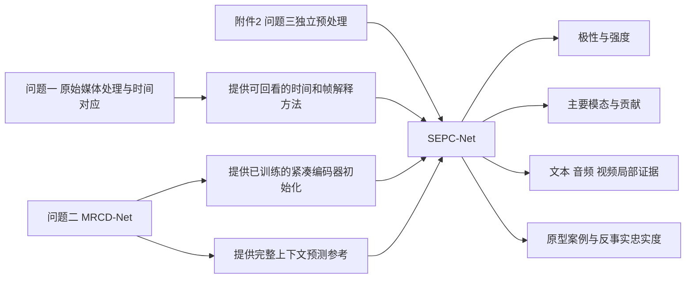
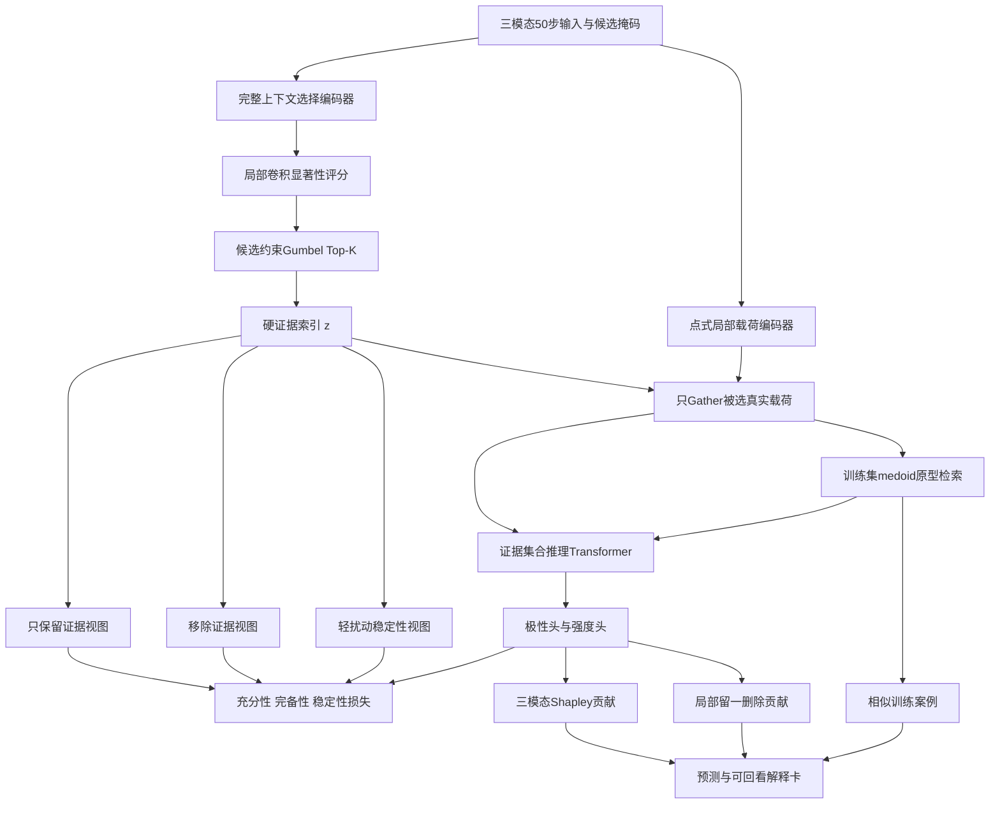
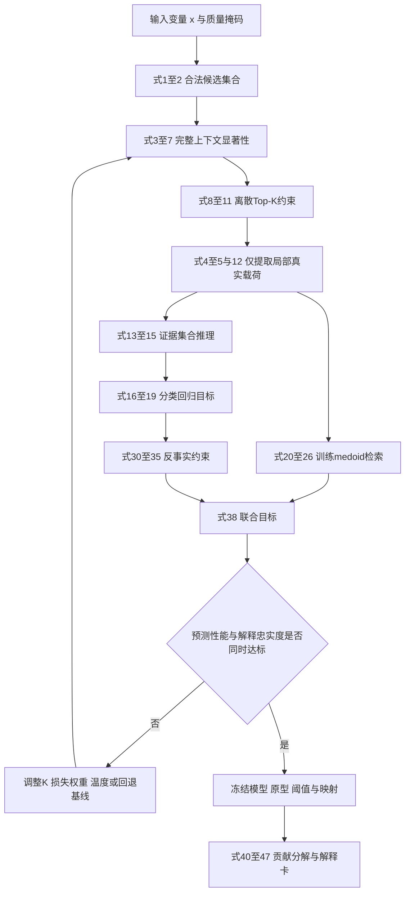
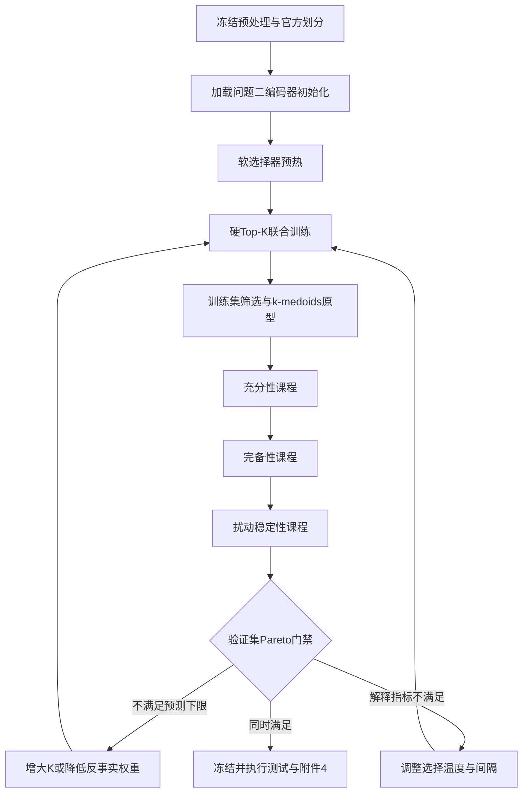

# 问题三稀疏证据瓶颈原型记忆与反事实一致性完整建模方案

## 1 建模结论与方案调整

问题三要求模型在给出情感极性和连续情感强度的同时，输出主要参考模态、三模态作用程度，以及能够回到原始文本、音频时段和视频关键帧的局部证据。仅把注意力权重画成热力图不能证明这些位置真正决定了预测，因此本题采用“先选择、再预测、再验证”的内生解释框架。

所选“Top-K证据选择器＋证据受限预测器＋类别/强度原型记忆库＋充分性与完备性反事实损失”方案具有较高可行性，不需要更换，但必须做四项结构修正：

1. **选择通道与预测通道分离。** 选择器可以读取完整上下文以判断哪些位置重要；预测器只能读取被选择位置的局部真实载荷，不能读取由完整序列上下文化得到的隐藏状态，否则未选择信息已经泄漏到被选表示中。
2. **采用全局可用性感知Top-K。** 不固定每种模态选相同数量，而是在全部有效文本、音频、视觉候选中联合选择，使“主要参考模态”由样本决定；模态失效时不会被硬性分配名额。
3. **原型使用可追溯medoid。** 原型必须对应真实训练样本、模态和位置，而不是无法回溯的合成质心；极性原型和七级强度原型分别建库。
4. **增加索引通道泄漏检验。** 预测器不接收完整选择概率、未选上下文或问题二的`privileged_text`。还要用“只保留选择索引、把证据内容替换为常数”的对照实验验证索引本身没有暗中编码标签。

调整后的模型记为 **Sparse Evidence Prototype Counterfactual Network，SEPC-Net**。FRSR证明了“稀疏检索后再深层推理”在多模态情感分析上的可行性；SEPC-Net进一步加入可追溯原型、分类回归联合任务、反事实忠实度和概念泄漏审计。[FRSR论文](https://aclanthology.org/2026.findings-acl.1519/)报告其Fast Pathway通过局部卷积选择Top-K线索，Slow Pathway只在所选证据上推理，这一原则与本题高度一致。

## 2 赛题要求到数学任务的转换

### 2.1 赛题正式要求

问题三使用附件2训练、验证并选择模型，对附件4的20条无标签样本冻结推理。模型需要同时完成：

1. 三分类情感极性预测；
2. 区间`[-3,3]`内的连续情感强度预测；
3. 给出主要参考模态；
4. 量化文本、音频、视觉三模态作用程度；
5. 定位关键文本片段、音频时段和视频关键帧；
6. 在验证集报告Accuracy、F1、MAE、Pearson及解释性评价；
7. 对附件4输出全部样本的预测与解释结果，不得利用附件4调参。

将第1、2项表示为联合监督学习，将第3、4项表示为三模态因果贡献分解，将第5项表示为受候选掩码约束的离散子集选择，将第6项扩展为预测性能、解释忠实度、稀疏性、稳定性和原型可追溯性的多目标评价。

### 2.2 已完成数据处理提供的约束

| 数据事实 | 已核验结果 | 对建模的直接影响 |
|---|---:|---|
| 附件2划分 | 3395/728/727 | 训练、选择、独立评价边界固定 |
| 附件4样本 | 20 | 只做冻结推理，不参与任何阈值选择 |
| 时间轴 | 三模态统一50步 | 可在`模态×位置`空间直接选择证据 |
| 训练集平均内容长度 | 22.65步 | 每条样本约有66.67个三模态候选，适合K为5至10 |
| 训练集原型候选 | 78212个 | 足以建立模态特定的极性与强度原型 |
| 原型最小单元候选数 | 812 | 当前21个有效“模态×标签强度”单元均非小样本空单元 |
| Tokenizer核验 | 121213条offset、0不一致 | 文本证据可以精确回到字符区间 |
| 附件4截断 | 07、18 | 解释只覆盖模型可见前缀，必须披露未覆盖尾部 |
| 附件4视觉失效 | 13 | 视觉候选集合为空，视觉贡献应为0并标记不可用 |
| 未对齐长度异常 | 13、16 | 未对齐数据不进入主模型，仅作审计或候选修复 |
| 修复验证 | 中位余弦0.734＜0.80 | 样本13不得用修复视觉替换官方特征 |
| 分布漂移 | 音频0.966%，视觉1.621%越界 | 沿用训练集稳健缩放，增加漂移置信度标记 |
| 文本重复 | 附件4有5条与附件2测试文本相同 | 只做泄漏审计，严禁复制标签或加入原型库 |

## 3 与问题一和问题二的关系

问题三在代码和输出上独立，但在科学逻辑上承接前两问。

问题二最终学生模型约1207万参数，验证集Accuracy为0.6264、Macro-F1为0.6072、MAE为0.5941、Pearson为0.6371。问题三可复用其编码器参数作为初始化和完整上下文参考，但不能直接复用问题二的最终融合向量、路由概率或`modality_reliability`作为证据预测器输入。问题三训练得到的新模块、配置、检查点和结果全部写入独立目录。

## 4 子任务分解

| 子任务 | 数学问题 | 主要输入 | 主要输出 |
|---|---|---|---|
| 3.1 证据候选约束 | 从合法位置构造有限候选集 | 内容、观测、失败掩码 | 候选集合`Ω_i` |
| 3.2 稀疏证据选择 | 带基数约束的离散子集优化 | 完整上下文选择表示 | Top-K硬掩码`z_i` |
| 3.3 证据受限预测 | 仅由被选真实载荷预测 | 被选文本/音频/视觉片段 | 极性概率、强度 |
| 3.4 原型案例推理 | 度量空间最近medoid检索 | 被选证据嵌入、训练记忆库 | 相似训练证据及距离 |
| 3.5 反事实忠实度 | 比较保留、移除和扰动视图 | 证据集合及其补集 | 充分性、完备性、稳定性 |
| 3.6 模态贡献分解 | 三模态合作博弈 | 各模态证据子集 | Shapley贡献、主要模态 |
| 3.7 可回看定位 | 离散位置映射到原媒体 | token offset、时间和帧映射 | 文本区间、秒数、帧号 |

## 5 变量与符号定义

### 5.1 索引、输入变量和常量

| 符号 | 角色 | 类型 | 单位/维数 | 含义与范围 |
|---|---|---|---|---|
| `i` | 样本索引 | 离散 | 无 | `i=1,…,N` |
| `m` | 模态索引 | 离散 | 无 | `m∈M={L,A,V}`，分别为文本、音频、视觉 |
| `t` | 对齐位置 | 离散 | 步 | `t=1,…,T`，`T=50` |
| `x^L_it` | 输入变量 | 离散 | token ID | `x^L_it∈{0,…,30521}` |
| `x^A_it` | 输入变量 | 连续 | 74维标准化特征 | `x^A_it∈[-8,8]^74` |
| `x^V_it` | 输入变量 | 连续 | 35维标准化特征 | `x^V_it∈[-8,8]^35` |
| `y^c_i` | 监督目标 | 离散 | 类别 | `y^c_i∈{0,1,2}`，负向/中性/正向 |
| `y^r_i` | 监督目标 | 连续 | 情感强度 | `y^r_i∈[-3,3]` |
| `M^con_it` | 输入掩码 | 布尔 | 无 | 内容位置为1 |
| `M^obs_imt` | 输入掩码 | 布尔 | 无 | 模态位置实际可观测为1 |
| `M^fail_imt` | 输入掩码 | 布尔 | 无 | 提取或对齐失败为1 |
| `C_imt` | 候选变量 | 布尔 | 无 | 合法证据候选为1 |
| `K` | 超参数 | 离散 | 个 | 全局证据预算，候选`{3,5,8,10}` |
| `R_c,R_b` | 超参数 | 离散 | 个/单元 | 每个极性/强度单元medoid数量 |

### 5.2 决策变量

深度模型中的决策变量是通过优化求得的参数和通过验证集确定的离散超参数。

| 符号 | 变量类别 | 类型 | 单位/维数 | 约束 |
|---|---|---|---|---|
| `Θ_sel` | 决策变量 | 连续高维 | 参数 | 选择器参数，L2正则及梯度裁剪 |
| `Θ_pay` | 决策变量 | 连续高维 | 参数 | 局部证据载荷编码器参数 |
| `Θ_pred` | 决策变量 | 连续高维 | 参数 | 证据受限推理器及双任务头参数 |
| `Θ_proto` | 决策变量 | 连续/离散 | 参数与索引 | 度量投影参数；medoid索引必须来自train |
| `z_imt` | 核心决策变量 | 二元 | 无 | `z_imt∈{0,1}`且`z_imt≤C_imt` |
| `K_i` | 派生决策变量 | 离散 | 个 | `K_i=min(K,Σ_mt C_imt)` |
| `λ_q` | 决策超参数 | 连续 | 无 | 各损失权重，`λ_q≥0` |
| `τ_g` | 决策超参数 | 连续 | 温度 | Gumbel-Top-K温度，`τ_g>0` |
| `τ_p` | 决策超参数 | 连续 | 温度 | 原型距离温度，`τ_p>0` |
| `α_p` | 决策超参数 | 连续 | 无 | 原型预测融合上限，`α_p∈[0,0.3]` |

### 5.3 中间变量

| 符号 | 类型 | 维数/范围 | 含义 |
|---|---|---|---|
| `h^sel_imt` | 连续 | `R^d` | 选择通道的完整上下文表示 |
| `e^pay_imt` | 连续 | `R^d` | 不含未选上下文的局部真实载荷 |
| `s_imt` | 连续 | `R` | 候选证据显著性logit |
| `π_imt` | 连续 | `[0,1]` | 训练期软选择变量，不输入预测器 |
| `E_i` | 集合 | `|E_i|=K_i` | 最终硬证据集合 |
| `E_i^m` | 集合 | 无 | 证据集合中属于模态m的子集 |
| `q_ij` | 连续 | 单位球`R^d_p` | 第j个选中证据的原型查询向量 |
| `P^c_mcr` | 连续＋索引 | `R^d_p` | 模态m、极性c、第r个真实medoid |
| `P^b_mbr` | 连续＋索引 | `R^d_p` | 模态m、强度箱b、第r个真实medoid |
| `d(q,P)` | 连续 | `[0,2]` | 余弦距离 |
| `R_i^(l)` | 连续 | `R^(Q×d)` | 第l层推理token |
| `p^F_i,r^F_i` | 连续 | 概率单纯形、`[-3,3]` | 完整上下文参考输出 |
| `p^K_i,r^K_i` | 连续 | 同上 | 仅保留证据的最终输出 |
| `p^D_i,r^D_i` | 连续 | 同上 | 移除证据后的补集输出 |
| `J_i` | 连续 | `[0,1]` | 扰动前后Top-K集合Jaccard稳定度 |
| `φ^c_im,φ^r_im` | 连续 | 实数 | 模态m对分类和回归的Shapley值 |
| `δ_ij` | 连续 | 实数 | 单条局部证据的留一删除贡献 |

### 5.4 最终目标变量

| 变量 | 类型 | 单位/范围 | 赛题对应输出 |
|---|---|---|---|
| `ŷ^c_i` | 离散 | `{0,1,2}` | 情感极性 |
| `p_ic` | 连续 | `[0,1]`且求和为1 | 三分类概率 |
| `ŷ^r_i` | 连续 | `[-3,3]` | 情感强度 |
| `w_im` | 连续 | `[0,1]`且三模态求和为1 | 模态作用程度 |
| `m*_i` | 离散 | `{L,A,V}` | 主要参考模态 |
| `B_ij` | 区间 | 字符/秒/帧 | 第j条可回看局部证据 |
| `Q^exp_i` | 连续 | `[0,1]` | 解释可信度诊断值 |

## 6 核心假设及合理性

### 假设1 已对齐位置具有近似共同语义

假设附件2、4的aligned_50中，同一位置附近的文本、音频和视觉描述相近的局部语义区间，小范围残余时滞可由选择器的局部卷积吸收。

**合理性：** 赛方明确提供三模态50步对齐版，且问题三需要定位跨模态局部证据。模型并不假设三模态逐元素同步，只假设`±1`位置窗口内可比较。音视频回原媒体的时间边界仍单独标记置信度。

### 假设2 片段级情感证据是稀疏的

假设一个视频片段的情感判断主要由少量词语、语调变化或表情变化支持，而不是所有位置同等重要。

**合理性：** FRSR的实验和人类情感判断机制均支持先定位少量显著线索再推理；本数据平均约66.67个三模态候选，验证K为3至10可直接检验该假设。若小K造成显著性能下降，则假设在该数据上不成立，模型必须回退到更大证据比例或方案1。

### 假设3 视频级标签可以提供弱片段监督

假设同一视频的极性与强度标签虽然不能赋给每个局部位置，但可以通过多实例学习约束“至少若干被选片段应支持视频级判断”。

**合理性：** 赛方没有人工证据标签，无法直接监督位置。采用先聚合后计算样本级原型损失，不把每个片段强制标成视频标签，可降低弱标注噪声。

### 假设4 训练原型能够覆盖附件4的主要情感模式

假设附件2训练集与附件4遵循相同的特征和标签语义，稳健缩放后训练medoid可作为附件4的案例参照。

**合理性：** 赛方要求附件2训练、附件4推理，二者接口一致；附件4相对训练分位的越界比例较低。但原型距离过大时必须输出低覆盖标记，不能强行解释为已知模式。

### 假设5 预注册轻扰动不改变真实情感

假设标准化空间小噪声、`±1`位置抖动和少量非证据遮蔽不会改变视频级情感标签。

**合理性：** 这些扰动幅度由训练分布确定，且不进行词义替换或跨样本媒体替换。若扰动导致完整模型预测大幅变化，该样本不进入稳定性训练，只标记为高敏感样本。

## 7 总体架构

关键防泄漏边界是：选择器的`h^sel`只负责产生离散索引；预测器只接收由原始局部输入生成的`e^pay`、被选索引对应的固定位置编码和模态编码。`h^sel`、完整选择概率`π`、未选位置、全局池化向量均不得进入预测器。

## 8 核心公式推导

### 8.1 合法证据候选集合

候选掩码定义为

$$
C_{imt}=M^{con}_{it}M^{obs}_{imt}(1-M^{fail}_{imt}). \tag{1}
$$

式（1）表示证据必须同时处于内容区、实际可观测且没有被判定为模态失败。结构token、padding、自然全零和失败位置均不可选。候选集合为

$$
\Omega_i=\{(m,t):C_{imt}=1\},\qquad N_i=|\Omega_i|. \tag{2}
$$

### 8.2 双通道表示

选择器表示允许利用完整上下文：

$$
H_i^{sel,m}=f_m^{ctx}(X_i^m,M_i^m;\Theta_{sel}),
\qquad H_i^{sel,m}\in\mathbb R^{T\times d}. \tag{3}
$$

文本选择器可初始化自问题二紧凑BERT，音频和视觉选择器可初始化自问题二时序编码器。式（3）只用于排序。

预测载荷必须由单位置真实特征计算：

$$
e_{it}^{pay,L}=W_L E_{tok}(x^L_{it})+b_L, \tag{4}
$$

$$
e_{it}^{pay,m}=\operatorname{GELU}\!\left(\operatorname{LN}(W_mx^m_{it}+b_m)\right),
\quad m\in\{A,V\}. \tag{5}
$$

式（4）使用token嵌入而不是完整BERT上下文输出；式（5）使用点式投影而不是先扫描完整序列的BiGRU输出。因此未选位置不能通过隐藏状态渗入预测。若后续实验使用局部窗口，则窗口内所有位置必须一并展示为证据闭包，不能只展示中心点。

### 8.3 显著性评分

参照FRSR的局部上下文卷积，对每个模态计算

$$
s_{imt}=w_m^\top\operatorname{GELU}
\left(\operatorname{Conv1D}_{k=3}(H_i^{sel,m})_t\right)+b_m. \tag{6}
$$

加入候选约束后

$$
\widetilde s_{imt}=
\begin{cases}
s_{imt},&C_{imt}=1,\\
-\infty,&C_{imt}=0.
\end{cases} \tag{7}
$$

式（7）保证任何无效位置在数值上都不可能进入Top-K。

### 8.4 可微Top-K与基数约束

训练期加入独立Gumbel噪声`g_imt`：

$$
u_{imt}=\frac{\widetilde s_{imt}+g_{imt}}{\tau_g},
\qquad g_{imt}\sim\operatorname{Gumbel}(0,1). \tag{8}
$$

硬选择为

$$
z^{hard}_{imt}=\mathbb I\left[(m,t)\in
\operatorname{TopK}(u_i,K_i)\right],
\quad K_i=\min(K,N_i). \tag{9}
$$

用可微SoftTopK投影得到`z^soft`，满足`0≤z^soft≤1`和求和为`K_i`，直通估计为

$$
z^{ST}_i=\operatorname{sg}(z^{hard}_i-z^{soft}_i)+z^{soft}_i. \tag{10}
$$

式（10）前向传播严格使用K个离散证据，反向传播通过软变量更新选择器。推理阶段关闭Gumbel噪声，直接对`s`确定性Top-K。核心约束为

$$
z_{imt}\in\{0,1\},\quad z_{imt}\le C_{imt},\quad
\sum_{m,t}z_{imt}=K_i. \tag{11}
$$

### 8.5 证据受限输入

被选证据集合为

$$
E_i=\left\{e_{it}^{pay,m}+E_{mod}(m)+E_{pos}(t):z_{imt}=1\right\}. \tag{12}
$$

`E_mod`为模态编码，`E_pos`建议采用固定正弦位置编码或低容量位置编码，避免位置索引成为高容量标签通道。集合按标准化时间位置排序，同位置时按文本、音频、视觉固定顺序排列。预测器禁止接收`s`、`π`、`H^sel`或未选位置摘要。

### 8.6 证据集合推理器

设`Q`个可学习推理token为`R_i^(0)∈R^(Q×d)`。先让被选证据内部交互：

$$
U_i^{(l)}=\operatorname{TransformerLayer}_l(U_i^{(l-1)}),
\qquad U_i^{(0)}=E_i. \tag{13}
$$

再由推理token跨层读取证据：

$$
R_i^{(l)}=R_i^{(l-1)}+
\operatorname{CrossAttn}
\left(\operatorname{LN}(R_i^{(l-1)}),
\operatorname{LN}(U_i^{(l)}),
\operatorname{LN}(U_i^{(l)})\right). \tag{14}
$$

最终证据表示为

$$
h_i=\operatorname{MeanPool}(R_i^{(L)}). \tag{15}
$$

建议`d=128`、`L=2`、4个注意力头、`Q=4`，以控制小数据集过拟合和总附件大小。

### 8.7 极性与强度联合预测

分类概率为

$$
p_i=\operatorname{softmax}(W_ch_i+b_c),
\qquad \widehat y_i^c=\arg\max_c p_{ic}. \tag{16}
$$

强度输出通过双曲正切限制范围：

$$
\widehat y_i^r=3\tanh(w_r^\top h_i+b_r)\in[-3,3]. \tag{17}
$$

分类隐含强度定义为

$$
\widetilde y_i^r=3(p_{i,2}-p_{i,0}). \tag{18}
$$

式（18）使负向概率提高时隐含强度下降、正向概率提高时上升，中性概率不会人为制造方向。分类回归协调损失为

$$
\mathcal L_{coh}=\frac1N\sum_i
\operatorname{SmoothL1}(\widehat y_i^r,\widetilde y_i^r). \tag{19}
$$

### 8.8 训练集原型记忆库

#### 8.8.1 原型形成

原型只从附件2训练集产生。选择器预热后，仅保留训练集中预测正确且置信度超过预注册阈值的高分证据，避免把所有视频级标签机械赋给所有位置。对查询投影归一化：

$$
q_{ij}=\frac{W_pe_{ij}}{\|W_pe_{ij}\|_2+\epsilon}. \tag{20}
$$

分别在“模态×极性”和“模态×强度箱”内执行k-medoids。每个原型必须满足

$$
P_{mcr}^{c}=q_{i^*j^*},\qquad
P_{mbr}^{b}=q_{i^*j^*},\qquad i^*\in\mathcal D_{train}. \tag{21}
$$

式（21）规定原型是某条真实训练证据的嵌入，同时保存`sample_id、modality、position、raw_text、label、intensity`。七级强度箱为`[-3,-2)`、`[-2,-1)`、`[-1,0)`、`{0}`、`(0,1]`、`(1,2]`、`(2,3]`。

#### 8.8.2 距离与原型分布

余弦距离为

$$
d(q,P)=1-q^\top P. \tag{22}
$$

一个样本可能选择多条证据，用soft-min聚合其到某一原型单元的距离：

$$
D_{ic}^{cls}=-\tau_p\log
\sum_{j\in E_i}\sum_{r=1}^{R_c}
\exp\left(-\frac{d(q_{ij},P_{m_jcr}^{c})}{\tau_p}\right). \tag{23}
$$

极性原型概率为

$$
q_{ic}^{cls}=\frac{\exp(-D_{ic}^{cls})}
{\sum_{c'}\exp(-D_{ic'}^{cls})}. \tag{24}
$$

强度原型概率`q^int_ib`同理。令七箱代表值
`ν=(-2.5,-1.5,-0.5,0,0.5,1.5,2.5)`，得到

$$
\widehat y_i^{proto}=\sum_{b=0}^{6}\nu_bq_{ib}^{int}. \tag{25}
$$

原型监督采用样本级而非片段级：

$$
\mathcal L_{proto}=
-\frac1N\sum_i\log q_{i,y_i^c}^{cls}
+\lambda_{p,r}\operatorname{SmoothL1}
(\widehat y_i^{proto},y_i^r). \tag{26}
$$

主方案将原型作为辅助约束和解释检索；若验证集证明有益，可用最大不超过0.3的距离置信门控把原型分布与参数预测融合。这样即使原型覆盖不足，也不会主导最终输出。

### 8.9 监督预测损失

分类采用训练集类别权重`ω_c`的交叉熵：

$$
\mathcal L_{cls}=-\frac1N\sum_i
\omega_{y_i^c}\log p_{i,y_i^c}. \tag{27}
$$

回归同时对应MAE和Pearson评价方向：

$$
\mathcal L_{reg}=\frac1N\sum_i
\operatorname{SmoothL1}(\widehat y_i^r,y_i^r)
+\lambda_{corr}\left(1-\operatorname{Corr}
(\widehat{\boldsymbol y}^{r},\boldsymbol y^r)\right). \tag{28}
$$

基础预测损失为

$$
\mathcal L_{pred}=\mathcal L_{cls}
+\lambda_r\mathcal L_{reg}
+\lambda_{coh}\mathcal L_{coh}. \tag{29}
$$

### 8.10 反事实视图

对硬证据集合`E_i`定义三类视图：

1. `X_i^K`：只保留被选证据；
2. `X_i^D`：从完整输入移除被选证据；
3. `X_i^P`：对原输入施加语义保持轻扰动。

文本删除用`[MASK]`并显式带`counterfactual_mask`；音频、视觉使用训练集对应位置中位向量作为主基线，局部插值作为敏感性对照。不得把自然零值与人为删除混为一类。

令冻结的完整上下文参考模型输出为`(p_i^F,r_i^F)`，证据受限模型输出为`(p_i^K,r_i^K)`。充分性损失为

$$
\mathcal L_{suf}=\frac1N\sum_i
\left[
D_{KL}(\operatorname{sg}(p_i^F)\|p_i^K)
+\lambda_{s,r}\operatorname{SmoothL1}
(r_i^K,\operatorname{sg}(r_i^F))
\right]. \tag{30}
$$

式（30）表示只看少量证据时应尽量保持完整模型的判断。

设`c_i^F=argmax_c p^F_ic`，移除证据后的输出为`(p_i^D,r_i^D)`。分类完备性差为

$$
\Delta_{i}^{comp,c}=p^F_{i,c_i^F}-p^D_{i,c_i^F}. \tag{31}
$$

回归完备性差在非中性预测时取预测方向上的强度下降，在接近中性时取绝对变化：

$$
\Delta_i^{comp,r}=
\begin{cases}
\operatorname{sign}(r_i^F)(r_i^F-r_i^D)/3,&|r_i^F|>\epsilon_r,\\
|r_i^F-r_i^D|/3,&|r_i^F|\le\epsilon_r.
\end{cases} \tag{32}
$$

完备性损失使用间隔约束：

$$
\mathcal L_{comp}=\frac1N\sum_i
\left[
[\delta_c-\Delta_i^{comp,c}]_+
+\lambda_{c,r}[\delta_r-\Delta_i^{comp,r}]_+
\right]. \tag{33}
$$

式（33）表示删除所选证据后，原预测至少应减弱预定幅度；否则这些片段不是决定性证据。

### 8.11 扰动稳定性

对预注册扰动`a(·)`得到`X_i^P`，重新选择`z_i^P`并预测。软选择与预测稳定性损失为

$$
\begin{aligned}
\mathcal L_{stab}=\frac1N\sum_i\big[&
\|\pi_i-\pi_i^P\|_2^2
+\lambda_{st,c}D_{JS}(p_i^K\|p_i^P)\\
&+\lambda_{st,r}|r_i^K-r_i^P|/6
\big].
\end{aligned}\tag{34}
$$

硬集合稳定性只作评价，不用不可微值直接反传：

$$
J_i=\frac{|E_i\cap E_i^P|}{|E_i\cup E_i^P|}. \tag{35}
$$

若采用`±1`时间抖动，则位置`t`与`t±1`可按邻域匹配计算宽容Jaccard，并同时报告严格Jaccard，不能只报告较高的宽容指标。

### 8.12 选择器辅助监督

为降低离散选择初期方差，对每个模态的Top-K证据加权池化并执行弱辅助预测：

$$
h_i^{fast,m}=\sum_t
\frac{z_{imt}^{ST}\exp(s_{imt})}
{\sum_{t'}z_{imt'}^{ST}\exp(s_{imt'})+\epsilon}
h_{imt}^{sel}. \tag{36}
$$

$$
\mathcal L_{aux}=\sum_m
\left[\operatorname{CE}(y_i^c,\widehat p_i^m)
+\lambda_{a,r}\operatorname{SmoothL1}(y_i^r,\widehat r_i^m)
\right]. \tag{37}
$$

辅助分支仅用于训练选择器，推理解释和主预测均不输出该分支结果。其权重随训练逐步衰减，避免强迫每种模态单独完成不可能的任务。

### 8.13 总目标函数

完整优化目标为

$$
\begin{aligned}
\min_{\Theta}\ \mathcal L_{total}=
&\mathcal L_{pred}
+\lambda_{aux}(e)\mathcal L_{aux}
+\lambda_{proto}\mathcal L_{proto}\\
&+\lambda_{suf}\mathcal L_{suf}
+\lambda_{comp}\mathcal L_{comp}
+\lambda_{stab}\mathcal L_{stab}
+\lambda_{wd}\|\Theta\|_2^2,
\end{aligned}\tag{38}
$$

满足式（1）、（11）、预测器白名单和训练原型来源约束。式（38）各部分含义如下。

| 损失 | 作用对象 | 解决的问题 |
|---|---|---|
| `L_pred` | 极性、强度、任务协调 | 保证基础预测能力 |
| `L_aux` | 选择器的模态内显著性 | 缓解离散Top-K训练不稳定 |
| `L_proto` | 查询与训练medoid度量空间 | 提供可追溯相似案例 |
| `L_suf` | 只保留证据输出 | 证据是否足以维持判断 |
| `L_comp` | 移除证据输出 | 证据是否真正不可替代 |
| `L_stab` | 轻扰动前后选择与预测 | 解释是否稳定 |
| 权重衰减 | 全部可学习参数 | 控制小样本过拟合 |

建议分阶段预热损失权重，而不是从第一轮同时施加强反事实约束：

$$
\lambda_q(e)=\lambda_q^{max}
\min\left(1,\frac{\max(0,e-e_q^{start})}{E_q^{warm}}\right). \tag{39}
$$

### 8.14 模态贡献的精确三方Shapley分解

赛题要求“模态作用程度”，不能直接把选择数量或注意力分数当贡献。由于只有三种模态，可以枚举全部`2^3=8`个模态子集，计算精确Shapley值。

对预测类别`ĉ_i=argmax p_i^K`定义分类价值函数

$$
v_i^c(S)=\log p_{i,\widehat c_i}(E_i^S), \tag{40}
$$

其中`E_i^S`只保留模态集合`S`中的已选证据。回归价值函数定义为

$$
v_i^r(S)=\frac{\sigma_i\widehat y_i^r(E_i^S)}{3},
\quad
\sigma_i=\begin{cases}
\operatorname{sign}(\widehat y_i^r(E_i)),&|\widehat y_i^r(E_i)|>\epsilon_r,\\
1,&\text{中性附近}.
\end{cases} \tag{41}
$$

模态`m`的任务`q∈{c,r}`的Shapley值为

$$
\phi_{im}^{q}=\sum_{S\subseteq\mathcal M\setminus\{m\}}
\frac{|S|!(3-|S|-1)!}{3!}
\left[v_i^q(S\cup\{m\})-v_i^q(S)\right]. \tag{42}
$$

保留有正负号的`φ`用于分析协同或冲突；赛题所需非负作用比例定义为

$$
w_{im}=\frac{
\beta|\phi_{im}^{c}|+(1-\beta)|\phi_{im}^{r}|
}{
\sum_n[\beta|\phi_{in}^{c}|+(1-\beta)|\phi_{in}^{r}|]+\epsilon
}. \tag{43}
$$

$$
m_i^*=\arg\max_{m:C_i^m\ne\varnothing}w_{im}. \tag{44}
$$

式（43）保证三模态作用程度和为1，式（44）给出主要参考模态。样本13的视觉候选为空，因此视觉贡献固定为0，并同时输出“不可用”而不是“模型认为不重要”。

### 8.15 局部证据贡献

对已选证据`e_ij`做留一删除，分类和回归贡献分别为

$$
\delta_{ij}^{c}=\log p_{i,\widehat c_i}(E_i)
-\log p_{i,\widehat c_i}(E_i\setminus\{e_{ij}\}), \tag{45}
$$

$$
\delta_{ij}^{r}=\sigma_i
\frac{\widehat y_i^r(E_i)-
\widehat y_i^r(E_i\setminus\{e_{ij}\})}{3}. \tag{46}
$$

输出时分别保留两项，并用绝对值归一化生成显示长度。负值表示该片段与最终预测存在冲突，不能将其强行截断为0后宣称所有证据都支持结论。相邻且同模态的入选位置合并成一个可读证据段，但贡献仍由合并前位置求和得到。

### 8.16 解释可信度

解释可信度不参与预测，只用于提示复核。构造六个归一化分量：预测置信`Q_pred`、充分性`Q_suf`、完备性`Q_comp`、稳定性`Q_stab`、映射质量`Q_map`和原型覆盖`Q_proto`。几何均值为

$$
Q_i^{exp}=\left(
Q_i^{pred}Q_i^{suf}Q_i^{comp}
Q_i^{stab}Q_i^{map}Q_i^{proto}
\right)^{1/6}. \tag{47}
$$

任何一项接近0都会显著降低总分，符合“短板决定是否需要人工复核”的含义。阈值只能在附件2验证集确定。

## 9 变量到目标的逻辑链

## 10 训练与求解步骤

### 阶段A 数据冻结与完整性门禁

1. 运行问题三预处理和官方tokenizer严格验收；
2. 核验3395/728/727/20样本数、121213条精确token offset和0 tokenizer mismatch；
3. 读取候选掩码，确保`[CLS]`、`[SEP]`、padding、自然零值和失败位置不可选；
4. 固定训练集缩放器、源文件哈希、随机种子和验证扰动种子；
5. 将附件4和附件2测试集从训练、原型构建、阈值选择中彻底隔离。

### 阶段B 完整参考与骨干初始化

1. 加载问题二学生模型的共享文本、音频、视觉编码器权重；
2. 把问题二学生作为完整上下文参考`F_φ`并冻结；
3. 仅复制编码器初始化，不复制问题二融合路由到证据预测器；
4. 前2至3轮冻结共享底层，只训练选择器、载荷投影和预测头；
5. 若需要适配，只解冻顶层或训练LoRA/Adapter，避免保存第二份完整骨干。

### 阶段C 软选择器预热

1. 暂以较高温度`τ_g≈2`和K=8训练；
2. 优化`L_pred+λ_auxL_aux`，先让显著性具备情感方向；
3. 辅助分支的权重从1逐步下降到0.1；
4. 监控不同模态的候选得分、选中率和梯度方差；
5. 若选择器长期坍缩到固定位置，加入位置抖动和批级位置分布诊断，不直接强迫三模态均匀。

### 阶段D 硬Top-K联合训练

1. 启用式（8）至（10）的直通Gumbel-Top-K；
2. 温度从2逐步退火到0.3至0.5；
3. 每个样本严格选择`K_i`个合法位置；
4. 预测器只接收Gather后的局部载荷；
5. 加入分类、回归和协调损失；
6. 同时运行白名单断言：未选特征非零、完整概率输入预测器等情况立即停止训练。

### 阶段E 原型记忆构建

1. 用当前选择器遍历训练集；
2. 仅收集预测正确、置信较高、候选质量合格的被选证据；
3. 分别在模态×极性、模态×强度箱内执行k-medoids；
4. 原型数候选建议`R∈{3,5,8}`，只由验证集选择；
5. 每个原型保存真实训练ID与位置；
6. 每2至3轮重算一次原型，最后5轮冻结记忆库以稳定收敛；
7. 加入式（26）的原型损失。

### 阶段F 反事实课程学习

1. 先启用充分性损失，使少量证据逼近完整参考；
2. 充分性稳定后逐步加入完备性间隔；
3. 最后加入扰动稳定性，避免早期错误证据被强行固化；
4. 反事实基线至少比较训练中位向量和局部插值，不能只用全零；
5. 同一验证样本使用固定扰动种子；
6. 记录每项损失对Accuracy、Macro-F1、MAE、Pearson和Jaccard的影响。

### 阶段G 校准与冻结

1. 在附件2验证集选择K、原型数、损失权重和反事实间隔；
2. 校准分类温度；如回归有系统偏差，仅在验证集拟合单调线性校准并裁剪到`[-3,3]`；
3. 冻结选择器、预测器、原型medoid、阈值、校准参数和时间映射规则；
4. 记录配置哈希、参数量、模型哈希、随机种子和原型来源清单；
5. 只在全部冻结后运行附件2测试集和附件4。

## 11 建议超参数搜索空间

| 参数 | 首选值 | 验证候选 | 选择依据 |
|---|---:|---|---|
| 统一隐维`d` | 128 | 96、128、192 | 性能与参数量 |
| 全局证据数K | 8 | 3、5、8、10 | Pareto性能、稀疏率、忠实度 |
| 推理层数L | 2 | 1、2、3 | 小样本过拟合与性能 |
| 推理token数Q | 4 | 2、4、8 | 表达能力与计算量 |
| Gumbel初始温度 | 2.0 | 1.0、2.0 | 梯度稳定性 |
| Gumbel最终温度 | 0.5 | 0.3、0.5、0.7 | 硬软差距 |
| 每单元medoid数R | 5 | 3、5、8 | 原型覆盖与可读性 |
| 原型温度`τ_p` | 0.1 | 0.05、0.1、0.2 | 距离分布校准 |
| 原型融合上限 | 0.2 | 0、0.1、0.2、0.3 | 防止噪声原型主导 |
| `λ_suf` | 0.5 | 0.2、0.5、1.0 | 充分性差距 |
| `λ_comp` | 0.5 | 0.2、0.5、1.0 | 删除后性能下降 |
| `λ_stab` | 0.2 | 0.1、0.2、0.5 | Jaccard与性能折中 |
| Dropout | 0.2 | 0.1、0.2、0.3 | 验证集泛化 |
| 学习率 | `1e-4` | `5e-5、1e-4、2e-4` | 收敛速度和稳定性 |

搜索不能做全笛卡尔积。建议先固定K=8完成结构消融，再单独搜索K和R，最后微调三项反事实权重。至少使用3个随机种子报告均值与标准差。

## 12 模型选择与验收准则

### 12.1 预测性能

必须同时报告：Accuracy、Macro-F1、三类F1、MAE、Pearson。以问题二完整学生验证性能为参考，不允许为了漂亮解释显著牺牲预测。

建议先注册以下临时门槛，最终以3随机种子标准差修正：

- Accuracy不低于0.616，即相对0.6264下降不超过约1个百分点；
- Macro-F1不低于0.597；
- MAE不高于0.624；
- Pearson不低于0.617。

这组值不是赛方标准，而是当前项目内部的模型准入线。若多种子波动超过上述容差，应使用“问题二基线均值减/加一个标准差”的规则替代固定值。

### 12.2 解释指标

参考ERASER对忠实解释的充分性和完备性思想，评价如下。[ERASER论文](https://aclanthology.org/2020.acl-main.408/)

| 指标 | 定义 | 方向 | 建议准入值 |
|---|---|---|---|
| 证据比例 | `K_i/N_i` | 越低越简洁 | 均值不高于20% |
| 分类充分性差 | `p^F_c-p^K_c` | 越低越好 | 均值不高于0.05 |
| 回归充分性差 | `|r^F-r^K|` | 越低越好 | 均值不高于0.15 |
| 分类完备性 | `p^F_c-p^D_c` | 越高越好 | 均值不低于0.10 |
| 回归完备性 | 式（32） | 越高越好 | 均值不低于0.08 |
| 删除曲线AOPC | 逐步删除高贡献证据 | 越高越好 | 显著高于随机删除 |
| 严格Jaccard@K | 式（35） | 越高越稳 | 均值不低于0.70 |
| 原型纯度 | 最近原型标签一致率 | 越高越好 | 分类不低于0.70 |
| 原型覆盖 | 最近medoid距离 | 越低越好 | 不超过训练95%分位 |
| 可回溯率 | 证据和原型具备完整来源 | 越高越好 | 100% |

阈值均在附件2验证集冻结。附件4只能报告结果，不能根据20条解释是否“好看”调整阈值。

### 12.3 多目标选择

不把所有指标随意加成一个分数。先执行预测性能硬门槛，再在通过者中做Pareto选择：

1. 优先最小化分类/回归充分性差；
2. 最大化完备性与稳定性；
3. 在解释指标近似时选择K更小、参数更少、原型更少的模型；
4. 若复杂模型改善不超过随机种子波动，使用简化模型作为主模型。

## 13 概念泄漏与数据泄漏专项检验

### 13.1 预测器可见字段白名单

允许：被选局部载荷、被选位置、模态类型、候选质量状态、由被选证据检索到的训练原型。

禁止：完整选择概率向量、未选隐藏状态、全序列池化表示、`privileged_text`、问题二路由向量、真实标签编码、附件4重复文本的历史标签。

### 13.2 四个泄漏对照实验

1. **Index-only：** 保留选择索引但把所有证据载荷换成同一常数；性能应接近类别先验/回归均值，否则索引通道泄漏。
2. **Payload-shuffle：** 保留索引，将批内证据载荷随机置换；性能应明显下降。
3. **Selector-random：** 保持预测器不变，随机选择同样K个合法位置；应显著弱于学习选择器。
4. **Full-context-payload：** 故意把上下文化隐藏状态送入预测器作为反例；若性能显著提高但充分性审计失真，说明严格双通道设计是必要的。

任一Index-only结果明显高于先验基线时，模型不得被称为“证据瓶颈”。

## 14 消融实验矩阵

| 编号 | 模型 | 目的 |
|---|---|---|
| B0 | 问题二完整学生 | 预测性能参考，无局部解释 |
| B1 | 层次稀疏注意力＋IG | 问题三方案1解释基线 |
| M1 | Top-K＋受限预测器 | 验证内生证据瓶颈 |
| M2 | M1＋选择器辅助监督 | 验证离散训练稳定化 |
| M3 | M2＋极性原型 | 验证类别案例记忆 |
| M4 | M3＋独立强度原型 | 验证强度分段记忆 |
| M5 | M4＋充分性 | 验证只保留证据的一致性 |
| M6 | M5＋完备性 | 验证证据不可替代性 |
| M7 | M6＋扰动稳定性 | 完整SEPC-Net |
| A1 | 全局Top-K改为每模态固定K | 检验固定配额偏差 |
| A2 | medoid改为合成质心 | 检验可追溯性与性能差异 |
| A3 | 中位基线改为全零 | 检验反事实基线敏感性 |
| A4 | 去除防泄漏双通道 | 揭示上下文泄漏影响 |

K取3、5、8、10绘制性能—忠实度—稀疏率三维Pareto图。删除实验同时比较学习排序、随机排序和反向排序；只有学习排序显著更快破坏预测，才能说明贡献排序有效。

## 15 附件4冻结推理与结果组织

### 15.1 单样本推理步骤

1. 读取官方对齐特征和候选掩码；
2. 选择器产生确定性Top-K，不加入Gumbel噪声；
3. 证据受限预测器输出极性、概率和强度；
4. 每条被选证据检索训练集极性与强度medoid；
5. 枚举8个模态子集计算精确Shapley贡献；
6. 对K条证据做留一删除计算局部贡献；
7. 用固定扰动模板重复3次计算稳定性；
8. 把位置映射到文本字符、音频秒数、视频帧；
9. 输出质量标记和解释可信度；
10. 不依据附件4输出修改模型。

### 15.2 预测主表字段

| 字段 | 含义 |
|---|---|
| `sample_id` | 附件4编号 |
| `polarity` | Negative/Neutral/Positive |
| `intensity` | `[-3,3]`连续值 |
| `prob_negative/prob_neutral/prob_positive` | 分类概率 |
| `primary_modality` | 主要参考模态 |
| `text/audio/vision_contribution` | 三模态非负作用比例，和为1 |
| `text/audio/vision_shapley_signed` | 有符号贡献，保留冲突信息 |
| `evidence_count/evidence_ratio` | 证据数量与比例 |
| `sufficiency/comprehensiveness/stability` | 忠实度指标 |
| `explanation_confidence` | 式（47）诊断值 |
| `quality_flags` | 截断、模态失败、漂移、低映射置信等 |

### 15.3 局部证据明细表字段

每个证据段至少输出：`sample_id、rank、modality、position_start/end、token_text、char_start/end、start_sec/end_sec、start_frame/end_frame、representative_frame、local_cls_contribution、local_reg_contribution、prototype_train_id、prototype_position、prototype_label、prototype_intensity、prototype_similarity、mapping_method、mapping_confidence`。

文本offset为精确WordPiece映射。当前音视频时间与帧范围仍是比例映射，必须标记为低置信度，不能在论文中称为真实词级声学边界。若后续接入强制对齐，可替换映射层而不改变模型选择索引。

## 16 特殊样本规则

### 样本07和18

两条文本发生50步截断。模型只能解释可见前缀；输出必须包含`truncation_flag=true`和未覆盖字符区间。不得根据原文尾部人工修正预测。

### 样本13

官方对齐视觉特征全零，`vision_failure=true`，所有视觉位置从候选集中删除，视觉贡献为0。未对齐视觉重构未通过0.80余弦阈值，因此最终分支只使用文本和音频。原视频关键帧可以用于人工回看，但不能伪装成模型使用了视觉特征。

### 样本16

异常仅存在于未对齐`vision_lengths`字段，主模型使用官方对齐版，因此保留审计标记但不改动主输入。

### 五条重复文本

附件4的03、07、08、12、15与附件2测试集存在规范化文本精确匹配。不得查表复制历史标签，不得把附件2测试样本纳入原型库。可以在最终敏感性分析中分别报告这5条和其余15条的预测置信度，但不能据此调参。

## 17 复杂度与50MB附件约束

选择器扫描至多150个模态位置，证据推理器只处理K约8个位置，因此深层交互复杂度由`O((3T)^2)`下降到`O(K^2)`。附件4只有20条，8个模态子集和K次留一删除的解释开销可接受。

问题二FP16学生约1207万参数，单独复制完整骨干会逼近总附件50MB限制。建议：

1. 问题二和问题三共享同一份紧凑编码器权重；
2. 问题三只保存选择器、局部载荷投影、推理器、任务头和LoRA/Adapter增量；
3. 最终只保存少量medoid嵌入及来源元数据，不保存78212条候选嵌入；
4. 共享骨干可采用FP16或验证后的INT8动态量化；
5. 提交前自动统计所有模型、代码和说明文件总大小。

按`d=128、L=2、Q=4、R≤8`估计，问题三新增参数应控制在数百万以内，原型本体只有数百个128维向量，远小于完整候选库。

## 18 风险、停止条件与回退方案

| 风险 | 诊断 | 处理 |
|---|---|---|
| Top-K训练方差大 | 多种子选择重合率低、损失震荡 | 延长软预热、减慢退火、梯度裁剪 |
| 文本模态完全垄断 | 音视频长期零选择但消融显示有效 | 检查缩放和评分尺度，加入模态温度校准，不强制平均配额 |
| K过小损害性能 | 未通过预测硬门槛 | 依次从3、5增至8、10 |
| 原型语义不清 | 纯度低、距离超过训练95%分位 | 降低原型损失/融合，保留为检索说明 |
| 反事实基线偏置 | 全零与中位基线结论相反 | 同时报告多基线敏感性，不只选有利结果 |
| 概念泄漏 | Index-only显著高于先验 | 限制位置编码、移除概率向量、重新检查双通道 |
| 解释稳定但错误 | 高Jaccard、低预测性能 | 预测硬门槛优先，不接受错误的一致解释 |
| 音视频映射不精确 | 映射置信度低 | 降低解释可信度并披露；后续接入强制对齐 |

出现下列任一情况时，不应把SEPC-Net作为唯一主模型：

1. K=10仍不能达到预测性能硬门槛；
2. 学习证据的删除AOPC不显著优于随机证据；
3. Index-only对照仍保留明显预测能力；
4. 三随机种子的Top-K稳定性和性能方差不可接受；
5. 模型与提交材料无法满足50MB限制。

回退时保留SEPC-Net作为创新实验，最终主结果采用“层次稀疏注意力＋Integrated Gradients＋删除/保留验证”的方案1。更推荐的折中不是直接更换方案，而是保留严格受限预测器，将原型从预测融合改为纯辅助检索，或适当增大K。

## 19 可复现性清单

1. 固定Python、PyTorch、CUDA、transformers和tokenizer revision；
2. 固定NumPy、PyTorch、CUDA和DataLoader随机种子；
3. 保存数据、缩放器、问题二共享骨干、问题三配置和原型清单哈希；
4. 保存每轮K、温度、各损失权重和选择分布；
5. 原型清单100%可回到训练ID和位置；
6. 验证、测试、附件4不进入原型构建；
7. 附件4不参与早停、校准、阈值或K选择；
8. 至少运行3个随机种子，报告均值与标准差；
9. 每个解释图保留生成数据表；
10. 输出预测器字段白名单和泄漏测试结果；
11. 记录样本07、13、16、18及5条重复文本的专项处理；
12. 在模型卡中披露音视频时间映射置信度限制。

## 20 最终可行性判断

该方案适合继续实现，综合可行性为“中高”。依据是：对齐序列仅50步，训练集有3395条，平均候选约66.67个，原型候选78212个且最小有效原型单元仍有812个；问题二已经提供可用的12M级紧凑骨干和完整性能基线；附件4只有20条，反事实和精确三模态Shapley的多次前向成本可控。

最大风险不在计算量，而在没有人工证据标签时的选择器不稳定和概念泄漏。采用本文的双通道证据载荷、train-only medoid、Index-only检验、分阶段反事实课程和预测性能硬门槛后，风险可被量化和控制。因此不建议更换方案，而建议将方案2作为论文核心创新模型，同时保留方案1作为稳定解释基线和失败回退。

## 21 主要方法依据

1. Zhu A, Hu M, Xing Y. [Fast Retrieval and Slow Reasoning for Explainable Multimodal Sentiment Analysis](https://aclanthology.org/2026.findings-acl.1519/). Findings of ACL, 2026. 该工作支持先稀疏Top-K检索、再对选中多模态线索深层推理。
2. DeYoung J, Jain S, Rajani N F, et al. [ERASER: A Benchmark to Evaluate Rationalized NLP Models](https://aclanthology.org/2020.acl-main.408/). ACL, 2020. 该工作给出解释忠实度中的充分性和完备性评价思想。
3. Snell J, Swersky K, Zemel R. [Prototypical Networks for Few-shot Learning](https://proceedings.neurips.cc/paper/2017/hash/cb8da6767461f2812ae4290eac7cbc42-Abstract.html). NeurIPS, 2017. 该工作支持在学习度量空间中通过到类别原型的距离进行判断。
4. Sundararajan M, Taly A, Yan Q. [Axiomatic Attribution for Deep Networks](https://proceedings.mlr.press/v70/sundararajan17a.html). ICML, 2017. Integrated Gradients用于方案1解释基线，不替代本方案的内生证据与反事实验证。

