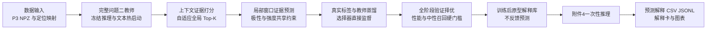

# 问题三 SEPC-Net 模型求解与工程实现说明

## 1 求解目标

问题三要求在三模态信息完整但决策依据难以追溯的场景中，同时输出情感极性、情感强度、三模态作用程度、主要参考模态和可回看的关键局部证据。P0–P2 修复版采用“完整问题二教师蒸馏 + 稀疏局部证据瓶颈 + 训练后原型解释”模型。模型选择器可以读取三模态上下文，但最终预测器只能读取被选择中心前后固定半径内的局部载荷；完整选择概率向量不会进入预测器，从结构上抑制概念泄漏。

问题三沿用问题二的数据划分和训练集拟合的数值标准化统计，但具有独立模型、配置段、检查点、日志和结果目录。问题二最佳模型一方面提供同构文本骨干热启动，另一方面以全参数冻结方式作为软目标教师；真实标签始终是主监督，教师不替代标签。

## 2 总体求解流程



## 3 数据输入

入口代码为 `src/problem3/data.py`，读取 `datasets/preprocessed_data/problem3` 下的四个文件：

- `train.npz`：3395 条，只用于学习网络参数和原型记忆；
- `valid.npz`：728 条，只用于早停、模型结构、Top-K、融合系数和阈值选择；
- `test.npz`：727 条有标签内部测试集，只用于最终泛化评价；
- `attachment4_aligned.npz`：20 条无标签专项样本，只执行最终推理。

每个样本含 50 个对齐位置、文本 token、74 维音频、35 维视觉及三套证据候选掩码。候选掩码已排除结构 token、padding、自然全零和质量失效位置。正式求解不得从附件4反向调整参数。

注意事项：

1. `top_k=8` 是上限；按候选总数的 8% 自适应分配，正常情况下至少 4 条，候选不足时使用全部可用证据，其余槽位只作 padding。
2. 文本定位使用官方 BERT tokenizer 的精确字符 offset；附件4音视频目前为比例时间映射，置信度 0.35，报告时必须显式说明。
3. 附件4样本 13 的视觉失效保留为质量标记，不使用未经验证的候选修复静默替换。
4. DataLoader 支持 `num_workers>0` 多进程并发；Windows 建议从 0 或 2 开始，避免过多 worker 造成重复内存。

## 4 参数初始化

统一配置为 `configs/problem3.yaml`，预处理与建模不再拆成两个 YAML。主要参数如下：

|参数|默认值|合法范围或调试原则|作用|
|---|---:|---|---|
|`model.top_k`|8|整数且不大于 150；只用验证集选择|控制解释稀疏度|
|`prototype_fusion_alpha`|0.00|固定为 0|原型仅解释，不参与预测|
|局部窗口半径|2|建议 1 至 3|证据中心左右各保留的局部步数|
|选择器初始/最终温度|1.5 / 0.35|均应大于 0|由软探索逐步过渡到稳定稀疏选择|
|选择器初始/最终噪声|1.0 / 0.05|非负|早期探索、后期稳定排序|
|`prototypes_per_cell`|5|建议 3 至 10|每个模态 极性 强度分仓的实际训练样本原型数|
|`learning_rate`|1.5e-4|建议验证集对数尺度搜索|非文本模块学习率|
|`text_learning_rate`|1e-5|应显著小于主学习率|避免破坏预训练语言表征|
|反事实批次概率|0.00|P0–P2 阶段关闭|避免在主预测未达标时引入冲突梯度|
|稳定性批次概率|0.00|P0–P2 阶段关闭|性能达标后再逐项恢复|

初始化顺序如下：

1. 固定 Python、NumPy、PyTorch 和 CUDA 随机种子；
2. 从本地 `models/bert-mini` 加载文本模型，不在训练时联网；
3. 将问题二检查点中形状完全一致的 `text_encoder.backbone.*` 参数映射到问题三文本骨干，并加载完整问题二模型作为冻结教师；
4. 音频、视觉上下文编码器、局部窗口投影、选择器、推理 token 和任务头随机初始化；
5. 前两轮冻结文本骨干，随后解冻并使用较小学习率微调。

## 5 模型调用与分阶段训练

### 5.1 上下文证据选择

文本、音频和视觉分别经过上下文编码器和 Conv1D 显著性头，三模态得分展平后在有效候选集合上执行自适应全局 Gumbel Top-K。硬掩码决定真实前向证据；迭代软 Top-K 同时进入全局软选择辅助头，直接获得分类和回归监督，解决旧版选择器梯度过弱的问题。预测器仍不接收完整得分或软掩码。

### 5.2 局部载荷受限预测

文本载荷取 token embedding，音频和视觉载荷只经逐位置 MLP；每个中心再与半径 2 内的有效邻域作掩码聚合，形成可复核的局部窗口证据，仍不含全局上下文。选中后加入模态与位置 embedding，与可学习推理 token 一起送入小型 Transformer。情感强度映射为有序极性 logits，并与自由分类头融合，显式约束负/中/正与连续强度的一致性。

### 5.3 原型记忆

模型选择完成后仅构建一次原型库。候选不再按模型“预测正确”过滤，避免中性类和困难类被系统性删除；按模态、真实极性和七档强度联合分仓，使用确定性最远点实际样本 medoid。原型只用于相似训练案例追溯，融合系数恒为 0，因此原型稀疏或缺失不会改变预测。

### 5.4 反事实目标

P0–P2 主损失包括真实标签分类、强度、相关性、极性强度一致性、冻结教师分类/回归蒸馏、教师充分性、全局软选择辅助和可微模态平衡项。原型、完备性、稳定性权重暂设为 0。

- 充分性：只用入选证据时应接近密集参考输出；
- 完备性、稳定性仍在评价端报告，但本阶段不反向优化；待主性能过门槛后按单因素消融恢复；
- 原型只提供相似训练样本，不形成预测损失。

训练先进行 5 轮预热，再进行最多 30 轮选择器优化。warmup 与 selector 阶段共同参与最优模型选择，后期模型不得强制覆盖更好的早期模型。验证综合分数为 `Macro-F1 + Pearson - 0.25*MAE + 0.10*解释忠实度`；同时要求相对问题二基线的 Accuracy、Macro-F1、MAE、Pearson 均达到 95% 性能地板且中性类召回不低于 0.10，连续 8 轮不提升则早停。

## 6 结果输出

每次运行在 `outputs/problem3/modeling/runs/<时间戳>/` 下创建隔离目录：

```text
logs/           时间戳训练日志与异常堆栈
checkpoints/    best.pt last.pt 和 fp16 部署模型
prototypes/     可追溯原型记忆 NPZ
metrics/        训练历史 验证/测试指标 错误归因
predictions/    验证 内部测试 附件4预测 CSV
explanations/   逐证据明细与附件4 JSONL
figures/        性能 忠实度 模态贡献 证据热图 错误归因
reports/        配置快照 运行摘要 典型解释卡
```

附件4汇总表至少包含：样本 ID、三类概率、预测极性、预测强度、文本/音频/视觉作用程度、主要参考模态、关键证据摘要和质量标记。逐证据文件包含 Top-K 排名、模态、对齐位置、逐证据删除重要性、原型相似度、原型训练样本及字符/时段/帧定位。

三模态作用程度由完整三模态的 8 个子集精确 Shapley 计算；局部重要性由逐个删除入选证据后的类别对数概率下降和强度变化联合计算。两者解释同一个纯局部证据预测分支，原型匹配只作为旁证展示。

## 7 可视化与结论口径

代码自动生成以下图表，均含标题、坐标轴、图例和图下注释：

1. 训练损失与验证指标曲线：确定最佳 epoch，检查过拟合；
2. 验证集混淆矩阵与强度散点图：对应 Accuracy、Macro-F1、MAE、Pearson；
3. 平均模态贡献与主要模态频数：比较三模态总体作用差异；
4. 充分性、完备性和选择稳定性柱状图：评价解释是否忠实；
5. 附件4局部证据位置热图：展示不同样本的重要位置分布；
6. 验证集质量分组错误归因：比较截断、模态失效和低定位置信样本。

论文结论必须区分总体规律和单样本解释。总体平均贡献不能代替当前样本的主要模态；比例时间映射只能说明模型对齐位置对应的近似原始时段，不能表述为人工精确标注。

## 8 运行命令

完整训练、评价和附件4推理：

```powershell
uv run python scripts/problem3/solve_problem3.py --stage all --device cuda --num-workers 2
```

从中断检查点恢复：

```powershell
uv run python scripts/problem3/solve_problem3.py --stage all --device cuda --resume outputs/problem3/modeling/runs/<运行ID>/checkpoints/last.pt
```

只使用已有最佳检查点完成附件4推理：

```powershell
uv run python scripts/problem3/solve_problem3.py --stage infer --device cuda --checkpoint outputs/problem3/modeling/runs/<运行ID>/checkpoints/best.pt
```

## 9 运行前后验收

运行前应确认预处理验收通过、本地文本权重与问题二检查点可读取、GPU 显存满足批量 24；显存不足时优先减小 batch size，不应改变 Top-K 语义。运行后必须确认：日志无非有限损失；`performance_gate_passed=true`；附件4恰有 20 条预测；每条样本的模态贡献和为 1；每个有效证据均有原始位置或明确的低置信定位；提交文件合计不超过 50 MB。原型记忆构建失败不阻断预测，但必须在解释局限中报告。

当前交付仅完成代码与非训练验证。正式训练、参数搜索和最终数值结论需由参赛者在目标 GPU 环境执行后填写。
